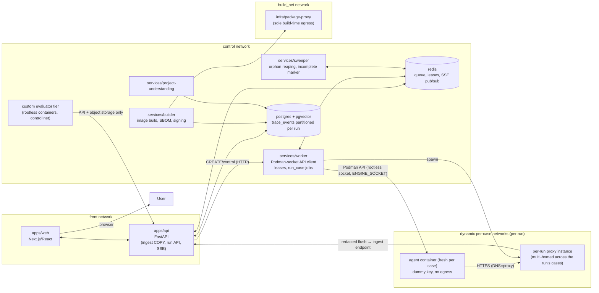
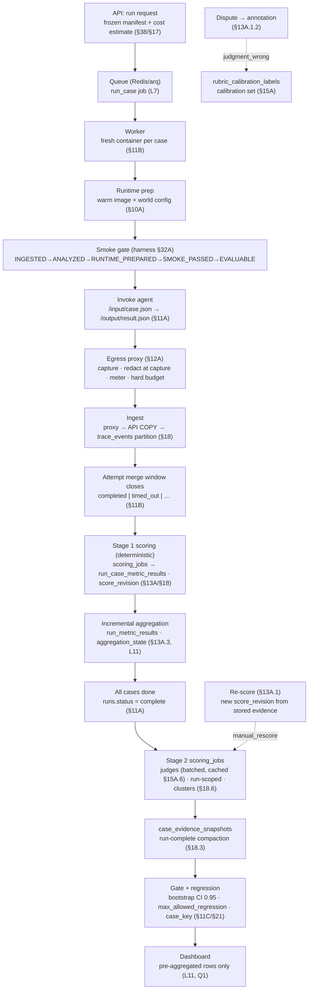
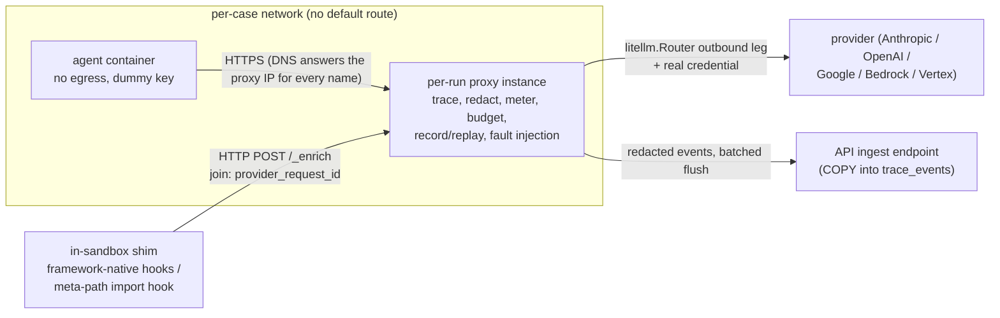

# LLM Agent Evaluation Engine — Design Doc v3

Product, UX, Evaluation Model, and Technical Architecture

> **Core thesis** — The platform is not primarily an LLM-as-a-judge product. It is a configurable
> evaluation engine in which an LLM helps users understand an agent and translate natural-language
> evaluation intent into executable, composable metrics and evaluators. The LLM is the authoring
> and explanation layer; the engine is the source of truth for execution, validation, scoring,
> persistence, and reproducibility.

Status: Product / technical design specification — revision v3

## What v3 is

v3 is the revised design document for the LLM Agent Evaluation Engine. It assembles the v2
specification's unchanged text with the corrections and new mechanisms agreed in the v2 review
(`docs/design/v2-review-and-v3-plan.md`) and written by the domain writers for engine, semantics,
harness, and UX. The plan is the authority: where anything in this document disagrees with the
plan, the plan's corrected position (corrections C1–C6 and decisions 4C–4K, L1–L13, G1–G12,
A1–A21) wins, and the divergence is noted in the section that implements it.

## How v3 differs from v2

**Revised in place** (full replacement text, marked `(REVISED)`): §3 Users and Use Cases; §17
Backend APIs and Service Contracts; §18 Persistence and Storage Design; §19 Security, Isolation,
and Trust; §20 Versioning, Reproducibility, and Governance; §21 Regression, Comparison, and
Continuous Evaluation; §26 Implementation Roadmap; §38 End-to-End Agent Interaction Example; §40
Agent Observability and Auditability.

**New suffixed sections** (inserted adjacent to their v2 bases): §3A (wedge), §4A/§4B (first-run
time budget, onboarding recovery), §4K (isolation tiers and platforms), §5A/§5B (conversation
state machine, async UX), §7A (metric semantics), §9A (predicate and trace-rule languages), §10A
(world model: fixtures, cassettes, fault injection), §10B (conversational test-case authoring),
§10B.1 (starter metrics), §11A (invocation protocol and image build), §11B (container lifecycle,
concurrency, cancellation), §11C (determinism, repeats, statistical validity), §12A (trace
capture: the egress proxy), §12B (event schemas, caps, redaction), §12C (model gateway), §13A
(run-scoped results and decoupled scoring), §13A.1/§13A.2 (dispute and re-score: data model and
UX), §14A (preview generation and one merged registry), §15A (the judge as a validated
instrument), §15A.1/§15A.2 (judge readiness: enforcement and UX), §31A–§31D (harness topology,
session state, transactional mutations, conversation-turn diagram), §32A–§32C (smoke gate,
ingestion, project model), §33A (retrieval), §34A (discovery), §35B (queue, streaming, resume),
§36A (confirmation mechanism), §37A–§37C (adapter contract, dashboard definition schema, plugin
trust model). **Four Mermaid architecture diagrams** were added: platform components (§11B.13),
proxy/adapter merge flow (§12A.1), one test case end-to-end (§11B.14), and one harness
conversation turn (§31D).

**Reality check.** Every mechanism in v3 was walked against the deliberately broken reference
agent in `fixtures/reference-agent/` (a CrewAI + Gemini project with a truncated file, no
entrypoint, tools registered in a runtime dict, unseeded `random` mocks, an implicit env-based
model lookup, and an invalid model string its own SDK rejects). Claims that do not survive contact
with that agent are corrected in the sections that make them; the reference agent's failure modes
are the modal first-run cases in §4B, §11A, §32A, and §37A.

---

# 1. Executive Summary

The proposed platform is a conversational evaluation operating system for agentic applications. A developer connects an agentic codebase or workflow, the platform inspects the project, identifies the workflows and observable execution points, and helps the developer define exactly what should be true about the system. Those evaluation definitions are converted into structured specifications, executed against the real agent in an isolated runtime, scored using configurable evaluators, and presented through explainable dashboards and trace views.

The core differentiation is the evaluation abstraction. The system does not assume that every agent should be judged using one generic LLM score. Instead, a user can create metrics that inspect tool inputs, tool outputs, final answers, state transitions, workflow sequences, latency, structured values, expected references, or any custom condition. LLM-based judging is supported where semantic judgment is genuinely required, but it is one evaluator type among many.

> **Design principle**
>
> The LLM is the intelligent interface and orchestration layer. The evaluation engine is the source of truth for execution, validation, scoring, persistence, and reproducibility.

## Primary outcome

A team should be able to bring a real agent into the platform and go from “I want to know whether this works correctly” to a repeatable evaluation suite with executable tests, transparent metrics, trace-level evidence, and version-to-version regression detection without building a custom evaluation framework from scratch.

## Product loop

> Connect project → Understand code → Discover workflow → Define evaluation → Generate tests → Preview → Execute → Evaluate → Explain → Compare → Iterate

# 2. Problem, Vision, and Product Principles

## Problem statement

Agentic systems are difficult to evaluate because their behavior is not always captured by a final text response. A single task may involve multiple model calls, tool selections, tool arguments, external results, intermediate state, retries, policy checks, and a final response. Different teams care about different notions of correctness, and many useful checks are deterministic or domain-specific rather than naturally suited to an LLM judge.

## Vision

Build an evaluation engine where “what good looks like” is configurable at the level of the agent execution itself. A user should be able to define assertions against any observable part of a workflow and combine those assertions into a repeatable evaluation suite.

## Product principles

- Configurable over prescriptive: do not force teams into a fixed metric taxonomy.

- Observable over opaque: every score should be traceable to evidence.

- Deterministic where possible: use code and rules whenever the requirement can be expressed exactly.

- LLM-assisted, not LLM-dependent: use an LLM to make evaluation design easier, not to replace the evaluation engine.

- Reproducible: every run identifies the agent, dataset, evaluator, metric, and model versions involved.

- Composable: simple metrics can be combined into higher-level evaluations.

- Safe by default: user code executes in isolated environments with explicit resource and network boundaries.

- Progressive disclosure: the first-time user can stay in chat; expert users can inspect and edit structured evaluation specifications.

# 3. Users and Use Cases (REVISED)

*What changed: §3 now opens with the wedge persona (plan L13); the U1–U14 use-case rows are added from the four writers' USE_CASES fragments (ruling R3), and each row carries a stated evaluator strategy so none is aspirational.*

## 3.1 Primary users

| **Persona**                | **Need**                                                    | **Primary workflow**                                 | **v1 role**            |
|----------------------------|-------------------------------------------------------------|------------------------------------------------------|------------------------|
| Agent developer            | Know whether a new agent version still behaves correctly.   | Connect code → define metrics → run regression suite | **Wedge (L13)**        |
| Applied AI / ML engineer   | Build repeatable evaluation suites and compare experiments. | Dataset → metrics → runs → analysis                  | Secondary              |
| QA / reliability engineer  | Validate workflow invariants and edge cases.                | Rules → traces → failures                            | Secondary              |
| Product / operations owner | Understand whether the agent is meeting business outcomes.  | Dashboard → trends → failure clusters                | Tertiary               |
| Platform engineer          | Standardize evaluation infrastructure across teams.         | Projects → reusable evaluators → policy              | Tertiary               |

The wedge is the **agent developer** (L13): the only persona holding code, agent, provider key,
and urgency. Every v1 feature is justified against that loop:

> Connect → Understand → Define → Run → Analyze → Iterate

The other four personas are downstream consumers of the same loop, not separate v1 drivers. The
product/operations owner's dashboards and the platform engineer's policy layer are served by the
same declarative registry and versioning machinery the wedge needs to iterate; they are not
optimized for separately in v1. See §3A for the consequences.

## 3.2 Core use cases

v2's core use-case table carries over unchanged (tool output correctness, tool argument
correctness, tool selection, workflow compliance, final response correctness, business rule
validation, structured output validation, latency and cost evaluation, adversarial evaluation,
regression testing, failure analysis, production replay) and is extended with U1–U14 below.

| **Use case**                 | **What the platform must enable**                                                                              |
|------------------------------|----------------------------------------------------------------------------------------------------------------|
| Tool output correctness      | For a given query and expected state, assert that a specific tool returns the correct value or structure.      |
| Tool argument correctness    | Verify that the agent passes the right identifier, amount, filter, date, or other arguments to a tool.         |
| Tool selection               | Verify that the correct tool is called for a particular request, or that forbidden tools are never called.     |
| Workflow compliance          | Verify that required steps happen in the correct order, such as eligibility check → approval → action.         |
| Final response correctness   | Compare the final answer to an expected output, schema, reference answer, or semantic rubric.                  |
| Business rule validation     | Encode domain rules such as refund limits, approval policies, pricing constraints, or escalation criteria.     |
| Structured output validation | Require JSON, fields, types, ranges, enums, or schemas to be valid.                                            |
| Latency and cost evaluation  | Track execution time, token usage, tool latency, and cost against thresholds.                                  |
| Adversarial evaluation       | Generate or maintain tests designed around edge cases, policy boundaries, malformed inputs, and failure modes. |
| Regression testing           | Run the same evaluation suite against multiple agent versions and identify material regressions.               |
| Failure analysis             | Cluster failures, inspect traces, and explain likely root causes using evidence.                               |
| Production replay            | Replay selected or anonymized real interactions against candidate versions for pre-release validation.         |

**Extended use cases (U1–U14).** Each row below names why the use case belongs in v3 and a stated
evaluator strategy, so none is aspirational. Rows with two writers are merged (U2: harness
mechanism + UX; U10: evaluator + deferred UI).

| ID | Use case | Why it belongs in v3 | Evaluator strategy (one line) | Section reference |
|---|---|---|---|---|
| U1 | Multi-turn / conversational evaluation | Every v2 test case is single-shot (`input: {query: ...}`); multi-turn agents need cases with dialogue history, goal completion across a dialogue, and turn-level vs conversation-level metrics | Interaction script (typed user turns + `wait_for_input`/`user_response` event pairs) replayed by a user-simulator under §10A cassette modes; trace rules assert turn ordering; goal completion judged with a calibrated rubric, turn-level checks deterministic | §10B (conversational authoring), §31A, §35B; consumes §12B events, §10A cassettes |
| U2 | Human-in-the-loop / approval gates | v2's own flagship workflow is eligibility → approval → action, yet nothing can test that the agent pauses, presents correct options, respects the decision, and resumes — and the UX half is what makes the pause *testable*: `approval_card` is a typed message kind backed by a persisted confirmation object (§36A), so an interaction script's expectation maps 1:1 to observable UI state | Interaction script with `wait_for_input` / `user_response` event pairs; trace rules assert no side-effecting tool call between pause and scripted response, payload equality of the presented options, and the resumed action matching the scripted decision; the approval UX guarantees the decision point is a persisted, refresh-stable object the script can reference | §36A (confirmation mechanism), §10B, §31A, §37A; §5A.4 (approval_card), §5A.1 (ownership rule), §13A.1 (dispute of approval behavior) |
| U3 | Security & prompt-injection resistance | v2 has no way to assert the agent refuses injected instructions, cannot be forced into unauthorized tool calls, and routes injection attempts through its guardrails — the guardrail existence is only observable if the trace records the attempt and the refusal | Trace-rule metrics over `guardrail_check` events (attempt detected, refusal emitted) paired with `tool_call` events (no side-effecting tool invoked after an injected instruction); injection attempts seeded via `world` fixture cases, scored by the closed operator set | §9A (operators over `guardrail_check`/`tool_call`), §10A (world model seeds injection cases), §10B.1 (no-PII, no-side-effect template metrics), §12B (`guardrail_check` event) |
| U4 | Agent data discipline / PII echo | v2 never asks whether the agent *itself* echoes PII into responses, leaks it into tool args, or fails to redact — distinct from platform-side redaction-at-capture (the platform redacts; the agent's discipline is what the user ships) | CEL predicate metrics over redacted payloads: `exists(tool_call … payload.args contains secret/PII pattern)` and echo checks against the response text, with secrets planted by seeded fixtures (never real credentials) | §9A (CEL env over `payload`/`output`), §10A (seeded fixtures), §12B (`redaction_state` distinguishes platform-redacted from agent-emitted), §7A (`on_missing`/`on_error` semantics) |
| U5 | RAG / retrieval quality | v2 assumed retrieval happened and scored only the final answer; groundedness, context relevance, citation accuracy, and recall@k are first-order for retrieval-heavy agents and are scoreable only from `retrieval` events the trace records | `recall@k` and groundedness computed from `retrieval` events (`query`, `chunks`, `scores`) against `expected` evidence lists; citation accuracy via CEL predicates tying `llm_response` citations to retrieved chunk ids; missing-retrieval on retrieval-intended cases is an `on_missing` failure | §9A (operators over `retrieval` events), §12B (`retrieval` payload), §7A (target/selector/occurrence over event payloads), §11C (CI over recall@k across repeats) |
| U6 | Multi-agent delegation | v2 deferred it to "future", yet the reference agent *is* a manager/sub-agent crew (`allow_delegation=True`), and handoff correctness, delegation choice, per-sub-agent attribution, and shared-state consistency are first-order for the wedge persona. The proxy makes the delegation *decision* observable without any code change: CrewAI injects a `delegate_work` tool, so the choice appears in the Gemini request body the proxy decodes | Trace-rule metrics over `delegation` events — "delegated to the right agent" is proxy-only scoreable from the request body; "what the sub-agent did" scores from `tool_call`/`tool_result` adapter events (cross-ref §37A) | §12A.10 (proxy sees `delegate_work` decisions, zero tool executions), §12B.3 (`delegation` payload), §9A (operators), §37A (adapter for sub-agent detail) |
| U7 | Tool-error recovery / resilience | Behavior under 429s, 5xx, timeouts, malformed JSON, and slowdowns — retry with backoff, degrade, or fabricate — is how agents fail in production, and v2 had no mechanism to provoke it. The proxy makes fault injection nearly free: every byte crosses it, so deterministic per-request faults cost nothing and replay exactly | `world.fault_injection` cases (§10A) drive `retry` / `error` / `tool_result(status: error)` events, scored by trace rules (retry/backoff present, no unrecovered crash — §10B.1 starter metrics); `on_error` aggregation decides the run-level rollup | §12A.8 (proxy fault injection), §10A (world model), §12B.3 (`retry`/`error` payloads), §10B.1 (no unrecovered tool-error crash) |
| U8 | Termination, loop safety, tool parsimony | Infinite loops, oscillation between two tools, "called the same tool 14 times", step blowups, and budget exhaustion are how agents most often fail, and v2 had no storage bound, no event cap, and no enforcement | Runtime enforcement (per-attempt 1,000-event cap with `trace_truncated` marker, hard token/USD budget with `budget_exceeded`, wall-clock → `timed_out`) plus scored metrics — "no tool called more than N times", "terminates within budget" — from §10B.1's Agent Health template | §12B.5 (event cap + `trace_truncated`), §12A.5 (budget abort → `budget_exceeded`), §11A/§11B (lifecycle statuses, timeout grace), §10B.1 (starter metrics) |
| U9 | Run-to-run stability | A single run cannot distinguish "flaky" from "passing" — the wedge persona ships agents where an intermittent failure is a release blocker, and v2's single-shot scoring never surfaced the repeats distribution | Case classification from the repeats distribution (PASSING / FLAKY 0<p<1 / FAILING p=0), reported separately, with "passed in ≥9 of 10 runs" as a `pass_rate` metric gated by bootstrap CI | §11C (repeats, flakiness, CI), §7A (`method: pass_rate`, `aggregation`), §21 (flaky vs failing never merged), §13A (aggregation_state renders the distribution while streaming) |
| U10 | Pairwise / side-by-side preference | Pairwise preference is the standard way judge-based eval is actually done (A/B two versions on identical cases with a preference judge), and it is absent from v2. The **judge capability stays** in v3 — position-swapped batching and pairwise verdict aggregation live in §15A — while the **A/B UI is cut** (§4H, accepted). The cut is mechanism-recoverable by design: the dashboard registry and binding language (§37B) already express two-run, two-case-set comparisons, so a `ComparisonBoard`-style component is a registry addition later, not an architectural one | Preference judge over paired outputs with position-swapped batching and length-normalization bias controls, pairwise verdict aggregation with κ per rubric binding, verdicts cached on `(rubric_version, judge_model, content_hash)`; run comparison intersects on `case_key` and only on matching judge bindings | §15A (judge contract, bias controls, caching), §15A.1 (readiness states), §21 (paired comparison via case_key), §11C.5 (comparability); §37B (deferred-UI building blocks), §4H (scope cut) |
| U11 | Streaming behavior | v2 had no token-stream, first-token, or partial-output events — streaming-first agents were unrepresentable, and time-to-first-token was unmeasurable | `stream_start` / `first_token` events with proxy-authoritative timing; time-to-first-token as a per-case/run metric, and budget enforcement *mid-stream* (abort on breach while the stream is open, §12A.5) | §12B.3 (`stream_start`/`first_token` payloads), §12B.4 (stream events as children of `llm_call`), §12C.2 (gateway mapping), §12A.5 (mid-stream budget abort) |
| U12 | Cost & token efficiency | v2 tracked cost only as a *risk*; the wedge persona owns the provider key, so per-case cost, cost-per-successful-task, and cost regression gates are first-order | Proxy metering against the versioned price table (`cost` block + `cost_ledger`/`cost_summaries`, §18) drives cost metrics and `max_allowed_regression` cost gates (§21), with `price_version` on every row so drift never rots the gates; per-run budgets and tier estimates at the confirmation card (§11B.9) | §12A.5 (metering, price table, budget), §12B.2 (`cost` block), §11B.9 (tiers + estimates), §18 (cost_ledger), §21 (cost regression gates) |
| U13 | Human annotation & labeling | The judge is only as trustworthy as its ground truth, and v2's judge was uncalibrated by construction; human labels from guided labeling and disputes are the calibration set that moves a binding from UNCALIBRATED to CALIBRATED | Guided "label these N cases" flow and dispute outcomes land in `rubric_calibration_labels`; κ against human labels per binding; ≥30 labels and κ ≥ 0.6 (defaults) transition the binding state; overrides stored alongside machine scores, never replacing them | §15A.1 (readiness states, calibration flow), §13A.1 (disputes feed the calibration set; overrides side by side), §18 (`rubric_calibration_labels`, `annotations` DDL) |
| U14 | Continuous evaluation / CI gating | §1's primary outcome is regression detection, which only means something when runs fire automatically on new commits; v2 deferred this to Phase 9 | Regression gate per the §21 revision (bootstrap CIs, comparability rules, first-attempt authoritative); runs triggered by webhook/API on new commits; pipeline fails when declared regression rules are violated | §26 (REVISED), §35B (queue/streaming/resume); cross-ref §21 |

Governing thesis, restated here because it shapes every use case: **this is not an
LLM-as-a-judge product.** It is a configurable evaluation engine in which an LLM helps users
understand an agent and translate natural-language evaluation intent into executable, composable
metrics and evaluators. The LLM is the authoring and explanation layer; the engine is the source
of truth for execution, validation, scoring, and reproducibility. A use case is evaluable only if
every score can trace to evidence (§12 evidence linking; §9A operators report the events they
matched — that *is* the evidence link).

---

## §3A — The wedge and its product consequences

*Traceability: closes C2 (personas in scope), L13 (wedge persona). Extends §3 (REVISED above).*

### Why the wedge is the agent developer

The agent developer is the only persona who holds all four things evaluation needs on day one:

| Asset | Held by | Consequence |
|---|---|---|
| The code | the developer | Only they can fix what a run exposes. |
| The agent's provider key | the developer | Only they can run the agent at all (proxy brokers it, §12A). |
| The definition of "correct" | the developer | Domain rules live in their head and their prompts, not in a spec. |
| Urgency | the developer | A regression in a shipped agent is a live incident; a dashboard is not. |

Every other persona either lacks one of these (the ops owner has urgency but not the code) or
arrives later (the platform engineer arrives once evaluation exists to standardize).

### What the wedge buys, and what it forbids

- **Buy:** every v1 feature must shorten the developer's loop. Anything that adds a step to
  Connect → Understand → Define → Run → Analyze → Iterate without shortening a later step is cut.
- **Forbids:** v1 does not build for "someone else evaluates this agent" (review queues, §4H),
  does not build generic benchmarking ("which agent is best?"), and does not optimize for
  read-only consumers. Where a feature serves the wedge *and* a downstream persona (the
  dashboard registry serves both the developer's iteration and the ops owner's reporting), it
  earns its place on the wedge justification alone and the second audience is free.
- **Consequences adopted elsewhere in v3:** the first-run time budget (§4A) is a wedge
  requirement (their patience is measured in minutes, not demos); onboarding recovery (§4B) is a
  wedge requirement (their code is broken in real ways — the reference agent is the modal case);
  the conversation (§5A) is the wedge's working surface; re-score-without-rerun (§13A.1) is the
  wedge's headline iteration capability.

---

# 4. End-to-End User Journey

| **Step**                     | **Experience**                                                                                                                          |
|------------------------------|-----------------------------------------------------------------------------------------------------------------------------------------|
| 1\. Create project           | Upload a ZIP, connect a repository, or provide a mounted/local project path.                                                            |
| 2\. Inspect project          | The platform performs static analysis and targeted LLM analysis to identify agents, workflows, tools, models, prompts, and entrypoints. |
| 3\. Select workflow          | The system presents detected workflows as evaluation targets.                                                                           |
| 4\. Open evaluation chat     | The user enters a conversation with the evaluation harness, not merely the underlying agent.                                            |
| 5\. Define objective         | The user explains what they want to know in natural language.                                                                           |
| 6\. Generate evaluation plan | The LLM proposes metrics, targets, test categories, expected values, and scoring rules.                                                 |
| 7\. Review and edit          | The user can accept, reject, or manually adjust the structured definition.                                                              |
| 8\. Generate test suite      | The system creates or imports test cases and validates the dataset.                                                                     |
| 9\. Preview                  | A mock-data HTML/dashboard preview shows the user how the evaluation will work.                                                         |
| 10\. Execute                 | The runner executes the agent in an isolated container and records traces.                                                              |
| 11\. Evaluate                | Configurable evaluators compute metric-level results.                                                                                   |
| 12\. Analyze                 | The user sees aggregates, failed cases, clusters, and trace evidence.                                                                   |
| 13\. Compare                 | The run can be compared with prior runs or agent versions.                                                                              |
| 14\. Iterate                 | The user edits metrics/tests and reruns the evaluation.                                                                                 |

## §4A — First-run time budget and the ghost run

Traceability: 4C (first-run time budget, ghost run); supports L13 (wedge loop); consumes §32A
smoke lifecycle (harness) and §11B image build (engine).

### 4A.1 The budget

| Phase | Target | Definition |
|---|---|---|
| First useful content | **≤ 10 s** | From upload/connect click to the first thing the user can read or act on (file inventory, detected framework, progress with a "what's happening" line). |
| Project understanding | **≤ 60 s** | From upload to a usable project summary: framework, agents, workflows, tools, confidence scores with provenance (§32C). Partial availability applies — the summary renders as soon as its deterministic layers land; semantic analysis is staged (§32B). |
| Runnable | **~5 min cold / < 1 min warm** | From upload to a successful smoke invocation. Cold = image build with dependency install; warm = cached image. 10-min hard cap for pathological repos (4G). The one-time `podman machine init` VM pull (~10 min, macOS/WSL2 first boot only) is disclosed up front with its own progress line and excluded from the per-project budget: it happens once per machine, before any project exists. |
| First scored run | **≤ 15 min** | From upload to a scored run with evidence links. This is Quick tier (≤ 20 cases, ~2 min) plus smoke and build — §4I. |

**Governing rule: no human time is ever spent waiting on machine time that could have run earlier
or in parallel.** Concretely: image build starts the moment the archive is accepted (not after
analysis); analysis stages and renders as it completes (partial availability); smoke runs the
moment the image is ready; authoring is never serialized behind any of it (C1 — see §4B.5).

### 4A.2 The bare-spinner rule

No state may be a bare spinner for more than 10 s without a "what's happening" line. A
"what's happening" line states, in one sentence: **the current stage, what it is doing, how long
it has been doing it, and what happens next.**

| Wait | Line pattern (example) |
|---|---|
| Ingest (staged) | "Ingesting… 412/3,204 files indexed · semantic analysis queued (≈30 s)" |
| Image build | "Building image… installing 27 dependencies (step 3 of 5) · cold build ≈ 4 min" |
| Smoke | "Smoke run… first invocation in progress · traced 0 events so far · timeout 60 s" |
| Run | "Run 14 · 120/500 cases complete · streaming results as they land (≈35 min remaining)" |

Mechanics: every machine-time surface carries a `stage`, `detail`, `elapsed_s`, and optional
`expected_remaining_s`; the renderer formats them (determinate progress where a count exists,
staged otherwise, never an unlabeled indeterminate spinner past 10 s). Every wait surface is
interruptible: the user can navigate away, keep authoring, or start another machine operation —
no modal locks during machine time, and the work continues server-side (§31B persistence; §5B
async UX). This is a hard rule: a wait with no explanation is a bug, and the reducer treats a
"what's happening" line as required for any state lasting > 10 s.

### 4A.3 The ghost run: the smoke invocation is the first deliverable

The smoke invocation (harness §32A) is not a checkbox the onboarding must clear — it is the
product's **first deliverable**.

- **Its trace is persisted** (engine §12A/§12B: proxy capture, redaction at capture) and rendered
  as the proof moment: *"here is your agent's first real execution."* The user sees their agent's
  actual timeline — LLM calls, tool calls, delegations, the provider round-trip — the first time
  they meet the platform's evidence layer.
- **Honest framing is mandatory.** The ghost run is one invocation, not a scored run: the trace
  viewer renders it with a persistent label ("smoke trace · one invocation · not a scored
  result"), no metric rows, no pass/fail verdicts. It is the proof that execution works, not the
  first evaluation.
- **Its probe cases seed dataset version 1.** The smoke invocation's inputs become the first
  test cases (2–5 probe cases), committed as dataset version 1 with provenance recorded:
  `source: derived_from_smoke`, expected values `derived_from_trace` where the smoke observed
  them. Per §10B's governing rule (an inferred expected value is never silently authoritative),
  derived-from-trace expectations are marked and shown in review, never silently trusted. The
  user gets a runnable dataset without having typed a single test case; the "Agent Health"
  starter metrics (§10B.1) apply to it in one click.

---

## §4B — Onboarding recovery: DECLARE → PREPARE → SMOKE

Traceability: 4B (onboarding recovery), C1 (authoring decoupled from smoke), G8 (smoke gate
mechanism owned by harness §32A), reference-agent failure modes. Consumes: the six smoke-failure
states **verbatim** from harness §32A (single source of truth — ruling R4); invocation protocol
from engine §11A; image-build no-manifest case from engine §11B.

The readiness gate lifecycle is harness §32A's: `INGESTED → ANALYZED → RUNTIME_PREPARED →
SMOKE_PASSED → EVALUABLE`. The UX splits the gate into **three named stages** — DECLARE, PREPARE,
SMOKE — each with first-class recovery UI. The gate gates **RUNNING only** (C1): authoring is
never locked behind it.

### 4B.1 Stage model

| Stage | Gate span | What the user does here | Failure states it can emit |
|---|---|---|---|
| **DECLARE** | ANALYZED (when discovery reports `needs_entrypoint_declaration`) | Declare an entrypoint, or generate a shim | — (declaration is a supported path, never a failure; see below) |
| **PREPARE** | ANALYZED → RUNTIME_PREPARED | Watch the image build; fix dependencies | `install_failed` |
| **SMOKE** | RUNTIME_PREPARED → SMOKE_PASSED | Watch the first invocation; recover | `entrypoint_missing`, `invocation_failed`, `provider_unreachable`, `no_trace`, `timeout` |

Per harness §32A's classification: **discovery-time absence of an entrypoint is NOT one of the
six failure states.** `DiscoveryReport.needs_entrypoint_declaration` is a supported
prompt-to-declare path that opens DECLARE. `entrypoint_missing` is reserved for a **smoke
attempt made with no declared and no discoverable entrypoint** — i.e., the DECLARE stage was
bypassed or left empty and the invocation could not even be constructed.

Stages are sequential for RUNNING but the user is never locked out: the authoring surface stays
available throughout (§4B.5), and every stage's wait obeys §4A.2.

### 4B.2 DECLARE — entrypoint declaration is a supported path, not an error

The reference agent's exact situation — a CrewAI project with no call to `kickoff()` — is argued
to be the **modal** first run for CrewAI (reference-agent README), so DECLARE is a first-class
stage with first-class copy, not a failure page.

- Discovery (harness §32A) returns `needs_entrypoint_declaration` plus candidate call sites with
  confidence and provenance (§32C). The DECLARE panel lists candidates ("Call
  `crew.kickoff()` at line 214 of `main.py`? · confidence 0.2 · static inventory — execution
  confirms"), each with **Declare / Show code / Dismiss**.
- Per-framework declaration forms (closed set for MVP, one per supported framework — harness
  §37A):

  | Framework | Declaration form |
  |---|---|
  | CrewAI / agent-loop frameworks | Select the instantiation + invocation (e.g., "call `.kickoff()` on the `Crew` named `manager`"), or provide a module entry (`module:function`). |
  | Plain Python | `python -m module` or `module:function` with an optional argv template. |
  | Generic command | Command template with declared input/output paths (`{input}`, `{output}` placeholders per §11A's protocol: `/input/case.json`, `/output/result.json`). |

- **Shim generator.** When no declaration fits, the platform generates a small shim file
  (the adapter's `build_shim` output, harness §37A ShimBundle): it invokes the declared agent
  with the §11A protocol and reports via the enrichment channel. The generator **shows the file
  for review before use** — a code block in the panel with Accept / Edit / Decline. Nothing is
  injected into the user's project invisibly; the shim becomes a declared, versioned project
  file the user has seen in full. The shim is a hint, never authority (invariant 8): it cannot
  claim cost or usage; the proxy wins every conflict.
- What the user declared is persisted as part of the resolved runtime config (engine §11A /
  harness §20 revision: `source_digest` + resolved runtime config) so "what actually ran" is
  reproducible and the declaration is re-proposed, not re-asked, on re-ingest.

### 4B.3 PREPARE — image build with a log you can read

- Progress is staged (base pull / dependency install / verification) per §4A.2, with an
  expandable install-log tail viewer. Build-time failure with **no dependency manifest** is the
  reference-agent case: the build succeeds with base + code, and the smoke run surfaces the
  ImportError with **"add a dependency manifest"** as the named recovery action (engine §11B
  no-manifest case) — the user is never told "your project is invalid" when the actual defect is
  a missing `pyproject.toml`/`requirements.txt`.
- `install_failed` recovery (state copy + actions in §4B.4): show the failing step's log tail,
  open the manifest editor, retry. Failed builds write zero cache entries (engine §11B), so the
  retry is clean.

### 4B.4 SMOKE — the six classified failure states, verbatim from harness §32A

The following six states are consumed **verbatim** from harness §32A (ruling R4 — the list is
harness's single source of truth; harness publishes per state: `meaning`, `detected_by` — which
log/probe/exit-code source decides it — and `recovery`). This section adds only the UI
conventions on top: distinct copy per state, distinct recovery actions, the attempt log, and the
"reproduce locally" command.

| State (verbatim) | Meaning (harness §32A) | Detected by (harness §32A) | Copy pattern (what happened / why / what to do) | Primary recovery actions |
|---|---|---|---|---|
| `entrypoint_missing` | A smoke attempt was made with **no declared and no discoverable entrypoint** (the DECLARE stage was bypassed or left empty). | Build/run-prep stage, invocation not constructible. | "We couldn't construct the invocation — no entrypoint is declared or discoverable. For CrewAI this usually means nothing calls `kickoff()`." | Return to DECLARE (§4B.2); per-framework forms; shim generator. |
| `install_failed` | Dependency install failed during PREPARE. | Install step log, non-zero exit. | "The image build failed installing dependencies." + failing step + log tail. | Add/fix manifest; view install log; retry. If no manifest exists: "add a dependency manifest" is the named action (engine §11B no-manifest case). |
| `invocation_failed` | The entrypoint ran and crashed. **Runtime misconfiguration is classified here, never as infrastructure failure** — including a provider 4xx from a bad model string (the reference agent's `gemini/gemini-2.0-flash` passed to `langchain_google_genai`). `provider_unreachable` is **network/credential-level only**; a 4xx from a working connection is `invocation_failed`. | Exit code + stderr tail (engine §11A protocol); provider 4xx observed in the trace. | Exit code + stderr tail + resolved runtime config (entrypoint, model string, env refs — values redacted per invariant 7); copy states plainly: "the agent's configured model string is invalid for its own SDK" — never blamed on the sandbox. | Edit the resolved config (model string, env, entrypoint); retry; reproduce locally. |
| `provider_unreachable` | The sandbox could not reach the provider (network or credential level). | Network-verification probe results (three-layer egress, engine §12A); proxy credential check. | Probe results + provider key validity (the sandbox holds a dummy key; the proxy brokers the real one). | View probe results; check the workspace provider key at the proxy; provider status; retry. |
| `no_trace` | The agent ran but produced zero trace events. | Zero events flushed by proxy/adapter for the attempt. | "Your agent ran, but we captured nothing." Local, non-HTTP tool calls are invisible to the proxy by design (C5); the enrichment shim is what observes them. | Show what was captured (zero events, honest); enable/inspect the enrichment shim (harness §37A, `EnrichmentReport untrusted: true`); re-run smoke. |
| `timeout` | The invocation exceeded the smoke timeout. | Worker-applied `timed_out` lifecycle status (engine §11A — never an agent exit code). | "The invocation didn't finish in 60 s." + the last events before the timeout. | Show last events; raise the step budget; trim the entrypoint; reproduce locally with the same timeout. |

**The attempt log.** Every smoke attempt is a row in `smoke_attempts` (harness §32A):
`{id, session_id, image digest, declared entrypoint, exit_code, state (one of the six, or
passed), redacted log ref, reproduce_locally, created_at}`. The UI renders the full history as a
timeline in the stage panel; each attempt row is one tap from its log tail and its reproduce
command. Attempts are never silently retried: repeats and retries are different (invariant 6,
§11C) — the smoke gate may retry at most once per declaration change, and every attempt is
visible in the log.

**Reproduce locally.** Each attempt carries harness's `reproduce_locally` string: the **exact
podman/docker run command** — image, mounts, env, entrypoint — so the attempt reproduces in the
user's own environment where their debugging tools live. Two hard rules: the command substitutes
the real credential (the sandbox dummy key is replaced by an env-var placeholder, so the user's
real key is never printed by the platform), and the command never contains redacted content (it
references the same paths/values the attempt used). The panel shows the command in a copyable
code block (and `llm-eval reproduce <project_id> --attempt <id>` where that CLI helper exists).

### 4B.5 Authoring is decoupled from smoke (C1)

- While PREPARE and SMOKE run, the authoring surface (chat, spec drafting, dataset editing)
  remains fully available. Drafting proceeds during image build.
- Evaluation and spec drafts created before `SMOKE_PASSED` carry an **`awaiting smoke`** badge.
  Specs still validate (validation is structural and independent of the gate); the gate is
  re-checked at run time, not at edit time. Run-request buttons show the reason when blocked:
  "first smoke hasn't passed — the agent must run once before it can be evaluated."
- When the smoke passes, the project becomes `EVALUABLE`: `awaiting smoke` badges clear, and the
  ghost run (§4A.3) is presented as the first deliverable.
- **The lockout rule:** the user is never locked out of authoring by machine time. Machine-time
  surfaces sit behind authoring, never in front of it.

---

# 5. User Experience and Information Architecture

## Primary navigation

> Workspace  
> └── Project  
> ├── Overview  
> ├── Workflows  
> ├── Evaluations  
> ├── Datasets  
> ├── Runs  
> ├── Traces  
> └── Dashboards

## Project overview

The project overview should summarize the code connection, detected agent/workflow inventory, latest evaluation state, recent runs, and open regressions. It should remain lightweight; detailed evaluation work happens inside a workflow.

## Workflow workspace

> ┌────────────────────────────────────────────────────────────┐  
> │ Workflow: Refund Processing Status: Healthy │  
> ├────────────────────────────────────────────────────────────┤  
> │ Overview │ Evaluations │ Runs │ Dashboard │ Code/Trace │  
> ├────────────────────────────────────────────────────────────┤  
> │ │  
> │ Chat with Evaluation Harness │  
> │ │  
> │ User: I want to verify that refunds never happen before │  
> │ eligibility is checked. │  
> │ │  
> │ AI: I can model that as a trace-based metric... │  
> │ │  
> │ \[Evaluation definition preview\] │  
> └────────────────────────────────────────────────────────────┘

## Chat as control plane

The chat should be able to inspect project context, create and modify evaluation objects, start runs, retrieve results, explain failures, and modify dashboards. It should not silently change production artifacts. Mutating actions should produce a structured preview or explicit action confirmation depending on risk.

## Evaluation builder

The builder should expose both conversational and structured modes. Novice users describe intent in chat; advanced users can open the underlying metric/evaluator definition and edit it directly.

## §5A — Conversation state machine and message taxonomy

Traceability: 5A (conversation states + typed messages), A2 (sessions must resume), A4
(confirmation mechanism — harness §36A consumed). Mermaid: one state machine (this section);
one conversation turn is harness §31A's diagram.

### 5A.1 Ownership rule

**Chat references persisted objects; the panel owns state.** Every harness contribution that
means something is backed by a platform object — a draft spec, a dataset version, a run, a
confirmation, a notification — stored in the platform's own tables (harness §31B/§31C:
transactional, idempotent mutations). The chat transcript is a *projection* of those objects, not
the source of truth. Consequence: **a refresh re-renders the exact decision point.** If the user
is staring at an approval card and reloads, the card re-renders from the persisted pending
confirmation, not from a conversation log; if the harness LLM died mid-proposal, the panel shows
the last persisted draft with its state, never a half-written transcript. This is what makes
sessions resumable (A2) and is the mechanism behind every state below.

### 5A.2 States

```
                     ┌─────────────┐
        ┌───────────▶│    IDLE     │◀───────────┐
        │            └─────────────┘            │
        │                    │ (new intent)     │
        │                    ▼                  │
        │            ┌─────────────────┐        │
        │            │CONTEXT_GATHERING│        │
        │            └─────────────────┘        │
        │                    │                  │
        │                    ▼                  │
        │            ┌─────────────┐            │
        │            │  PROPOSING  │            │
        │            └─────────────┘            │
        │            ┌─────┴─────┐              │
        │            ▼           ▼              │
        │    ┌──────────────┐ ┌────────────────────────┐
        │    │AWAITING_     │ │        DEGRADED        │  (any state, harness LLM
        │    │DECISION      │ │   deterministic ops    │   unavailable)
        │    └──────────────┘ │   still usable         │
        │            │        └────────────────────────┘
        │            │ accept          │ (LLM back) → RESUMED → re-enters prior state
        │            ▼                 │   from persisted objects, never the transcript
        │    ┌─────────────┐           │
        │    │  EXECUTING  │           │
        │    └─────────────┘           │
        │            │                 │
        │            ▼                 │
        │    ┌─────────────┐           │
        │    │  REPORTING  │───────────┘
        └────┴─────────────┘
```

| State | Meaning | Entry | Exit |
|---|---|---|---|
| `IDLE` | No active intent. | Run reported; user idle. | New user intent. |
| `CONTEXT_GATHERING` | Harness is retrieving project/workflow context (search, §33A). | Intent received. | Context sufficient → `PROPOSING`; clarification needed → `AWAITING_DECISION` (question kind). |
| `PROPOSING` | Harness is drafting a spec / dataset / dashboard definition. | Context sufficient. | Proposal persisted → `AWAITING_DECISION`. |
| `AWAITING_DECISION` | A decision point: approval card, question, or spec review. | Proposal or confirmation persisted. | Accept → `EXECUTING` (or `IDLE` if the mutation is terminal); reject/edit → `PROPOSING`; reject → `IDLE`. |
| `EXECUTING` | A run is in flight. | Confirmation accepted. | Run terminal (complete/failed/cancelled) → `REPORTING`. |
| `REPORTING` | Results/analysis are being presented. | Run terminal. | Report delivered → `IDLE`. |
| `DEGRADED` | Harness LLM unavailable (A2/§39). | Any state, when the harness LLM fails. | LLM available again → `RESUMED`. |
| `RESUMED` | Transient: harness re-entered from `DEGRADED`. | LLM restored. | Decision point re-rendered from persisted objects → prior state. |

Transition rules:

- **Interruptibility.** The conversation is always interruptible: the user can type at any time;
  the harness incorporates the interrupt from the last persisted object. Machine operations are
  cancellable at defined points: a proposal can be abandoned (draft GC per §31C); an
  `AWAITING_DECISION` expires after its confirmation TTL; a run can be cancelled per engine §17 —
  cancellation never pretends success (invariant 11: mutating tools return explicit states).
- **`DEGRADED` semantics.** When the harness LLM is unavailable: the chat surface shows a
  persistent degraded banner ("authoring assistant unavailable — deterministic operations
  still work"); everything that does not need the LLM stays fully usable — viewing specs,
  datasets, runs, traces, dashboards; starting a run from an already-validated spec (with
  confirmation, §36A); re-scoring from stored traces (§13A.1). Queued continuations (§5B.3) wait
  and execute on restore.
- **`RESUMED` semantics.** On restore, the harness re-renders the exact decision point from
  persisted objects — never from a reconstructed transcript. A half-finished proposal is shown
  as the persisted draft with its state; the user is asked to continue, not to redo.
- **SSE and states.** Run progress arrives via SSE (§35B streaming); the run card (§5B.2)
  updates from the stream, and the chat renders `status_update` kinds — the frontend never
  synthesizes state from polling gaps.

### 5A.3 The ten message kinds

Closed set for MVP. Every message kind is schema-validated JSON (invariant 2 — the LLM emits
validated JSON, never a string to parse); the frontend renders each kind from its schema and
**never renders state as prose**. Free-form LLM prose is confined to three kinds (`question`,
`analysis_report`, and `spec_proposal.summary`).

| # | Kind | One-line semantics | Rendered by | Persisted object behind it |
|---|---|---|---|---|
| 1 | `spec_proposal` | A newly drafted or fully revised EvaluationSpec. | Chat: summary + link; panel: full definition with per-metric cards. | Draft spec (harness §31C). |
| 2 | `spec_diff` | Incremental change to an existing spec (metric added/removed/changed, threshold, dataset, gate). | Structured diff (added/removed/changed rows). | Draft spec revision. |
| 3 | `dataset_diff` | Proposed test-case changes (add/remove/modify) with expected-value provenance badges. | Diff against current dataset version; provenance badges `user_stated` / `inferred` / `derived_from_trace` (§10B). | Dataset version proposal. |
| 4 | `run_card` | A run was started; the pinned card. | Pinned run card (§5B.2), persistent. | Run object. |
| 5 | `approval_card` | Explicit confirmation required before a consequential action. | Card with tier + duration + cost estimate, the tripped rule, Accept/Reject. | Pending confirmation (harness §36A). |
| 6 | `error_card` | A typed error with a recovery path. | Error code + stage + recovery actions; never bare prose. | The failed job/attempt. |
| 7 | `question` | Clarification request, structured options where enumerable. | Options as buttons; free text otherwise. | Conversation state (§31B). |
| 8 | `analysis_report` | Failure/regression explanation with evidence links. | Narrative + evidence chips linking to trace events. | Run + evidence snapshot (§18). |
| 9 | `status_update` | A stage/progress transition (ingestion, build, smoke, run lifecycle). | Progress line per §4A.2. | The underlying job object. |
| 10 | `link_card` | A reference to a persisted object outside the conversation. | Chip/card deep-linking to trace, dashboard, dataset version, notification. | The referenced object. |

### 5A.4 The confirmation card (approval_card)

Before any run, the harness presents `approval_card` (argument-sensitive confirmation consumed
from harness §36A: static `read_only | mutating | destructive` classification + dynamic CEL rules
over arguments). The card shows, before approval:

- **Run tier** — one of Quick (≤ 20 cases, ~2 min) / Standard (100–200) / Full (up to 5,000),
  with the case count (engine §11B, §4I; `runs.tier` is a first-class field written at run
  creation, and the card reads the label from that same source — never derived client-side).
- **Duration estimate** — from throughput (~10 cases/min sustained; 500 ≈ 50 min, 5,000 ≈ 8 h,
  §4I) with the tier's own expected range.
- **Cost estimate** — `runs.estimated_cost_usd` as a range `{min, max}` computed at creation
  (case count × tier × §15A model policy × proxy price table), shown against the
  proxy-enforced hard budget (`runs.budget_usd`). The three-way spend split (harness /
  agent-under-test / judge, engine §12A) is shown beside it.
- **What the confirmation covers** — the recorded tool call: tool name, redacted arguments
  preview, and the stored idempotency key (harness §36A; see the mechanism below).
- **Why confirmation is required** — `triggered_rules` quoted verbatim (e.g.
  `args.case_count > 100`), so the user can see the mechanism, not a wall of text.
- **Accept / Reject / Edit.**

**Confirmation mechanism (harness §36A, final).** The mutating tool call carries a
client-generated idempotency key created **before** the LLM call (a model retry reuses it). When
confirmation is required, the platform records the tool call in `harness_tool_calls` with
outcome_state `pending_confirmation` and returns a `confirmation_id`. The card's Accept calls
`POST /confirmations/{id}` with `{decision: accept|reject}`: accept executes the recorded call
under its stored idempotency key; reject marks it rejected. The confirmation lifecycle is
`pending → accepted | rejected | expired` (expired = the request outlived its TTL, default 10
minutes, or the session/turn was abandoned); an expired card re-renders as "this decision expired
— request again", never as a silent accept or a dead button. Because the tool-call row and the
confirmation row are persisted platform objects, **refresh re-renders the exact decision point**
(§5A.1). Reject returns to `PROPOSING` with the reason attached to the draft.

The 500-case walkthrough (§38 revision) is corrected by this card: it shows a "≈50 min"
duration estimate and the cost estimate before approval — the user never approves a blind run.

---

## §5B — Async UX: run card, planned continuations, notifications

Traceability: 5B (async UX), A18 (streaming partial results; no AGGREGATING barrier), L11
(aggregation_state), 4H (human review queues cut — notifications are their placeholder).

### 5B.1 The pinned run card

Every run produces a **run card** that is pinned in the run list and survives refresh. The card
is the conversation's `run_card` kind (§5A.3) and the run detail page's header; it is never
reconstructed from the transcript.

| Field | Source |
|---|---|
| Status | Engine §11B lifecycle: `draft → queued → provisioning → running → aggregating → complete`, terminal `failed` / `cancelled`, plus the run-level **`incomplete`** status value (run ended without every scheduled case terminal; renders "run was interrupted — results below are partial", never a silent full summary). `incomplete` is distinct from the metric-row `aggregation_state`; both render as banners, neither as final. |
| Tier + case counts | `runs.tier` (`quick \| standard \| full`), written at run creation from the requested case count (engine §11B, §4I). |
| Progress | SSE stream primary (§35B) — partial results render **as they land**, not at a barrier; `GET /runs/{id}` exposes `progress = {cases_completed, cases_total, attempts_completed, events_ingested}` as a polling fallback with identical semantics. Confirmations/approvals are never SSE events (engine §11B). |
| Aggregation banner | Per-metric `aggregation_state` (`IN_PROGRESS/PARTIAL/COMPLETE`, semantics §13A, L11) drives "results are partial — N cases still running" on affected blocks. **A run renders as final only when `runs.status` is terminal AND every metric row is `COMPLETE`**; terminal + `PARTIAL` shows the streaming banner. |
| Cost | Proxy-metered, split harness / agent-under-test / judge (engine §12A), live against the proxy-enforced `runs.budget_usd`. |
| Actions | Cancel (engine §17 cancellation; mutating tools return explicit states), open run detail, open dashboard, add a planned continuation (§5B.3). |

The card is where **human time meets machine time**: per §4A.2 it always carries a "what's
happening" line, and per §4A's governing rule the user never watches it by obligation — they can
leave, and the card keeps running server-side.

### 5B.2 Planned continuations

A planned continuation is a persisted instruction to the harness: *"when it finishes, explain
the failures."* It is stored as a platform object, cancellable, and survives refresh.

```yaml
continuation:
  id: cont_01HX...
  run_ref: run_123
  trigger: run_complete            # run_complete | run_failed | regression_detected | case_failure_threshold
  action: explain_failures         # explain_failures | summarize_run | propose_fix | notify
  params: { metric: eligibility_guard, top_n: 5 }
  status: pending                  # pending | queued | running | done | failed | cancelled
  created_at: ...
```

- **Triggers (MVP):** `run_complete`, `run_failed`, `regression_detected` (a comparable run
  declined beyond the regression policy, §21), `case_failure_threshold` (N cases failed a named
  metric).
- **Actions (MVP):** `explain_failures` (emits `analysis_report` with evidence links),
  `summarize_run` (emits `run_card` + summary), `propose_fix` (emits `spec_diff` against the
  draft spec), `notify` (emits a notification, §5B.4).
- **Execution:** on the trigger, the harness executes the action through the same persisted-object
  machinery — the continuation's output is a message kind, never ad-hoc prose. A continuation
  whose action needs confirmation (e.g. it would start another run) stops at an `approval_card`
  instead of auto-executing. Continuations are listed on the run card and cancelable; a
  cancelled continuation reports `cancelled`, never success it did not observe (invariant 11).

### 5B.3 The seven notification types

Closed taxonomy for MVP. Notifications are persisted (semantics §18 `notifications`), rendered
in an in-app notification center and as a badge on the project header, and optionally delivered
via webhook (engine §17 API; CI gating §26 stays).

| # | Type | Bring-back strength | Trigger | Payload / links |
|---|---|---|---|---|
| 1 | `regression_detected` | **Primary bring-back** (badge on the header and the project overview) | A comparable run declined beyond the declared regression policy (§21): same judge binding, comparable dataset (§11C). | Comparison view (old vs new run), largest-change metrics, evidence links. |
| 2 | `run_completed` | Informational | Run reached `complete`. | Run card, dashboard. |
| 3 | `run_failed` | Action required | Run `failed`/`cancelled`, or `incomplete` marker set. | Run card, failure view, recovery actions. |
| 4 | `smoke_ready` | Informational | Project became `EVALUABLE` (smoke passed). | Clears `awaiting smoke` badges; "you can run now". |
| 5 | `smoke_failed` | Action required | A smoke attempt failed (§4B.4). | The DECLARE/PREPARE/SMOKE stage panel, attempt log. |
| 6 | `approval_required` | Action required | A planned continuation or queued action tripped a confirmation rule. | The approval card. |
| 7 | `calibration_ready` | Action required | Judge calibration flow needs labels (disputes accumulated) or finished (κ computed). | The §15A.1 label flow. |

Rules: notifications are de-duplicated per target (one notification per run transition, not per
case); the notification center is the placeholder mechanism for the cut **human review queues**
(§4H) — `approval_required` + `calibration_ready` approximate queue semantics, and a queue
workflow later builds on the same persisted notification records. `regression_detected` is the
primary bring-back because it is the wedge's core reason to come back: the agent changed and got
worse.

---

# 6. Core Domain Model

## Project

A persistent container representing a user codebase and its evaluation assets. It owns agents, workflows, datasets, evaluations, runs, and dashboards.

## Workflow

A discovered executable target inside the project. A workflow includes an entrypoint, relevant code references, tool definitions, and an execution graph.

## Evaluation

A versioned collection of metrics, evaluators, test datasets, thresholds, execution parameters, and reporting preferences targeted at one or more workflows.

## Metric

A named assertion or measurement against an observable target. A metric defines what to inspect, what evaluator to use, what result to emit, and optionally a threshold or weight.

## Evaluator

The mechanism that determines whether a metric passes or what score it receives. Examples: exact match, schema, rule, code, trace, reference, numeric, or LLM judge.

## Test case

A structured scenario containing inputs plus optional expected outputs, expected tool calls, expected state, constraints, and metadata.

## Evaluation run

An immutable execution record tying an agent version, evaluation version, dataset version, evaluator versions, model versions, and runtime configuration to a set of test results.

## Trace

A chronological collection of execution events for one test, including model calls, tool calls, tool results, state transitions, and final output as available from the integration.

## Dashboard

A versioned view definition over evaluation results. It describes components, data queries, layouts, and interactions without embedding business logic in the UI.

| **Object** | **Key fields**                                                                     |
|------------|------------------------------------------------------------------------------------|
| Project    | id, name, source, connection, environment, created_at                              |
| Workflow   | id, project_id, entrypoint, graph, detected_tools, version                         |
| Evaluation | id, workflow_id, name, current_version, status                                     |
| Metric     | id, evaluation_version_id, name, target, evaluator_ref, scoring, threshold, weight |
| Evaluator  | id, type, implementation_ref, version, sandbox_policy                              |
| TestCase   | id, dataset_id, input, expected, metadata, version                                 |
| Run        | id, evaluation_version_id, agent_version, dataset_version, status, timestamps      |
| Trace      | id, run_case_id, events, metadata                                                  |
| Dashboard  | id, project_id, definition_version, layout, query_bindings                         |

# 7. Metric and Evaluator Architecture

> **Central abstraction**
>
> A metric answers: “What should be true, or what should be measured, about this execution?” An evaluator answers: “How do we determine that?”

## Metric anatomy

> Metric  
> ├── identity: name, description, owner  
> ├── target: event / step / test / trace / run  
> ├── inputs: actual, expected, context  
> ├── evaluator: evaluator_type + configuration  
> ├── scoring: binary / numeric / categorical / distribution  
> ├── threshold: optional pass condition  
> ├── weight: optional composite contribution  
> └── version metadata

## Evaluator types

| **Evaluator**   | **Purpose**                               | **Example**                            |
|-----------------|-------------------------------------------|----------------------------------------|
| Exact Match     | Compare normalized values                 | actual.status == expected.status       |
| Schema          | Validate structured output                | JSON conforms to required schema       |
| Rule            | Evaluate logical conditions               | amount \<= max_refund                  |
| Regex / Pattern | Validate strings                          | response contains required reference   |
| Numeric         | Compare numeric values                    | latency \< 2000 ms                     |
| Reference       | Compare against expected/reference object | answer fields match reference          |
| Trace           | Inspect event sequences                   | eligibility_check occurs before refund |
| Custom Code     | Run user-defined evaluator logic          | domain-specific Python function        |
| LLM Judge       | Semantic/rubric-based evaluation          | response correctly resolves issue      |
| Composite       | Combine child metrics                     | weighted score across sub-metrics      |

## Metric target types

- Input

- Model output

- Tool invocation

- Tool arguments

- Tool output

- State transition

- Workflow node

- Final response

- Entire test trace

- Evaluation run

- External artifact or reference

---

## §7A — Corrected metric semantics

*Traceability: closes G6 (missing-target semantics) and G7 (per-case scoring conflated with
run-level aggregation, undefined ERROR rollup). Replaces v2 §7's prose metric anatomy with a
validated schema.*

### 7A.1 The canonical metric

A metric is one validated JSON object with **seven top-level fields, three of which are the
three-layer separation this design refuses to conflate**: `target` (per-case observation),
`scoring` (per-case pass/fail/score), `aggregation` (run-level rollup), and separately `gate`
(run-level pass condition). Conflating per-case scoring, run-level aggregation, and the gate makes
two implementers produce different numbers from one spec — the fields are independent and
explicit.

```yaml
- id: refund_amount
  target:
    type: tool_output
    tool: refund_order
    selector: "$.amount"
    occurrence: last              # first | last | all | index:N
    on_missing: fail              # fail | skip | pass      ← G6, was undefined
  evaluator: { type: numeric, expected: "test.expected.refund_amount", tolerance: 0 }
  scoring:   { type: binary, range: [0, 1] }                # per CASE
  aggregation:                                               # per RUN  ← G7, was conflated
    method: pass_rate                                        # pass_rate|mean|p50|p95|min|sum
    on_error: fail                                           # fail | exclude
  gate:      { min: 1.0 }                                    # v2's "threshold"
  weight:    1.0
```

### 7A.2 Field-by-field contract

| Field | Contract |
|---|---|
| `id` | Stable metric identity; immutable once referenced by a run. |
| `target` | What to observe. See 7A.3. |
| `evaluator` | How the observed value becomes a raw score. `type` ∈ `exact_match`, `json_schema`, `regex`, `numeric`, `reference`, `cel_predicate`, `trace_rule`, `llm_judge`, `composite`. Custom-code evaluators exist but run in their own sandbox tier (engine §19) and are not part of the metric schema. `trace_rule` bodies are §9A's closed operator set; scalar checks use CEL (§9A), never a hand-rolled DSL. |
| `scoring` | **Per-case** result mapping. `type` ∈ `binary` (with `range: [0,1]`), `numeric` (with `range`), `categorical` (with `categories`). Binary scoring of a boolean evaluator (trace rule without `count`, `exact_match`, `json_schema`, `regex`, `cel_predicate`) passes iff the evaluator returns true. Binary scoring of a numeric-producing evaluator (`count`, `numeric`) requires `condition` — a CEL predicate over `raw_value` deciding pass (e.g. `"raw_value <= 5"`); `condition` is required there, never defaulted. `normalized_score` is derived for `weight` composition. |
| `aggregation` | **Per-run** rollup of per-case results. `method` ∈ `pass_rate`, `mean`, `p50`, `p95`, `min`, `sum`. `on_error` ∈ `fail` \| `exclude` — how ERROR cases roll into the run result. |
| `gate` | Run-level pass condition on the aggregated value: `min` and/or `max`. Absent ⇒ the metric reports but never fails a run. Gate semantics are CI-aware (§11C): for runs with repeats ≥ 3 the gate evaluates against the CI lower bound (conservative). |
| `weight` | Composite contribution; default `1.0`. |

### 7A.3 Target

`target.type` ∈ `input`, `model_output`, `tool_invocation`, `tool_arguments`, `tool_output`,
`state_change`, `workflow_node`, `final_response`, `trace`, `run`, `external` (v2 §7's list,
normalized). `tool` names the tool for tool-scoped types. `selector` is a JSONPath expression per
RFC 9535 evaluated against the event `payload` (or the final response), producing a scalar or a
list; it is schema-validated (a regex + grammar check) so structured outputs can generate it.

`occurrence` ∈ `first` \| `last` \| `all` \| `index:N` selects which of the matched events feed the
evaluator when a target can match more than one event:

- `first` / `last`: the earliest / latest matched event by `(ts, seq)`.
- `all`: every matched event. With binary scoring the case passes iff **every** selected event
  passes; with numeric scoring the raw value is the list.
- `index:N`: the N-th matched event by `(ts, seq)`; out of range behaves exactly as `on_missing`.

`on_missing` ∈ `fail` \| `skip` \| `pass` decides what happens when the target matched **zero**
events — the G6 case. `fail` and `pass` are *not* vacuities to be chosen casually: `pass` is the
correct choice only for negative assertions ("never refund ineligible orders" — no refund event is
a pass), `fail` for positive ones ("refund must be issued"). `skip` produces a SKIPPED case result,
excluded from the aggregation denominator and reported separately.

**`on_missing` and `on_error` have no defaults.** Metric validation rejects a metric omitting
either. An unstated default silently *inverts* safety metrics: an agent that does nothing would
score 100% on "never refund ineligible orders" under a hidden `on_missing: pass`, and a hidden
`on_error: exclude` lets ERROR cases vanish from headline numbers.

### 7A.4 Case result statuses and ERROR rollup

Per-case result statuses are `PASS`, `FAIL`, `ERROR`, `SKIPPED` (v2 §13). `ERROR` is an evaluator
or infrastructure failure — never an assertion failure (engine §11A: a crash is never scored as an
assertion failure). `SKIPPED` comes only from `on_missing: skip` or an explicit skip. ERROR and
SKIPPED are distinct: SKIPPED is a design decision, ERROR is a measurement failure.

Run-level rollup of ERRORs is decided by `aggregation.on_error`:

- `fail` — ERROR cases count as failures in the aggregation (denominator includes them).
- `exclude` — ERROR cases leave the denominator and are reported as a separate count
  (`error_n` on the run-level row). The run still surfaces them with a banner; they do not
  silently vanish.

Either way the per-case ERROR rows are stored; nothing is discarded.

### 7A.5 Run-scoped targets

`target.type: run` metrics (latency p95, failure budgets, cost totals) have no per-case
denominator. Their result lives directly in `run_metric_results` (§13A) computed by the stage-2
scoring pipeline (§18). `on_missing` is not applicable to run targets; `on_error` still is
(an empty run must not produce a phantom pass).

### 7A.6 Validation rules

A metric that fails any of these is rejected with a named error, never silently adjusted:

1. `on_missing` and `on_error` present (no defaults).
2. `target.type`, `evaluator.type`, `scoring.type`, `aggregation.method` all from their closed
   enums; `scoring.range` present for binary/numeric; `aggregation.on_error` ∈ `fail|exclude`.
3. `condition` present when binary scoring meets a numeric-producing evaluator.
4. Evaluator config type-checks against the evaluator type (e.g. `numeric` requires `expected`
   and `tolerance`; `llm_judge` requires a rubric version reference, §15A).
5. `selector` and every CEL expression compile (CEL is compiled once per metric version, not per
   event).
6. `trace_rule` bodies validate against §9A's JSON Schema.
7. Referenced tools, event types, and rubric versions exist in the workspace.

---

# 8. Evaluation Examples

## Example A — Tool output correctness

Requirement: “For a given order query, the order status tool must return the correct status.”

> metric:  
> name: Order Status Accuracy  
> target:  
> type: tool_output  
> tool: get_order_status  
> evaluator:  
> type: exact_match  
> actual: output.status  
> expected: test.expected.status  
> scoring:  
> type: binary

## Example B — Tool argument correctness

Requirement: “The refund tool must receive the order ID supplied or resolved from the user request.”

> metric:  
> name: Refund Order ID Accuracy  
> target:  
> type: tool_arguments  
> tool: refund_order  
> evaluator:  
> type: rule  
> expression: args.order_id == expected.order_id

## Example C — Workflow invariant

Requirement: “Never call refund_order before checking eligibility.”

> metric:  
> name: Refund Eligibility Guard  
> target:  
> type: trace  
> evaluator:  
> type: trace_rule  
> condition: \|  
> every(refund_order) has prior(check_refund_eligibility)  
> and prior.check_refund_eligibility.output.eligible == true

## Example D — Structured output

Requirement: “The agent must return a JSON object containing status, order_id, and ETA with the correct types.”

> metric:  
> name: Response Schema Validity  
> target:  
> type: final_response  
> evaluator:  
> type: json_schema  
> schema_ref: order_status_response_v2

## Example E — Semantic evaluation

Requirement: “The answer should clearly resolve the customer’s issue and not claim actions that did not occur.”

> metric:  
> name: Resolution Quality  
> target:  
> type: final_response  
> evaluator:  
> type: llm_judge  
> rubric_ref: support_resolution_v1

> **Important**
>
> The LLM judge is optional. The first four examples can be evaluated entirely without an LLM judge.

*Note on Example C: v2's `every(...) has prior(...)` notation was an undefined language. The
validated v3 form of this rule is §9A.5's `for_all`/`exists_before` operator encoding; v2's
`rule.expression` strings are rejected by validation (§9A.1).*

# 9. Evaluation Specification and DSL

The LLM should not directly emit arbitrary code into the execution environment. It should generate a structured, validated evaluation specification. A human or policy layer can inspect it before execution.

## Illustrative specification

> evaluation:  
> name: Refund Safety v3  
> target:  
> workflow_id: refund_workflow  
> dataset:  
> id: refund_tests_v8  
> metrics:  
> - name: Eligibility Check Required  
> target:  
> type: trace  
> evaluator:  
> type: trace_rule  
> condition: eligibility_check_before_refund  
> threshold: 1.0  
>   
> - name: Refund Amount Accuracy  
> target:  
> type: tool_output  
> tool: refund_order  
> evaluator:  
> type: numeric  
> actual: output.amount  
> expected: test.expected.refund_amount  
> tolerance: 0  
>   
> - name: Customer Explanation  
> target:  
> type: final_response  
> evaluator:  
> type: llm_judge  
> rubric_ref: refund_explanation_v2

## Validation rules

- All referenced workflows, tools, datasets, schema IDs, evaluator types, and rubric IDs must exist.

- Metric target and evaluator inputs must type-check.

- Custom code must declare an explicit input/output contract.

- No evaluation can access secrets or production resources unless the execution policy explicitly allows it.

- Scores must use declared units and ranges.

- Every versioned evaluation must be immutable once a run starts.

---

## §9A — Predicate and trace-rule languages

*Traceability: closes G5 (v2's `every(...) has prior(...)` was an undefined language). Governed by
STYLE invariant 2: the LLM emits validated JSON — never a string to parse, never code to execute.*

### 9A.1 Two languages, one rule: no parsers, no eval

v2's `rule.expression` and `condition: every(refund_order) has prior(...)` are replaced by two
languages, both emitted as validated JSON/YAML, both schema-validatable so structured outputs with
`strict: true` can generate them, neither requiring a hand-written parser:

1. **Scalar predicates → CEL** (Common Expression Language — a real grammar, non-Turing-complete,
   explicitly designed for safe evaluation of untrusted expressions; maintained pure-Python
   implementation `cel-python`). Used wherever a single value must be tested.
2. **Trace rules → a closed JSON operator set** for event-sequence assertions.

Event-envelope binding (engine §12B, canonical): `match.event` keys select on the envelope's
`type` field; the 14 types are `llm_call, llm_response, tool_call, tool_result, error,
retrieval, delegation, guardrail_check, wait_for_input, user_response, stream_start,
first_token, retry, budget_exceeded`. **`final_response` is not a trace event** — v3's final
response is the validated `final_response` field of `/output/result.json` (engine §11A);
final-response metrics use `target.type: final_response` (§7A), never a trace rule.

Validation rejects v2-style `rule.expression` strings with an error naming the replacement
(`cel_predicate` for scalar checks, `trace_rule` for sequence checks) — the platform never
parses a DSL and never calls `eval()`.

### 9A.2 CEL environment (one environment, every consumer)

One CEL environment is shared by every consumer so generated expressions are portable across
call sites (the LLM sees one documented variable/function set):

| Variable | Meaning |
|---|---|
| `payload` | The matched event's redacted payload (jsonb); for non-event targets (`final_response`, `input`, `run`, `external`) the value selected by the target's `selector` (§7A.3). |
| `args` | `payload.args` alias for tool_call/tool_result events. |
| `output` | `payload.output` alias for tool_result/llm_response events. |
| `test` | The test case's `expected` object (`test.expected.*`). |
| `case` | Test-case metadata (tags, category, difficulty). |
| `raw_value` | The raw score, available in `scoring.condition` (metric level only). |

Extension functions (all pure, no side effects, no network): `size(x)` (list/string length),
`matches(s, regex)` (RE2 syntax), `string(x)` (safe stringification — never dumps nested secrets
beyond the redacted payload), `contains_secret(s)` (backed by the **same pattern set as capture
redaction** — see §10B.1), plus standard CEL operators and `in` membership. No access to
filesystem, environment, or secrets. Expressions are compiled once per metric version and executed
with a hard evaluation timeout (10 ms default).

### 9A.3 Trace-rule operator set

A rule node is a JSON object. Grammar:

```yaml
rule:
  op: for_all | exists | never | exists_before | exists_after | immediately_precedes
      | count | within_ms | and | or | not | implies
  match:            # required for all ops except and/or/not/implies
    event: <type>   # from the §12B closed event-type list (envelope field: `type`)
    tool: <name>    # optional; matches the envelope's typed `tool` column
                    # (tool_call / tool_result only, §12B.2 — null otherwise;
                    #  retrieval / guardrail_check match by name via `where`
                    #  CEL over payload, e.g. retrieval.source)
    where: "<CEL>"  # optional; CEL over payload (scalar filter)
    source: proxy|adapter|runner  # optional; default: BOTH proxy+adapter — see 9A.6
  assert: <rule>    # for_all only; evaluated anchored on each matched event
  rules: [<rule>]   # and / or;  rule: <rule> for not / implies
  ms: <int>         # within_ms only
  within_ms: <int>  # optional temporal filter on any match-bearing node
```

Every node evaluates to `{result, matched: [event_id]}` — **every operator reports the events it
matched; that IS the evidence link** (STYLE format rule 6). The metric's stored evidence is the
root node's matched events plus the matched events of the deepest failing subnode (or the matched
events that satisfied the rule, on pass).

| Operator | Semantics |
|---|---|
| `exists` | True iff ≥ 1 event matches. Reports all matched events. |
| `for_all` | For **every** event matching this node's `match`, the anchored `assert` must be true. The `assert` rule is evaluated with each matched event as its anchor (see 9A.4). Reports all outer matched events. |
| `never` | True iff 0 events match. Reports the events that would have been matched (for the failure UI) — on pass, empty. |
| `exists_before` | True iff ≥ 1 event matches that **precedes** the anchor event (9A.4). |
| `exists_after` | Mirror of `exists_before`. |
| `immediately_precedes` | True iff the matched event is the anchor's immediate predecessor: `parent_event_id(anchor) == event_id(matched)` (direct causal edge), or, absent a parent chain, the immediately preceding event by `(ts, seq)` in the same attempt. |
| `count` | Terminal, numeric: returns the number of matched events. Only valid as a rule's root op (a *numeric trace rule*). The count becomes `raw_value`; per-case pass/fail comes from `scoring.condition` (§7A.2). |
| `within_ms` | Terminal filter: true iff the child `match` found ≥ 1 event within `ms` of the anchor context. As a node key (`within_ms: N` on exists\*/never/count), it filters matches to the window around the anchor; at root level the anchor is the attempt start. |
| `and` / `or` | Boolean combination of child rules (`rules`). |
| `not` | Negation of a child rule (`rule`). |
| `implies` | Material implication (`rule` antecedent ⇒ `rules`... single child): `A implies B` ≡ `not A or B`. |

### 9A.4 Concurrency semantics (the `parent_event_id` contract)

Ordering between two events E1, E2 in one attempt (engine §12B, canonical):

- **Causal precedence — the only causal order:** E1 precedes E2 iff E1 is an ancestor of E2 in
  the `parent_event_id` chain (E1 is E2's parent, grandparent, …).
- **Parallel tool calls are siblings** that share the same `parent_event_id` — the triggering
  `llm_call`. Two siblings have no causal relation.
- **Total order fallback:** events where neither is an ancestor are **ordered by
  `(timestamp, sequence)`** — a deterministic total order that makes every operator total and
  reproducible.

Consequences, stated so no implementer guesses:

- `exists_before` on an anchor with **concurrent siblings** means: a matching event that is a
  causal predecessor (ancestor) of the anchor — and only that. Sibling events are considered
  only through the `(timestamp, sequence)` fallback: `exists_before` matches the non-descendant
  events ordered earlier by `(timestamp, sequence)`. The operator is total; the timestamp
  fallback is the defined answer, not an ambiguity.
- `immediately_precedes` prefers the causal edge (anchor's `parent_event_id` == matched
  `event_id`) and falls back to `(timestamp, sequence)` adjacency.
- `within_ms` uses `timestamp` only (a wall-clock window); concurrent events inside the window
  both match.
- Adapter events join the causal chain: as **children of the proxy event with the matching
  `provider_request_id`** (LLM events), or of the **nearest preceding `tool_call`**
  (best-effort hint, never authority — the hint structure is engine §12B's).
- The reference agent's parallel delegation produces sibling tool calls under one parent —
  metrics like "did the manager delegate before acting" rely on this contract, and the adapter's
  join rules keep causal chains intact across the proxy/shim split.

### 9A.5 The canonical refund-order rule

The plan's example, encoded verbatim in shape:

```yaml
evaluator:
  type: trace_rule
  rule:
    op: for_all
    match: { event: tool_call, tool: refund_order }
    assert:
      op: exists_before
      match:
        event: tool_result
        tool: check_refund_eligibility
        where: "payload.output.eligible == true"   # CEL
```

Read: for every `refund_order` call, there must be a causally-prior `check_refund_eligibility`
result whose output was `eligible == true`. The rule's evidence on failure is the offending
`refund_order` call(s) plus the eligibility events examined — exactly what the failure view needs.

Equivalent safety forms (De Morgan, so the LLM can emit the negated shape directly):

```yaml
# "never refund ineligible orders" — the G6 zero-match case is a PASS here:
rule:
  op: never
  match:
    event: tool_call
    tool: refund_order
    where: "!(has(test.expected.eligible) && test.expected.eligible) && payload.order_id != ''"
```

Note the metric-level `on_missing` still governs a fully empty trace (no events at all), per §7A.

### 9A.6 Adapter events are first-class evidence

Tool-argument and tool-output metrics are scored *entirely* from `source='adapter'` events (the
in-sandbox shim, engine §12A/C5) — the proxy alone cannot see local, non-HTTP tool calls.
Trace-rule operators therefore **must not filter by `source` unless a metric explicitly asks**;
the `source` key on `match` is the explicit opt-in. Filtering by source by default would silently
unscore every local-tool metric on the reference agent (whose three tools are pure `_run` methods).

`source` values (engine §12B): `proxy` (wire capture), `adapter` (shim enrichment via /_enrich,
stored as adapter-authored), `runner` (reserved for case-level `error` events the worker writes
for pre-trace failures). A metric that filters by source must state the value it selects; a
metric that filters out `adapter` events removes itself from every local-tool score it purports
to measure.

### 9A.7 Properties, restated

1. **Schema-validatable** — §9A's rule grammar and CEL grammar are published as JSON Schema; the
   harness's structured output (`strict: true`) emits rules that validate on the first pass.
2. **No parser to write** — the platform stores and evaluates JSON and CEL; nothing is parsed,
   nothing is executed as code.
3. **Evidence is generated, not hand-wired** — every operator's `matched` list is stored as the
   metric result's `evidence_event_ids` (v2 §13's field, now with a producer).

# 10. Dataset and Test Case System

## Test case structure

> test_case:  
> id: tc_001  
> input:  
> query: "Where is order 123?"  
> expected:  
> tool_calls:  
> - name: get_order_status  
> arguments:  
> order_id: "123"  
> tool_output:  
> status: shipped  
> eta: "2026-08-26"  
> final_response:  
> schema_ref: order_status_response_v2  
> metadata:  
> category: order_status  
> difficulty: medium

## Dataset sources

| **Source**             | **Behavior**                                                          |
|------------------------|-----------------------------------------------------------------------|
| Manual                 | User creates or edits tests in the UI.                                |
| Upload                 | CSV/JSON/JSONL import.                                                |
| Generated              | LLM generates tests from workflow behavior and evaluation objectives. |
| Derived from traces    | Create tests from prior observed executions.                          |
| Production replay      | Import sanitized real interactions for candidate evaluation.          |
| Mutation / adversarial | Generate edge cases from existing test cases.                         |

## Test quality controls

- Schema validation

- Duplicate detection

- Expected-value consistency checks

- Coverage by workflow branch or category

- Difficulty tagging

- Human review status

- Generator provenance

- Dataset versioning

---

## §10A — The world model: fixtures, cassettes, fault injection

*Traceability: closes G3 (no mock/fixture world; deterministic tool results only a mock can
deliver). Delivers U7 (tool-error recovery) via fault injection. Keeps "production replay" buildable
as a v1 path through cassettes (4H cut is mechanism-deferred, not deleted).*

### 10A.1 World modes

`world.mode` ∈ `live` \| `record` \| `replay` \| `hybrid`, declared per run in the run plan:

| Mode | Behavior |
|---|---|
| `live` | Provider traffic flows through the proxy to the real provider. Determinism comes from repeats/CI (§11C), not from the world. |
| `record` | Live traffic **and** a cassette is written (proxy records every request/response pair, redacted at capture). |
| `replay` | No provider traffic: requests are answered from the cassette. This is a primary determinism source (§11C.2). |
| `hybrid` | Recorded requests replay; unrecorded requests go live and are appended to the cassette (re-record). |

### 10A.2 The plan's YAML, verbatim

```yaml
world:
  mode: replay
  cassette: cassettes/refund_v3
  tool_mocks:
    - { tool: charge_payment, when: "args.order_id == '123'",
        returns: { status: refunded, amount: 49.99 } }
  fault_injection:
    - { tool: get_order_status, on_case_tag: tool_failure, raise: timeout }
```

### 10A.3 Cassette format contract (published to INTERFACES.md)

A cassette is a directory in object storage / the workspace:

```
cassettes/<name>/v<version>/
  manifest.json      # { cassette_version: 1, format: "cassette/1", provider, model_ids,
                     #   recorded_at, world_seed, content_hash }
  events.jsonl       # one TraceEvent per line — the §12B envelope minus workspace-scoped fields
```

- **Request fingerprint** (engine §12A, confirmed): `(method | host | path | body_hash)` —
  replayed when a live request's fingerprint matches a recorded entry. Recorded payloads are
  redacted at capture; a cassette never contains the real credential.
- **Replay-miss policy** (unrecorded request), per mode — determinism first, no silent
  live-forward in `replay`:
  - `replay` → **fail closed**: the case is `errored` with reason `cassette_miss`, and the miss
    is recorded as `capture_gap` (observability only, engine §12A/C6).
  - `hybrid` → live-forward, with the miss recorded as `capture_gap`.
  - `record` → always forwards.
- **Replay cost**: replayed exchanges are recorded in `cost_ledger` with the original
  `price_version` and a `replayed: true` marker; they cost nothing at the meter but remain
  attributable.
- Recording happens at the proxy with capture-time redaction (§19 pipeline) — a cassette never
  contains pre-redaction payloads. Recorded cassettes are the **"production replay" import
  format** (4H): sanitized production traces import as cassettes and replay against candidate
  versions.

### 10A.4 Tool mocks

- `tool_mocks[]`: `tool`, `when` (CEL over `args`), `returns` (deterministic result — the only
  way to get deterministic tool results, since network is off by default).
- **Enforcement point by tool kind**: HTTP-visible tool calls are mocked at the proxy (the proxy
  answers the request with `returns` without reaching the provider); local, non-HTTP tool calls
  are mocked at the in-sandbox shim (engine §12A/C5 shim layer wrapping the discovered tool
  symbols, which is the only component that can intercept a pure `_run` method — the reference
  agent's exact case).
- Mocked results flow through normal capture as ordinary `tool_result` events (`source` per the
  capturing layer) — **mocked results are first-class evidence**, tagged by the world config
  reference, and score like any other event (§9A.6: no source filtering by default).
- `when` not matched → the real tool runs (or the fault applies); the mock is a fixture, not a
  rewrite of the agent.

### 10A.5 Fault injection

- `fault_injection[]`: `tool`, `on_case_tag` (case metadata tag selector — deterministic, never
  random), `raise` ∈ `timeout` \| `http_429` \| `http_5xx` \| `malformed_json` \| `slowdown(ms)`.
- HTTP requests: injected at the proxy (response-level faults, plus request `slowdown`).
- Local tools: injected at the shim; the fault is emitted as a `tool_result` with an error
  payload, and the shim's `error` event carries `payload.recovered` per the tool's own
  error handling.
- Faults are per-case (selected by `on_case_tag`), so U7 suites ("behavior under 429s, 5xx,
  timeouts, malformed JSON, 10× slowdowns — retry with backoff, degrade, or fabricate?") are
  expressible as dataset tags, not as separate worlds.
- `world` is snapshotted into the run manifest (`runs.world_config`) — a replay run is
  reproducible from manifest + cassette `content_hash` alone.

---

## §10B — Conversational test-case authoring

*(closes A17 · governing rule: inferred expectations are never silently authoritative · consumes
§11C case_key and §10A cassette modes)*

### 10B.1 The flow

```
user intent → LLM drafts cases → schema validation → dedup (exact + embedding)
   → expected values tagged  user_stated | inferred | derived_from_trace
   → preview as a diff against the current dataset → user commits → new dataset version
```

1. **User intent.** "Add a case where the order is already refunded" is parsed by the harness
   agent against workflow evidence and the current dataset.
2. **LLM drafts cases.** Drafting runs on the bulk model (§15A policy) and produces
   `TestCaseDraft[]`; each draft cites the workflow/trace evidence it used.
3. **Schema validation.** Every case validates against the test-case schema, including
   `case_key = hash(normalized input)` (semantics §11C, C3) — stable across dataset versions.
   A draft that fails validation returns concrete errors, never a silent fix.
4. **Dedup.** Exact dedup on `case_key` collision; near-dedup on embedding cosine (≥ 0.95 →
   suggest merge with the existing case; 0.90–0.95 → flag for review).
5. **Expected-value tagging.** Every expected value carries one of:
   - `user_stated` — the user gave it (highest authority),
   - `derived_from_trace` — taken from observed smoke/prior-run trace evidence, with event refs
     as provenance,
   - `inferred` — LLM-inferred, with the draft's cited evidence as rationale.
6. **Preview as a diff.** The user sees added/changed/removed rows against the current dataset
   version; inferred values are visibly marked inline.
7. **Commit.** Committing writes a **new dataset version** (immutable), atomically (§31C).

### 10B.2 The governing rule

**An LLM-inferred expected value is never silently authoritative.** It is marked `inferred`,
shown in review, and reported as a **dataset-health figure**: per dataset version, the count
and share of each expected-value provenance (e.g. "14% inferred"). When the inferred share
exceeds 25% (default threshold), the dataset version is flagged at commit time and in the
dataset-health UI — because a wrong expectation means confidently evaluating the wrong thing
(§28's own stated risk, and the hardest failure to notice). `user_stated` and
`derived_from_trace` values are the calibration authority for judging (semantics §15A.1).

### 10B.3 Multi-turn and interactive cases

Authoring covers multi-turn and human-in-the-loop cases (U1, U2): a draft may carry an
**interaction script** — a typed sequence of user turns and expected `wait_for_input` /
`user_response` event pairs (engine §12B canonical events) — and the user-simulator replays the
script under §10A cassette modes (`live | record | replay | hybrid`) at run time. The draft UI
shows the script as part of the diff.

---

## §10B.1 — Starter metrics

*Traceability: plan 4C (§10B.1 — six framework-agnostic deterministic metrics, "Agent Health"
template, one-click activation, first scored run within 30 minutes).*

Six prebuilt metrics — **five trace rules over §9A's operator set plus one target-based
final-response check** — no judge, no domain intent needed.
They apply to any traced agent and ship as the **"Agent Health"** template: one click creates the
evaluation, binds the smoke-run probe cases (ghost run, ux §4A) as dataset v1, and runs the Quick
tier. Every metric fills `on_missing` and `on_error` **explicitly** (they have no defaults), uses
binary scoring + `pass_rate` aggregation + `gate: {min: 1.0}`, `weight: 1.0`.

| id | Rule (trace-rule form) | `on_missing` | Checks |
|---|---|---|---|
| `terminates_within_budget` | `never { event: budget_exceeded }` | pass | No budget abort. |
| `no_budget_exceeded` (alias template name) | — same rule; the template ships it once under `terminates_within_budget` and keeps the name — | pass | *(collapsed into the first row)* |
| `no_unrecovered_tool_crash` | `never { event: error, where: "payload.recovered == false" }` | pass | Tool errors must recover (U7 baseline). |
| `non_empty_final_response` | target-based (not a trace rule — `final_response` is not a trace event, engine §11A): `target: {type: final_response, selector: "$.text", on_missing: fail}` + `evaluator: {type: cel_predicate, predicate: "size(payload) > 0"}` | fail | A typed, non-empty final response exists in `/output/result.json`. |
| `no_secrets_in_tool_args` | `never { event: tool_call, where: "contains_secret(string(payload.args))" }` | pass | Secrets/PII never enter tool args. `contains_secret` is the CEL extension backed by the same pattern set as capture redaction (§9A.2) — what the platform already refuses to store, it also refuses to see in args. |
| `no_tool_overuse_<tool>` | `{ op: count, match: { event: tool_call, tool: <tool> } }` with `scoring.condition: "raw_value <= 5"` (default N=5, configurable) | pass | No tool called more than N times (U8 parsimony). The template generates one metric per **smoke-confirmed** tool (harness §32C: execution confirms static analysis — never from the static inventory alone). |

Notes: template metrics are ordinary evaluation objects — editable, duplicatable, deletable; they
are the platform's own first showcase that a scored run needs no LLM in the loop. The "first 30
minutes" claim rests on: ingestion → smoke gate (harness §32A) → ghost-run probe cases → one-click
template → Quick-tier run; nothing in the path waits on human authoring (C1: authoring is
decoupled from smoke; the template makes even authoring optional).

---

# 11. Execution Architecture

## Execution model

> Evaluation Run  
> ↓  
> Run Orchestrator  
> ↓  
> Container / Sandbox Allocation  
> ↓  
> Agent Entrypoint + Dataset Case  
> ↓  
> Instrumentation / Trace Collector  
> ↓  
> Agent Execution  
> ↓  
> Trace Finalization  
> ↓  
> Metric Evaluation  
> ↓  
> Result Aggregation  
> ↓  
> Persistent Run Record

## Docker runner

For the initial version, Docker should provide isolation for user code, dependencies, filesystem state, and resource limits. The execution contract should expose only the files, environment variables, services, and network access explicitly permitted by the evaluation configuration.

## Execution policies

| **Policy**   | **Controls**                                                      |
|--------------|-------------------------------------------------------------------|
| Runtime      | Maximum execution time, retries, concurrency.                     |
| CPU / memory | Per-run resource ceilings.                                        |
| Filesystem   | Read-only base image plus temporary working directory.            |
| Network      | Disabled by default; explicit allow-list for permitted endpoints. |
| Secrets      | Never mounted unless explicitly required and authorized.          |
| Concurrency  | Limit parallel containers per project/workspace.                  |
| Artifacts    | Cap output size and retention.                                    |

## Worker model

The API layer should submit work to a queue. Workers pick up evaluation jobs, allocate isolated runtimes, emit progress events, and persist results. The MVP may use a relational queue or Redis-backed worker system; the execution API should hide this implementation detail from the product layer.

> **v3 note.** The design decisions in this section are implemented by the mechanisms in §11A
> (invocation protocol), §11B (container lifecycle, concurrency, cancellation), and §11C
> (determinism, repeats, statistical validity). Where v2's prose and the sections disagree, the
> sections are authoritative.

---

## §11A — Invocation protocol and image build

*Closes G2 (the invocation contract v2 never wrote down) and G10's image-pinning gap; answers the
1D image-build landmine; encodes 4E's protocol.*

### 11A.1 The contract

One documented protocol; the adapter's `invoke()` (harness §37A) and every runtime (generic
Python, CrewAI, …) honor the same shape.

**Paths (mounted into the container):**

| Path | Contents |
|---|---|
| `/input/case.json` | The test case input — exactly the spec's `input` object. |
| `/input/manifest.json` | Run-scoped execution manifest (below). |
| `/output/result.json` | The agent's final response + structured result (below). |

**Manifest (`/input/manifest.json`):**

```yaml
manifest:
  version: 1
  run_id, case_id, attempt_id, repeat_index, attempt: ...
  world: { mode: live | record | replay | hybrid, cassette: str | null }   # §10A
  providers: [ { name: google, env_var: GOOGLE_API_KEY, model: gemini/gemini-2.0-flash } ]
  timeout_seconds: 120
  budget_usd: 5.00
  concurrency_hint: 20            # informational; the worker schedules
  ENGINE_PROXY_URL: "http://proxy:8080"
```

**Expected values are never shipped into the sandbox.** The manifest carries no `expected`
section; the agent would game them. Case expectations live only in the evaluation spec, on the
control plane, applied by scoring (§13A) — never inside the container.

**Result (`/output/result.json`) — atomic write:** the agent (or adapter) writes
`.result.json.tmp`, fsyncs, and renames to `result.json`. The runner reads it after the process
exits; a missing or invalid file is an execution failure (`errored`), never a silent pass.

```yaml
result:
  version: 1
  status: completed | error
  final_response: { type: text | json, content: <str | json>, schema_ref: str | null }
  error: { type: str, message: str } | null     # redacted by the runner
  timings: { started_at, finished_at }          # advisory; proxy timestamps are authoritative
```

**Exit codes and lifecycle statuses:**

- Exit `0` = completed. Non-zero = agent failure — recorded as an execution failure, never scored
  as an assertion failure.
- **Runner-applied kills are never agent exit codes.** When the runner terminates the container,
  the status it writes is a lifecycle status decided by the worker, not something the agent
  could have returned: `timed_out` (wall-clock exceeded), `budget_exceeded` (proxy budget breach,
  §12A.5), `cancelled` (user or policy cancellation, §11B), `orphaned` (worker crash detected by
  the sweeper, §11B). The agent's actual exit code is preserved in the attempt record alongside
  the lifecycle status.
- **Metric results are computed only for `completed` attempts.** A crash, a timeout, a budget
  breach, or a cancellation is never scored as a pass or a failure of an assertion — it is its
  own status with its own rollup treatment (`on_error` aggregation, §7A).
- Timeout handling: the worker sends SIGTERM, waits **10 seconds**, then SIGKILL.
- stdout/stderr are captured by the container runtime and **capped at 1 MiB each**; overflow is
  truncated with a marker (never loaded into the API response).

**Env vars set inside the container:** `ENGINE_RUN_ID`, `ENGINE_CASE_ID`, `ENGINE_ATTEMPT_ID`,
`ENGINE_PROXY_URL`, plus dummy credentials for the manifest's declared providers. Everything else
in the environment comes from the resolved runtime config (§20 revision: env-selected models are
captured in the manifest, which is why a source hash alone lies).

### 11A.2 Image build

1. **Base image**: digest-pinned per runtime, warm-pooled at deploy so users never pay the base
   pull. Platform and agent never share an interpreter (L6) — the base contains only the runtime
   the agent needs, not the platform's Python.
2. **Dependency install** from detected manifests (`requirements.txt`/`pyproject.toml`/
   `uv.lock`/…), resolved by the builder service.
3. **Cache key**: `sha256(base_digest | manifest_hash | adapter_version | runtime | platform)`.
   The manifest hash covers the dependency manifests *and* the resolved runtime config, so an
   env-var model change or a lockfile bump invalidates the cache honestly.
4. **Failed builds write zero cache entries** — one workspace's broken install can never poison
   the shared cache.
5. **Build-time egress** is a single allowlisted caching package index (the `package-proxy`
   service), never open egress. Builds that need hosts outside the allowlist fail with a named
   recovery action.
6. **10-minute hard timeout** per build; the build job is `failed` with the last build log tail.
7. **SBOM + vulnerability scan + signing** on every produced image; unsigned or unscanned images
   are refused at run time.
8. **The no-manifest case** (the reference agent's situation — it has no dependency manifest):
   the build **succeeds** with base + code, and the smoke run surfaces the resulting ImportError
   with "add a dependency manifest" as the recovery action (harness §32A classifies;
   `install_failed` is not the classification for this path — the build did not fail, the runtime
   did). A no-manifest build is explicitly logged as `manifestless` so operators know the image
   lacks locked dependencies.
9. The in-sandbox shim is pre-baked into the image at build (L3) — the image carries
   `sitecustomize.py` and the shim package, so no post-build injection is needed.

---

## §11B — Container lifecycle, concurrency, cancellation

*Answers every 1D lifecycle landmine; encodes L4 (worker as Podman-socket API client), L5 (one
network per case), L7 (Redis + arq), and 4I (run sizing and tiers).*

### 11B.1 Fresh container per case

**Fresh container per test case — reuse is forbidden.** Reuse leaks agent state between cases and
corrupts results silently (invariant 9). The cost is amortized by the warm cache and pool below.

### 11B.2 Warm image cache and pool cap

- **Warm image cache**: built images stay resident on the worker host; case scheduling prefers a
  worker with the image already warm. No pull storms at run start.
- **Pool cap**: concurrent containers per worker and per workspace are capped
  (per-workspace default 100; per-run `concurrency` from the manifest, default 20 per §35.3) so
  bridge-network IP exhaustion and memory pressure are bounded by construction. Queue admission
  enforces the caps (harness §35B owns fairness/backpressure semantics over the job queue).
- A run at the hard cap (5,000 cases) therefore streams through the pool; it does not materialize
  5,000 containers.

### 11B.3 The runner: worker as Podman-socket API client (L4)

The worker is an **API client to a rootless Podman socket** — it never holds a daemon, never runs
Docker-in-Docker. Container lifecycle is driven through the Podman API; the rootless daemon runs
as the worker's unprivileged user. Isolation is selected by **one knob, `AGENT_RUNTIME`**
(`runc | runsc | vm`) — a tier, never an architectural fork. The Docker socket is nowhere in the
system (§19).

### 11B.4 Networks (L5)

One internal network per case, containing exactly the agent container and its run's proxy
(multi-homed across the run's case networks). Run-scoped DNS answers all names with the proxy IP
(§12A.3). Networks are created per case and removed at attempt terminal status.

### 11B.5 Queue (L7)

Redis + arq carries the job queue. **Job types: `build`, `smoke`, `run_case`, `re_evaluate`,
`gc`.** (`re_evaluate` = re-score from stored traces without re-running the agent, §13A.1;
`gc` = stale images, expired partitions, orphaned runs.) Priority, fairness, backpressure,
streaming, and resume semantics over these jobs are harness §35B's — this section lists the job
types only. Redis also carries case leases (below) and SSE pub/sub; durable state stays in
Postgres.

### 11B.6 Orphan reaping

- **Leases**: each running attempt holds a Redis lease — **120 s TTL, refreshed every 20 s** by
  its worker. A lease that lapses without an explicit terminal status marks the attempt
  `orphaned`.
- **Separate `sweeper` process**: reaping runs in its own service, not inside the worker — a
  worker crash must not take the reaper with it. The sweeper scans for lapsed leases, kills the
  corresponding containers, writes `orphaned` attempt statuses, and (if the run lost its only
  scheduler mid-flight) sets the run-level `incomplete` marker.
- **Proxy flush on SIGTERM**: the proxy flushes its event buffer on SIGTERM, so an orphaned
  case's events land *before* the sweeper marks it — the orphan's trace is still inspectable.
- A run whose cases ended via `orphaned`/worker loss is marked `incomplete` (11B.8), never
  `complete`.

### 11B.7 Cancellation semantics

Cancellation (user, policy, or a failed `gc`/control action) is real, not a flag:

1. Worker receives cancel for the run → the run's queued cases are dequeued (`cancelled`),
   running attempts get `cancelled` requested.
2. For each running attempt: worker sends SIGTERM to the agent container, waits 10 s, SIGKILL
   (same grace as timeout).
3. The proxy is told to stop metering new requests, flushes its buffer, and shuts down — its
   per-run partition closes.
4. Attempts become `cancelled`; the run becomes `cancelled` (unless other cases finished
   first — then `incomplete` with `partial: true`, so a half-run never renders as finished).

### 11B.8 The `incomplete` run marker

`runs.status = incomplete` is set when a run ends without every scheduled case reaching a
terminal attempt status (worker crash, mid-run cancellation, unrecoverable queue loss). It is a
**status value on `runs.status`**, distinct from the metric-row `aggregation_state`
(IN_PROGRESS/PARTIAL/COMPLETE, semantics §13A/L11): both render as banners, and neither can
display as final. A run is `complete` only when every scheduled case is terminal and the scoring
pipeline (semantics §13A) has finished stage 1.

### 11B.9 Run sizing and tiers (4I)

Throughput target: **~10 cases/min sustained** (warm pool, reference-class agent). Consequences:

- 500 cases ≈ **50 minutes**; 5,000 cases ≈ **8 hours**.
- **Hard cap: 5,000 cases per run; warning at 1,000.** Repeats multiply attempts (5,000 cases ×
  5 repeats = 25,000 attempts); tier estimates and the confirmation card show attempts, not just
  cases.
- Tiers, offered at the confirmation card (ux §5A), each with its duration and cost estimate:

| Tier | Case range | Estimated duration | Typical use |
|---|---|---|---|
| Quick | ≤ 20 | ~2 min | standard first run; smoke-adjacent |
| Standard | 100–200 | ~10–20 min | nightly suite, focused change |
| Full | up to 5,000 | ~8 h worst case | release qualification |

The estimate is computed at run creation (`runs.estimated_cost_usd` range + duration) from case
count × tier × §15A model policy × the proxy's price table, and shown **before approval** (§38).
The proxy-enforced hard budget (`runs.budget_usd`) is set at the same time.

### 11B.10 Archive defenses

Uploaded archives are defended twice — the header scan and the extraction enforcement answer
different lies:

1. **Header scan** (pre-extraction, cheap): declared sizes, entry counts, and types. Bombs that
   lie in their headers are rejected here.
2. **Enforcement during extraction** (authoritative): **2 GiB total** extracted size, **512 MiB
   per entry**, **compression ratio ≤ 100**, **≤ 10,000 entries**. **All symlinks are rejected by
   default** (no `..` escape via link, no link-to-secret reads). Violations abort extraction with
   a named error.
3. **Secret scan**: before anything reaches inventory, index, or embeddings (harness §32B
   embargo), quarantined names are scanned and quarantined: `.env`, `*.pem`, `id_rsa*`,
   `credentials*`. Quarantined files are never indexed, never embedded, and surfaced to the user
   for deletion or explicit un-quarantine. On Windows/WSL2 the case-insensitive filesystem makes
   these collision checks load-bearing (two entries differing only in case would collide in
   extraction — the check runs before extraction, not during).

### 11B.11 Custom evaluators in their own sandbox tier

Custom evaluators (v2's FR-08) run in a **separate rootless container tier on the control
network** — never in the agent container (which sees no credentials anyway, but must not see the
evaluator's data), never on the worker process (untrusted code must not share the control plane).
Evaluator containers: no provider credentials, no case networks, read-only rootfs, network access
only to the API and object storage for the result/evidence they were invoked with. Evaluator
output is validated against the evaluator result schema before it can affect scores (harness
§31C tool semantics apply to evaluator-invoking tools).

### 11B.12 Repo layout and services

```text
apps/{api,web}
packages/{evaluation-schema, trace-schema, runner-protocol, archive-safety, evaluator-sdk,
          dashboard-schema, proxy-core}
services/{worker, sweeper, builder, proxy, project-understanding}
infra/{docker, package-proxy, compose}
migrations/
tests/{unit, integration, sandbox}
```

Nine Compose services across three networks, plus dynamic per-case networks (diagram below):
`front` (web, api), `control` (worker, sweeper, builder, project-understanding,
postgres, redis), `build_net` (builder, package-proxy — the only build-time egress, §11A.2).
The proxy is a ninth compose service in the sense that its image and CA bootstrap are defined
there; per-run proxy instances are spawned dynamically by the worker onto case networks (§12A.2).
Workers and the builder attach to both `control` and (worker only) case networks.

### 11B.13 Platform components — service layout

*The full service layout (4E repo layout; the proxy/adapter merge flow diagram is in §12A.1).*



### 11B.14 One test case end-to-end

*Traceability: plan 4D (four Mermaid diagrams; this is the one test case end-to-end).*



---

## §11C — Determinism, repeats, and statistical validity

*Traceability: closes G4 (no variance model, `max_allowed_regression` without statistical basis,
nothing making two runs comparable). Applies correction C3 (case identity across dataset
versions).*

### 11C.1 Execution and regression policy (plan's YAML, verbatim)

```yaml
execution:
  repeats: 5                      # independent samples; distinct from retries
  retry: { max: 2, authoritative: first_attempt }   # retries never mask flakiness
  flakiness: { classify: true }   # 0 < pass_rate < 1  ⇒  FLAKY, reported separately
regression_policy:
  - metric: refund_amount
    max_allowed_regression: 0
    significance: 0.95            # bootstrap CI; deltas inside the noise band aren't regressions
comparability:
  require_same: [evaluation_version, dataset_version]
  on_mismatch: compare_intersection_and_warn   # intersection is on case_key — see 11C.5
```

### 11C.2 The determinism correction, stated explicitly

**Determinism never comes from `temperature: 0`.** Sampling parameters are removed on current
frontier models, and LiteLLM silently drops `temperature` for Anthropic while OpenAI honours it —
the same call, two providers, different semantics, no error. Any config snippet containing
sampling params must carry that note; determinism comes from exactly four mechanisms:

1. **Structured outputs** (`strict: true`) for everything the LLM emits — rules, metrics, judge
   verdicts, dashboard definitions. The schema is the stabilizer.
2. **Fixed cassettes** (§10A `replay` mode): the agent-under-test's provider responses come from a
   recorded cassette — identical request, identical response, zero sampling variance.
3. **Seeded fixtures**: tool mocks and fault injection (§10A) are deterministic per case; the
   reference agent's unseeded `random` is exactly the flakiness this design exists to control.
4. **Repeat-and-vote** (11C.3): variance is *sampled and measured*, never hidden.

### 11C.3 Repeats, retries, flaky, failing

- **Repeats** are independent samples of the same case. They measure variance.
- **Retries** mask variance. `retry.authoritative: first_attempt` — the per-case metric result is
  computed from the first attempt only; a case that passes on retry 2 is flagged
  `on_retry_override: true` and **can never re-enter the pass rate through the back door**
  (enforced in `run_case_attempts`, §18: separate `repeat_index` and `attempt` columns plus a
  first-attempt-authoritative flag).
- **Flaky** = 0 < pass_rate < 1 across repeats — classified `FLAKY` on the case, reported
  separately. **Failing** = pass_rate 0. Different bugs, different fixes; the dashboards and
  regression reports must never merge the two.

### 11C.4 Confidence intervals, not bare percentages

Runs report bootstrap confidence intervals (significance 0.95), stored as `ci_lower`/`ci_upper`
on every aggregated metric row:

- Procedure: 10,000 bootstrap resamples of the per-case scores (stratified by case), percentile
  interval at 0.95; case-level bootstrap when computing a difference (paired on `case_key`, §21).
- Repeats ≥ 3 are required for a CI; runs with fewer (e.g. Quick tier) store the point estimate
  with an explicit `no_ci: true` marker — the UI renders it as such, and `gate` evaluation falls
  back to the point value with the marker visible.
- `max_allowed_regression` gates the **CI**, not a point delta (§21).

### 11C.5 Comparability and case identity (correction C3)

`on_mismatch: compare_intersection_and_warn` is unimplementable as originally written: test cases
have **no stable identity across dataset versions**, so there is nothing to intersect on. The
correction:

- **`test_cases.case_key = sha256(normalized input)`** — the normalized input (JSON keys sorted,
  whitespace collapsed) hashed; **stable across dataset versions** because it depends only on the
  input, never on ids, ordering, or metadata.
- Each version additionally stores a **`content_hash`** of the full case content (input +
  expected + metadata) — anything changed inside the case bumps this.

Regression comparison (and run-to-run intersection) therefore:

1. Requires the same `evaluation_version` and `dataset_version` (`comparability.require_same`).
2. On mismatch, intersects the two runs' cases **on `case_key`**, compares only the intersection,
   and warns that the comparison is partial (the warning names the count of dropped cases).
3. Judge-scored metrics additionally require matching `judge_binding` (§15A); a
   `mixed_binding` run is excluded from comparison entirely.

## §4K — Isolation tiers and platform support

*Encodes decision 6 (open source, self-hosted, tri-platform; isolation as a tier) and 4K's
platform matrix; the CA rule appears here again because it is the most dangerous thing to get
wrong.*

### 4K.1 The tier model

Isolation is a **tier selected by one `AGENT_RUNTIME` knob** (`runc | runsc | vm`), never an
architectural fork. The trust model varies by deployer; the architecture must not.

| Tier | Runtime | Platforms | Appropriate when |
|---|---|---|---|
| **1 — default** | rootless Podman + runc, seccomp, no egress except the proxy | Linux, macOS, Windows/WSL2 | Self-hosters evaluating **their own** agents. Proportionate, and the only tier that runs everywhere. |
| **2 — opt-in** | adds gVisor `runsc` | Linux only | Hardened or shared deployments; anyone running the project **as a service** for others. |
| **3 — future** | per-run microVM (Firecracker/Kata) | Linux | Public multi-tenant with untrusted uploads. Named as the path; not built. |

### 4K.2 Tier 1 is not a security fiction

Tier 1 still enforces every boundary that does not depend on kernel virtualization:

- **No route off the internal network** (three-layer egress, §12A.3) — hardcoded-IP calls fail
  closed.
- **DNS answering only the proxy** — no DNS tunnel, no alternate egress.
- **Read-only rootfs with tmpfs scratch** — the agent writes only to `/tmp`-style scratch and its
  declared output paths.
- **CPU / memory / PID / wall-clock caps** per container, enforced by the runtime.
- **No Docker socket anywhere** — not in the worker, not in any container (§19).
- **Credentials never enter the container** — the sandbox holds a dummy key; the proxy brokers
  the real one (§12A.4).

gVisor hardens the kernel boundary specifically; it is not what makes the sandbox a sandbox.

### 4K.3 Platform matrix

Every platform runs *Linux containers* — Windows containers are never used.

| Platform | Engine | Notes |
|---|---|---|
| **Linux** | native rootless Podman | Reference platform. The only one where `runsc` is available. Full CI. |
| **macOS** | Podman Machine (Linux VM) | **Docker Desktop is rootful-only and cannot host this design** — Podman Machine is required. The compose client and the in-VM services use *different* socket paths, so `ENGINE_SOCKET` comes from env (never assumed). Keep run mounts on in-VM tmpfs: host bind mounts cross gRPC-FUSE and are slow. First `podman machine init` pulls a VM image (~10 min, one-time). |
| **Windows** | Podman or Docker Desktop on **WSL2** | The stack runs inside the WSL2 Linux VM; Windows is the client only. Path translation at the boundary (Windows → WSL paths in `ENGINE_SOCKET`/mounts), `core.autocrlf` guidance for contributors, and the case-insensitive filesystem makes the archive collision checks load-bearing (§11B.10). |

### 4K.4 Open-source consequences

- **The TLS-interception CA is generated per install, on first run, and never committed.** A
  shipped MITM CA private key would let anyone decrypt traffic from every deployment. The repo
  carries the generation step, never the key. This is the single most dangerous thing to get
  wrong here.
- **No telemetry, no phone-home, no bundled credentials.** Users bring their own provider keys.
- **`docker compose up` is the whole quickstart on all three platforms** — that is the real
  adoption bar for a self-hosted project, and it is a testable claim.
- **CI is a three-platform matrix**: Linux (full, plus a nightly `runsc` job), macOS, and
  Windows. A contributor on any of the three must be able to run the test suite.
- **Adapters are the natural contribution surface** — the `AgentAdapter` protocol (§37A) lets
  someone add LangGraph or OpenAI Agents support without touching the core; this is also what
  makes the framework-adapter cut (§4H) safe.
- **The design documents ship in the repository** — this review and v3 are the project's
  rationale record.
- **License: Apache-2.0.** The platform is open source and may be self-hosted or used
  commercially under Apache-2.0. The repository includes the license text before release; this
  is a locked product decision, not an open design question.

# 12. Tracing and Observability

Every evaluation case should produce a structured trace whenever the integration can expose the underlying events. The trace is the evidence layer behind evaluation results.

## Canonical event types

- run_started

- workflow_started

- llm_call

- llm_response

- tool_call

- tool_result

- state_change

- workflow_step_started

- workflow_step_completed

- final_response

- error

- run_completed

## Trace event shape

> {  
> "event_id": "evt_123",  
> "run_case_id": "case_456",  
> "timestamp": "...",  
> "type": "tool_call",  
> "node_id": "refund_tool",  
> "payload": {...},  
> "duration_ms": 84,  
> "parent_event_id": "evt_122"  
> }

## Evidence linking

Metric results should link back to the trace events that caused the decision. For example, a "refund eligibility guard" failure should point to the refund call and the prior eligibility-check event. This makes the result auditable and enables automated failure explanations.

> **v3 note.** v2's canonical event list is superseded: the 14 canonical event types, the
> envelope, concurrency semantics, size caps, and redaction contract are defined in §12B. The
> v2 `final_response`, `state_change`, `workflow_step_*`, and run-level events are deliberately
> not trace events in v3 (§12B.1 explains why).

---

## §12A — Trace capture: the egress proxy

### 12A.1 The keystone

The run sandbox has **no route to the internet**. A per-run recording proxy is the agent's sole
egress and the trace source of truth. The agent's SDK believes it is talking to the real provider;
the proxy terminates TLS, decodes the wire protocol into canonical `TraceEvent`s, substitutes the
real credential for the sandbox's dummy key, meters tokens to USD against a hard per-run budget,
redacts at capture, and forwards to the provider through an embedded `litellm.Router` outbound leg.
Nothing in the platform depends on the agent cooperating: this is **zero-code-change capture**.



### 12A.2 Per-run instance (L8)

The proxy is **one instance per run**, never a pooled service:

- **Isolated budget meter** — one run cannot consume another's budget; the meter resets per run.
- **Isolated trace namespace** — events are buffered and flushed under one `run_id`, which is the
  LIST-partition key of `trace_events` (L9; one partition per run — see §18 for the
  LIST-vs-RANGE rationale). A crashed proxy pollutes nothing outside its own run.
- **Crash containment** — a proxy failure fails its own run's cases (attempts become `errored`),
  never the platform.
- The proxy is multi-homed onto every case network of its run (L5): one container, N interfaces.
  Case count per run is capped (§11B), so N is bounded.

The proxy's identity is the run: `proxy.<run_id>` — its partition key, its budget scope, its
cassette scope, and its CA-signed server certificate are all run-scoped.

### 12A.3 Three-layer egress enforcement (C6)

This is what makes `capture_gap` a non-issue: **traffic the proxy cannot see cannot exist.**

1. **No default route.** Each case network is an isolated bridge with no gateway. Hardcoded-IP
   calls fail closed — there is no path off the network.
2. **Run-scoped DNS answers every query with the proxy IP.** The case's resolver returns the
   proxy's address for *all* names, so there is no DNS-tunnel exfil channel by construction, and
   no "the agent dialed something else" path. The agent's provider hostname resolves to the proxy.
3. **TLS termination at the proxy with SNI routing to allowlisted provider dialects.** The proxy
   terminates TLS (CA below) and routes by SNI: known provider dialects (Anthropic, OpenAI,
   Google/Gemini, Bedrock, Vertex) go through the matching decoder + outbound leg; other hosts
   are still terminated, forwarded, and traced *generically* (method, host, path, status, size,
   duration; bodies redacted heuristically) but are **not** token-metered. Tier 2 and above may
   hard-block non-allowlisted hosts by policy.

**The TLS-interception CA is generated per install and never committed.** The CA and its private
key are produced on first run of the platform, stored only in the install's private state, and
baked into agent images as the trusted root. A published CA private key would let anyone decrypt
traffic from every deployment — this is the most dangerous single thing to get wrong in this
repository. The repo carries the generation step, never the key.

**Network-verification probe (smoke step).** Before any case runs, the smoke gate runs a probe
from inside the prepared image that asserts all three layers: (1) a direct dial to a
non-allowlisted IP fails (no default route); (2) resolving several names yields the proxy's IP
(DNS answer); (3) an HTTPS request to a known provider host completes TLS with the baked-in CA and
receives a provider-shaped response to a dummy key (a 4xx is success — the path works, auth is
expected to fail). Probe failure classifies the smoke as `provider_unreachable` (harness §32A
consumes; ux §4B renders the recovery path).

### 12A.4 Provider-agnostic decoders and credential substitution (decision 4)

The proxy decodes each dialect's wire format into the canonical event record and knows where each
dialect carries the credential:

| Dialect | Wire shape | Credential location |
|---|---|---|
| Anthropic | `POST /v1/messages` (Messages API), native JSON | `Authorization: Bearer` header |
| OpenAI | `POST /v1/chat/completions`, OpenAI format | `Authorization: Bearer` header |
| Google (Gemini) | `POST /v1beta/models/{model}:generateContent`, native Gemini JSON | `x-goog-api-key` header (or `key=` query param) |
| Bedrock | AWS SigV4-signed `POST /model/{id}/invoke` | SigV4 signing key (derived from workspace credential) |
| Vertex | `POST /v1/projects/{p}/locations/{l}/publishers/{m}/models/{model}:generateContent` | OAuth bearer from workspace service account |
| Unknown host | any | — (not metered; generic trace) |

**The sandbox holds a dummy key.** The worker injects a valid-shaped dummy key per declared
provider (e.g. `GOOGLE_API_KEY=sk-engine-dummy-…`) via the case manifest. The proxy strips the
dummy credential and substitutes the workspace's real credential at the outbound leg, per dialect
above. Real credentials therefore never enter the container; the only copy leaves the proxy's
vault. On substitution the proxy records `credential_substituted: true` on the event and redacts
both credentials from the persisted payload.

Decoding is per-request, not per-SDK: the proxy sees only HTTP, so it must not care whether the
caller is CrewAI, LangGraph, or a bare `while` loop.

### 12A.5 Metering, price table, and hard budget

- **Metering** reads **raw usage from the provider's own response** (the `usage` object in each
  dialect's response), not LiteLLM's computed figures. LiteLLM's numbers are advisory only.
- The proxy owns a **versioned price table** — `{provider, model, price_version, effective_from,
  input_per_mtok, output_per_mtok, cache_read_per_mtok, cache_write_per_mtok, currency}` — and is
  **authoritative** for token→USD. Every cost row carries `price_version`; historical totals and
  cost gates survive provider price drift by construction (4F). The table ships with the product
  and is updated by release, never silently.
- **Hard per-run budget** (`runs.budget_usd`): the proxy checks (a) before forwarding a request,
  against the request's maximum possible cost (`max_tokens` × rate); (b) after each streamed chunk
  against actual usage. On breach it aborts the in-flight request (stream cut), emits a
  `budget_exceeded` event, and the worker terminates the case as `budget_exceeded` (§11A). A
  breached attempt is never scored.
- Budgets, spend, and quotas are split three ways — **harness / agent-under-test / judge** —
  because they have different owners (§15A).

### 12A.6 Redaction at capture (never display)

The proxy redacts **before anything is persisted** — before the database, before the vector index,
before failure explanations. This is the invariant: redaction happens at capture, not display.
Redaction covers:

- **Headers**: `Authorization`, `x-goog-api-key`, `x-api-key`, cookies — on both request and
  response.
- **Prompts and completions**: `llm_call` messages and `llm_response` content.
- **Tool arguments and outputs**: keys named for secrets (`api_key`, `token`, `password`), plus
  workspace-declared secret names from the manifest.
- **High-entropy strings**: provider credential patterns and long token-like strings.

Each applied rule is recorded in `redaction_state.rules` (rule ids, never the redacted content).
Redaction is re-run on every `/_enrich` payload and on every replay read — the proxy is the only
redaction authority in the pipeline.

### 12A.7 Record / replay cassettes (§10A consumed)

The proxy implements the world modes semantics' §10A defines (`live | record | replay | hybrid`):

- **record**: forward to the provider and append a cassette entry per request.
- **replay**: serve recorded responses instead of forwarding. No real tokens, no real cost, budget
  metered at zero; the case exercises the same request/response bytes on every run — this is one
  of the three real sources of determinism (with structured outputs and seeded fixtures; sampling
  params are never a determinism mechanism, and providers ignore `temperature` anyway).
- **hybrid**: forward and record; a previously recorded match is replayed.
- **live**: forward only, no cassette writes.

Cassette entries are keyed by request fingerprint `(method | host | path | body_hash)` and carry
`provider_request_id`; entries are redacted and never contain the real credential (the format
contract is semantics' §10A; the proxy writes and reads against it). **Replay-miss policy**:
`replay` fails closed — a miss errors the case (`cassette_miss`) and is counted as `capture_gap`;
`hybrid` live-forwards and records the miss as `capture_gap`; `record` always forwards.

### 12A.8 Fault injection (U7)

Fault injection is nearly free at the proxy because every byte crosses it. `world.fault_injection`
rules (§10A) target requests by fingerprint:

| Fault | Proxy behavior |
|---|---|
| `raise: timeout` | hold the request, then close the connection after the configured delay |
| `raise: 429` | respond `429` with `Retry-After`, without forwarding |
| `raise: 5xx` | respond `500/502/503` with a malformed-ish body, without forwarding |
| `raise: malformed_json` | forward, then corrupt the response body |
| `raise: slowdown` | delay response chunks by N× (streamed and non-streamed) |

Faults apply per fingerprint or per `on_case_tag` (a fault rule may be scoped to cases tagged
`tool_failure` etc.), are deterministic per run (a fault rule either fires for a request or not —
no randomness), and never leak into cassette recordings unless the cassette was recorded with the
fault active. In-process tool mocks are the shim's job (harness §37A); the proxy covers the
HTTP-facing half of the world model.

### 12A.9 The `/_enrich` side channel (L3)

Local, non-HTTP tool calls never reach the proxy (boundary in 12A.10), so the platform also
accepts in-sandbox enrichment:

- **Transport**: HTTP POST `http://proxy:8080/_enrich` — the proxy is the agent's only egress, so
  the shim reaches it there (`ENGINE_PROXY_URL`). **No shared volumes with untrusted code, ever.**
- **Body**: an `EnrichmentReport` (harness §37A defines the shape; always `untrusted: true`).
- **Join key**: `provider_request_id`. The proxy assigns one per outbound provider request and
  returns it to the agent in the response header `x-engine-provider-request-id`; the shim echoes
  it when it can observe it (framework-native hooks usually can). If the shim cannot observe the
  header, the proxy falls back to joining on `(request-content-hash, timestamp window)`.
  Unmatched enrichments are **never merged**; they are counted as `capture_gap` observability.
- **The proxy re-runs redaction on every enrichment payload** and rate-limits the endpoint
  (per-attempt quota of enrichment events, part of the 1,000-event cap in §12B).
- **Hint, never authority**: enrichment events may not claim cost, usage, or timing; the proxy
  wins every conflict. This is the compromised-by-default rule for everything inside the sandbox.

### 12A.10 Boundaries stated honestly

- **Local, non-HTTP tool calls are proxy-invisible.** On the reference agent, all three tools
  (`MockWebSearchTool`, `MockSQLTool`, `MockVectorSearchTool`) are pure local `_run` methods —
  the proxy sees zero tool executions. Tool-argument and tool-output metrics for such agents are
  scoreable only from adapter events (harness §37A) or OTel enrichment below. This is a stated
  boundary, not a hidden gap.
- **What the proxy *does* see on the reference agent**: the Gemini calls (native
  `generateContent` through `langchain_google_genai` — a format LiteLLM Proxy server would refuse,
  which is precisely why the custom proxy with embedded `litellm.Router` is the design), and the
  manager's **delegation decisions**: CrewAI's `allow_delegation=True` injects a `delegate_work`
  tool, so the delegation choice appears in the Gemini request body. "Did it delegate correctly"
  is proxy-only scoreable; "what did the sub-agent actually do" requires the adapter. The
  reference agent also sets `temperature=0.1`; sampling parameters are not a determinism
  mechanism (providers remove them), so reproducibility comes from cassettes, seeded fixtures, and
  repeats (§11C), not from its sampling config.
- **OTel / OpenInference enrichment is optional and additive**, injected via `sitecustomize.py`
  into the agent's interpreter, to recover in-process detail (spans, tool timing). It executes
  *inside the untrusted boundary*, so it is a hint, never authority — the proxy wins on conflict,
  and its events carry `otel.trace_id`/`span_id` for correlation only.
- **`capture_gap` survives only as an observability signal** (C6): the attempt summary reports
  counts of unmatched enrichments, aborted requests, and cassette misses so operators can see how
  much of the world the proxy could not see — it is never used to correct budgets or scores,
  because with the three-layer enforcement the budget is enforceable **by construction**.

---

## §12B — Event schemas, caps, and redaction

*Closes G1 (no per-type payload schemas), U5's retrieval gap (`retrieval` absent from the
canonical list), U11's streaming gap (`stream_start`/`first_token` absent); encodes L9, L10 and
the 4F per-attempt cap.*

### 12B.1 Canonical event types

The canonical list — semantics' §9A `match.event` keys and §18's DDL are built on exactly this
set; no event type may be added or renamed without a version bump to the trace schema. The
envelope and this list are published to INTERFACES.md (engine namespace) as the cross-domain
contract:

`llm_call`, `llm_response`, `tool_call`, `tool_result`, `error`, `retrieval`, `delegation`,
`guardrail_check`, `wait_for_input`, `user_response`, `stream_start`, `first_token`, `retry`,
`budget_exceeded`.

v2's `workflow_step_started`/`workflow_step_completed`/`state_change`/`final_response` are not
trace events in v3: workflow structure is a property of the run manifest, and the final response
is the validated `final_response` field of `/output/result.json` (§11A) — the field §10B.1's
"non-empty typed final response" starter metric reads.

### 12B.2 The envelope

```yaml
TraceEvent:
  event_id: str                      # ULID, globally unique
  run_id: str                        # LIST-partition key (L9); one partition per run, no FK to runs (4F)
  workspace_id: str                  # RLS key (decision 3)
  case_id: str
  attempt_id: str                    # one row in run_case_attempts
  repeat_index: int                  # 0-based repeat sample (§11C)
  attempt: int                       # 0-based retry attempt; first attempt = 0
  sequence: int                      # per-attempt monotonic order, assigned by the proxy
  type: <one of the 14 types above>
  source: proxy | adapter | runner   # adapter = shim/enrichment; runner = worker-written pre-trace errors
  timestamp: iso8601                 # proxy wall clock — authoritative
  duration_ms: int | null
  parent_event_id: str | null        # concurrency semantics in 12B.4
  provider_request_id: str | null    # join key with /_enrich (12A.9)
  otel: { trace_id: str | null, span_id: str | null }   # enrichment, never authority
  cost:                              # proxy-computed from raw usage; null for non-metered traffic
    tokens: { input: int, output: int, cache_read: int, cache_write: int }
    cost_usd: float
    currency: "USD"
    price_version: str               # from the proxy's versioned table (12A.5)
  redaction_state:
    status: clean | redacted | truncated
    rules: [str]                     # rule ids applied, never the redacted content
  payload: <typed per type, redacted jsonb ≤ 32 KB in-row> | null
  payload_ref: str | null            # object-storage key when payload exceeds the cap (semantics §18 key scheme)
  error: { type: str, message: str, retryable: bool } | null
```

Typed top-level columns (L10) serve every hot query; the `payload` jsonb is never GIN-indexed.
`tool` is a typed top-level column for `tool_call`/`tool_result` (null otherwise). `source` is
never filtered by trace-rule operators unless a metric explicitly asks — adapter events are
first-class evidence (invariant 12).

### 12B.3 Per-type payload schemas

Each type's `payload` is a closed schema (the adapter, the decoders, and the shim all emit these;
unknown fields are rejected, not absorbed):

```yaml
llm_call:
  provider: str; model: str; endpoint: str
  messages: [ {role: str, content: str} ]        # redacted; truncated at cap
  tool_defs: [ {name, description, parameters} ] | null   # present when tools were declared
  max_tokens: int | null; stream: bool
  request_body_hash: str                         # fingerprint for join + replay
llm_response:
  provider: str; model: str
  content: str | null                            # final content (redacted)
  finish_reason: str | null
  usage: { input_tokens, output_tokens, cache_read_input_tokens | null, cache_write_input_tokens | null }
tool_call:
  tool: str; args: json | null                   # redacted
  provider_request_id: str | null                # when the call went through the proxy (HTTP tool)
tool_result:
  tool: str; output: json | null                 # redacted
  status: success | error
error:
  error_type: str                                # e.g. provider_4xx, timeout, malformed_response
  message: str                                   # redacted
  retryable: bool
retrieval:
  query: str; source: str; hits: int             # chunk/file retrieval (U5)
  citations: [ {doc_id, score, span} ] | null
delegation:
  from_agent: str; to_agent: str | null          # to_agent null for task-only delegation
  task: str                                      # redacted
  decision: str | null                           # what the manager requested, from the wire
guardrail_check:
  guardrail: str; input_hash: str
  verdict: pass | fail | inconclusive
wait_for_input:
  requested_input: str | null                    # what the agent asked the human for
user_response:
  provided_input: str | null                     # redacted
  source: simulator | real_user                  # user-simulator (U1) vs manual HITL (U2)
stream_start:
  provider: str; model: str                      # stream began; timing is in first_token
first_token:
  time_to_first_token_ms: int                    # proxy-authoritative: first response byte − request sent
retry:
  cause: str                                     # e.g. provider_429, provider_5xx, timeout, malformed
  attempt: int                                   # 1-based attempt number this retry starts
budget_exceeded:
  phase: pre_request | mid_stream
  spent_usd: float; limit_usd: float; price_version: str
```

### 12B.4 Concurrency semantics for `parent_event_id`

Defined here so §9A's operators and §18's DDL mean one thing:

- **Causal precedence (happens-before)** is exactly the `parent_event_id` ancestor chain. An
  `llm_call`'s children are its `stream_start`/`first_token`/`llm_response`(s)/`retry`(s); a
  `tool_call`'s child is its `tool_result`. `exists_before`/`exists_after`/`immediately_precedes`
  consider only non-descendant events.
- **Parallel tool calls are siblings sharing the same `parent_event_id`** — the `llm_call` that
  triggered them. There is no total order among siblings; operators that need one use
  `(timestamp, sequence)` as the deterministic fallback order (this is also the order a replayed
  run reproduces, since the proxy assigns `sequence` in request-observation order).
- **Adapter events** join as children of the proxy event with the matching `provider_request_id`
  (LLM) or of the nearest preceding `tool_call` in `(timestamp, sequence)` order — a best-effort
  hint, never authority. A merged adapter event inherits the proxy event's `sequence` position.
- **`within_ms`** compares proxy timestamps only; adapter-reported timings are advisory.
- **Paired events** express completion: `llm_call` → `llm_response` (or `error` + optional
  `retry`), `tool_call` → `tool_result`. There is no `status` field on the envelope.

### 12B.5 Size caps and overflow

- Per-event payload: ≤ 32 KB redacted, in-row (L10); beyond that the payload is offloaded to
  object storage and `payload_ref` carries the key (semantics §18 owns the key scheme).
- Per-attempt cap: **1,000 events** with a `trace_truncated` marker on the attempt (4F). The cap
  bounds storage and loop-safety analysis; when hit, the proxy stops persisting further events
  for that attempt (still counting and metering), the attempt is marked `trace_truncated`, and
  the `trace_truncated` marker is a queryable column on `run_case_attempts`.
- Streaming: `stream_start`/`first_token` are small and always in-row; the stream's accumulated
  content lands in the final `llm_response`.

### 12B.6 Redaction at capture (never display)

Every event the proxy persists is redacted **at capture** (§12A.6 rules; `redaction_state`
records which rules fired). Redaction applies to headers and prompts, tool args and outputs, and
— via /_enrich re-redaction — to everything the shim reports. The runner's worker-written `error`
events are redacted by the worker with the same rule set. Redacted-at-capture is why credentials
and PII never reach the database, the vector index, or failure explanations (invariant 7), and why
the API's ingest COPY can assume a redacted stream (4G).

### 12B.7 Evidence linking

Metric results link to trace events (§12B serves §13A's evidence resolution: O(evidence), never
O(run)). Every trace-rule operator reports the events it matched — that report **is** the evidence
link (§9A generates it; this section guarantees the events exist, are redacted, and are
attempt-scoped so a re-score against stored traces (U13/§13A.1) reads the same stream).

---

## §12C — Model gateway

*Encodes 4D (the gateway rule, the LiteLLM sharp edges) and L1/L2; consumes semantics' §15A
judge binding.*

### 12C.1 The one rule

> **The egress proxy is authoritative for what happened on the wire; LiteLLM is authoritative for
> how to talk to a provider.**

The platform's own model calls go through a `ModelGateway` interface whose outbound leg embeds
`litellm.Router` (L1). Two surfaces are never conflated:

- **Platform calls** — harness agent (§31A) and LLM judge (§15A). Governed by the gateway.
- **Agent-under-test calls** — whatever the evaluated agent uses. The platform does **not**
  choose these; the proxy observes and meters them (§12A).

### 12C.2 Callback → event mapping

The gateway maps LiteLLM callbacks to the canonical event shape (same envelope as §12B, stored in
platform-call records — harness sessions / §40 observability — **never** in `trace_events`):

| LiteLLM callback | Event(s) |
|---|---|
| `pre_call` (request composed) | `llm_call` (platform) |
| `success` / `success_handler` | `llm_response` (platform) |
| `failure` | `error`; if the gateway retries within its retry policy, `retry` before the retried `llm_call` |
| streaming `on_chunk` start | `stream_start` |
| first chunk delivered | `first_token` (time-to-first-token, platform-side) |
| `on_exception` after retry budget exhausted | final `error` (no further `retry`) |

Platform-call records carry the same `cost` block shape (proxy-style accounting for the platform's
own spend, so the harness/agent-under-test/judge three-way split stays uniform), but they are
never written by the proxy: the gateway meters platform calls against the same versioned price
table the proxy owns.

### 12C.3 The LiteLLM sharp edges — stated so they are never re-litigated

1. **It silently drops `temperature` for Anthropic while OpenAI honours it.** Same call, two
   providers, different semantics, no error. Judge comparability via parameter parity is therefore
   impossible and must not be attempted — comparability comes from schema + calibration
   (§15A `judge_binding`), never sampling parameters.
2. **Its Anthropic usage passthrough has dropped `cache_read_input_tokens`** — the exact field
   §31B needs to verify prompt-cache health. This is a concrete reason the **harness uses the
   Anthropic-direct gateway** (L2) rather than routing everything through LiteLLM: the field is
   readable there.
3. **Its batch passthrough is OpenAI-centric.** §15A's "judging at 50% cost" must call
   **provider-native batch endpoints directly**; routing batches through LiteLLM's passthrough
   silently degrades to full-price calls.
4. **Its price tables drift for non-OpenAI providers.** The proxy recomputes cost from raw usage
   against its own versioned table and is authoritative (§12A.5); LiteLLM's figures are advisory.

### 12C.4 Judge calls never fall back

Judge calls are `judge_binding = (provider, exact model id + version, schema version, rubric
version)` (§15A). The gateway **never substitutes a fallback model for a judge call**: a mid-run
fallback changes the instrument, so if one occurs the run is flagged `mixed_binding` and excluded
from regression comparison (§21). Non-judge platform calls (harness, bulk/mechanical) may use
configured fallbacks, and doing so mid-run is recorded in the run manifest. `temperature: 0`
never appears anywhere as a determinism mechanism — determinism comes from structured outputs
(`output_config.format`), fixed cassettes, seeded fixtures, and repeat-and-vote (§11C).

# 13. Evaluation Result Model

## Metric result

> MetricResult  
> ├── metric_id  
> ├── test_case_id  
> ├── status: PASS / FAIL / ERROR / SKIPPED  
> ├── score  
> ├── normalized_score  
> ├── raw_value  
> ├── threshold  
> ├── reason  
> ├── evidence_event_ids[]  
> └── evaluator_version

## Run summary

A run aggregates test-level and metric-level results, but should retain raw results so dashboards can be recomputed without rerunning the agent.

| **Metric**           | **Value** | **Pass rule** | **Evidence**        |
|----------------------|-----------|---------------|---------------------|
| Tool output accuracy | 97.2%     | \>= 95%       | 486/500 test cases  |
| Workflow compliance  | 91.3%     | \>= 95%       | 43 trace violations |
| Latency p95          | 2.4s      | \<= 3.0s      | Run metrics         |
| Resolution quality   | 0.88      | \>= 0.85      | LLM judge v2        |

## Failure clustering

The system should group failures by shared causes or patterns. Clustering can use structured metadata first, then embeddings and LLM summarization as a secondary analytical layer. The cluster itself is an analysis artifact and should point to its constituent failures.

> **v3 note.** The result model in this section is implemented by §13A (run-scoped results and a
> decoupled scoring phase) and §13A.1/§13A.2 (dispute and re-score, data model and UX). Per-case
> statuses PASS/FAIL/ERROR/SKIPPED are scoring outputs; the per-attempt lifecycle statuses are
> separate fields (engine §11A).

---

## §13A — Run-scoped results and a decoupled scoring phase

*Traceability: closes G9 (run-scoped metrics had no storage path). Implements L11 (aggregation_state
separate from runs.status) and 4H's non-negotiable streaming partial results.*

### 13A.1 Run-scoped results

`run_metric_results` holds results for `target.type: run` and dataset-scoped metrics — latency p95,
failure budgets, cost totals, coverage — **separate from per-case results**
(`run_case_metric_results`). Shape and DDL in §18. Rules:

- Every row carries `aggregation.method` and `on_error` from the metric definition (§7A) so the
  stored value is self-describing.
- Run-scoped metrics are computed in the stage-2 scoring phase (§18 scoring pipeline), never on
  the per-case path.

### 13A.2 Scoring is a decoupled phase, not a per-case lifecycle stage

v2 §35.4's per-case `SCORING` stage is removed. Per-case execution ends when the attempt's trace
merge window closes (`EXECUTED`); scoring runs **asynchronously** (`scoring_jobs`) with two stages:

- **Stage 1 (deterministic)** — each attempt is scored as its merge window closes (a `scoring_job`
  per attempt or per batch of attempts). No judge latency on this path.
- **Stage 2** — judge metrics, run-scoped metrics, and failure clustering run as `scoring_jobs`
  after the run reaches `COMPLETE` (trigger: run completion or an explicit re-score).

Consequences, stated so the run tail cannot regress into v2's shape:

- Judge latency never serializes the run tail and **never races the per-case execution timeout**
  (the timeout governs execution only; scoring has its own job timeouts).
- Case result statuses (`PASS/FAIL/ERROR/SKIPPED`) are **scoring outputs, not execution states**.
  Per-attempt lifecycle statuses are engine §11A's (`queued → running → completed`, terminal
  `timed_out | budget_exceeded | cancelled | orphaned | errored`); metric results are computed
  only for `completed` attempts, and they appear as stage 1 lands.
- The dashboard can stream results as cases complete (4H: streaming partial results is not
  cuttable) because result rows exist per case from stage 1 onward.

### 13A.3 aggregation_state (L11) — separate from runs.status

`aggregation_state` (`IN_PROGRESS` / `PARTIAL` / `COMPLETE`) lives **on the metric row**
(`run_metric_results`), deliberately separate from `runs.status` (engine §11A owns the run
lifecycle: `draft → queued → provisioning → running → aggregating → complete`, terminal
`failed | cancelled`, plus the run-level `incomplete` marker — a status value, never a final
state). Semantics:

- `IN_PROGRESS` — cases still executing; the metric's row shows a running partial.
- `PARTIAL` — the run is done executing but some aggregation input is missing or failed (e.g. a
  stage-2 judge job failed, or a batch is still in the provider's queue).
- `COMPLETE` — the value is final for this `score_revision`.

Display rule (ux §37B banner, §5B run card): a run renders as **final only when `runs.status` is
terminal (`complete | failed | cancelled`) AND every metric row is `COMPLETE`**. `runs.status =
incomplete` and metric-row `PARTIAL` are distinct signals that both render as banners; a
streaming half-run can never display as final (L11).

### 13A.4 Write-time incremental aggregation

Everything the dashboard touches is pre-aggregated at write time (L10/L11):

- Each stage-1 result updates the metric's run-level row incrementally (counters, sums, sum of
  squares, min/max, and ordered quantile sketches for p50/p95) — the dashboard path is index
  reads over rows, never scans over events.
- The bootstrap CI is recomputed when the row reaches `COMPLETE` (and on each re-score revision).
- `aggregation_state` transitions with the same writes; no separate consistency job.

---

## §13A.1 — Dispute and re-score (data model)

*Traceability: plan 4C (inspect → dispute → annotate → re-score; overrides never destructively
replace machine scores; re-score from stored traces with no agent re-run; judge disputes feed the
calibration set). Data model here; the UX flows are ux §13A.2.*

### 13A.1.1 The flow and its data model

`Inspect → Dispute → Annotate → Re-score`. Each step is a row in `annotations` (§18 DDL),
keyed to a specific machine result:

| Step | `annotations` row |
|---|---|
| Inspect | read path only (evidence resolution, §18 query pattern 5). |
| Dispute | `kind: dispute`, `dispute_path` ∈ `rule_wrong` \| `evidence_missing` \| `judgment_wrong`, referencing `(run_id, case_id, metric_id, score_revision)`. |
| Annotate | `kind: label` or `kind: comment`; a `label` on a judge-scored content also creates a `rubric_calibration_labels` row with `source: dispute` (13A.1.4). |
| Re-score | `scoring_jobs` row `stage: rescore`, `trigger: manual_rescore`, new `score_revision` (13A.1.3). |

### 13A.1.2 Overrides never destructively replace a machine score

An override is `kind: override_score` with:

```yaml
{ run_id, case_id, metric_id, score_revision,
  machine_score_snapshot,   # jsonb — the machine value at dispute time, preserved
  override_value,           # jsonb — the human value
  dispute_path, reason, author_id, created_at, status: open|resolved }
```

The machine row in `run_case_metric_results` is **never modified or deleted**. Rendering shows
machine value and override value **side by side** (ux §13A.2), with the machine row flagged
`overridden: true` for ordering. A resolved override is recorded in `audit_log`; nothing is lost.

### 13A.1.3 Re-score from stored traces — no agent re-run

The headline capability: changing a metric and re-scoring takes **seconds, not hours**, because
scoring reads stored evidence, not the agent.

- A re-score is a new `score_revision` (integer, incremented per `(run, metric)` scope). Stage-1
  re-scores read the attempt's events from the run's `trace_events` partition; stage-2 re-scores
  (judge) read `case_evidence_snapshots` (§18) — the compaction written at run-complete.
- **Idempotent**: re-running the same re-score job upserts the same revision; identical inputs
  produce identical rows.
- **Diffable**: a revision comparison view (revision N vs N+1: score, status, evidence,
  aggregation, per-case diffs) is the standard output of any re-score.
- **Last 5 retained**: older revisions are pruned unless referenced by an `annotations` row or an
  in-flight comparison; pruning is `maint_role` work (§18), never app-path.
- A re-score of a judge metric invalidates/consumes the verdict cache only for contents whose
  input changed (`rubric_version` or content); unchanged contents reuse the cached verdict
  (§15A.5).
- While a re-score job is RUNNING, the dashboard keeps reading the previous revision; the UI
  derives "re-scoring…" from the `scoring_jobs` row (`stage: rescore`, scope intersects the
  visible run) — no score-row state is invented (contract to ux §13A.2).

### 13A.1.4 Judge disputes feed the calibration set

Resolving a `judgment_wrong` dispute creates `rubric_calibration_labels` (`source: dispute`,
`human_score` = the override value). These are first-class calibration data — disputed judgments
are exactly the cases where the judge needs evidence of the human's standard (§15A.4).

---

## §13A.2 — Dispute and re-score UX

Traceability: 4C (dispute/re-score), U13 (annotations feed the calibration set), 4H (review
queues cut — annotations are the placeholder). Consumes: semantics §13A.1 data model —
`score_revision` (idempotent, diffable, last 5 retained), overrides stored **side by side** with
machine scores (never destructively replacing), annotations feeding the calibration set; engine
§18 evidence resolution (`case_evidence_snapshots`, "payloads expired" state).

### 13A.2.1 The flow

```
inspect → dispute → annotate → re-score
```

1. **Inspect.** Every metric result opens to its evidence: run → case → attempt → trace events.
   Evidence resolution is O(evidence), never O(run) (engine §18 nine query patterns). When the
   original payloads are past retention, the surface renders the first-class **"payloads
   expired"** state with its own copy and the compact `case_evidence_snapshots` link — a score
   never silently loses its evidence story.
2. **Dispute.** The user classifies the problem into one of three paths:

   | Path | Means | Steered recovery |
   |---|---|---|
   | `rule_wrong` | The metric/evaluator definition is wrong: wrong target, threshold, `on_missing`, aggregation, or gate. | Edit spec → re-score from stored traces (below). |
   | `evidence_missing` | Trace evidence is absent, truncated, or over-redacted — the score cannot be judged. | Trace diagnostics first; re-run the case only as the last resort (a re-run is a new attempt, never a silent re-use). |
   | `judgment_wrong` | The judge (or an expected value) was wrong. | Annotate for calibration (§15A.2) and/or override. |

3. **Annotate.** A free note plus an optional calibration label, stored on the annotation record
   (semantics §18 `annotations`). **Judge disputes feed the calibration set directly** — they are
   the bootstrapping labels for §15A.2. Disputes are visible, not buried: a disputed count badge
   appears on the run summary and on dashboard metric rows.
4. **Re-score.** See below.

### 13A.2.2 Overrides: side by side, never instead

Machine scores are **never modified** (semantics §13A.1): the machine row in
`run_case_metric_results` stays pristine, and an override is an `annotations` row with
`kind='override_score'` (semantics §18):

```yaml
annotation:                      # kind = override_score
  run_id: run_123
  case_id: case_42
  metric_id: resolution_quality
  score_revision: rev_3          # the revision this override was created under
  machine_score_snapshot: 0.62   # jsonb — the machine score as of this revision
  override_value: 1.0            # jsonb
  dispute_path: judgment_wrong   # rule_wrong | evidence_missing | judgment_wrong
  reason: "judge misread the tool output; expected value was user_stated"
  author_id: user_...
  created_at: ...
```

Rendering: the result row shows both values with provenance — machine score (with its evidence
link) and override (with reason, author, path, revision) — and a diff line. The override affects
the gate only when the evaluation owner declared overrides authoritative for that metric (a
policy field, default off); otherwise the gate reports the machine score with the override
visible as a dispute signal. Overrides are themselves revisable and audited (audit reads, engine
§19).

### 13A.2.3 Re-score from stored traces — the headline capability

**Re-scoring requires no agent re-run.** Changing a metric definition, threshold, evaluator
config, aggregation, or gate and re-scoring re-executes the scoring phase against the stored,
redacted traces (semantics §13A decoupled scoring phase; job type `re_evaluate`, engine §11B
queue). Metric iteration goes from **hours (re-run) to seconds (re-score)**.

| Change | Requires re-run? | Mechanism |
|---|---|---|
| Metric definition, threshold, evaluator config, aggregation, gate | No | `score_revision` re-executes stage 1 (deterministic) / stage 2 (judges, from cached verdicts when the judge binding is unchanged) over stored traces. |
| Input, dataset, agent version, world mode | Yes | The score means nothing without the new execution. |

Flow: edit the metric in the spec → validate (structural validation is instant) → **"Re-score
from stored traces"** → new `score_revision` (idempotent: the same edit + same revision inputs
re-produce the same revision; diffable; last 5 retained per semantics §18) → a diff view of old
vs new metric rows with per-case deltas and evidence links → gate re-evaluated and re-rendered.

**In-flight rendering — derived, never invented.** A re-score creates a `scoring_jobs` row with
`stage='rescore'`, `status RUNNING`, `scope {run_id, case_ids, metric_ids}`, and
`score_revision = N+1`; the new revision's rows appear **only on completion** (idempotent
upsert). Until then the dashboard reads the old revision — there is no half-written score. The
UI derives its "re-scoring…" state from scoring_jobs rows whose scope intersects the visible
run, and renders the old revision beside it with a "re-scoring (revision N+1)…" line — the UI
never blanks a score it already has.

# 14. Dashboard and HTML Preview System

## Dashboard principle

Dashboards are rendered from structured definitions, not arbitrary LLM-generated frontend source. The LLM selects from a known component vocabulary, binds components to queryable metrics, and proposes a layout. The frontend validates and renders the definition.

## Dashboard component catalog

- Metric card

- Trend chart

- Metric comparison

- Failure breakdown

- Test case table

- Trace viewer

- Run comparison

- Filter control

- Distribution chart

- Coverage matrix

- Regression alert

- Text / insight panel

## Preview lifecycle

> Evaluation Spec  
> ↓  
> Mock Dataset + Synthetic Results  
> ↓  
> Dashboard Definition  
> ↓  
> HTML Preview  
> ↓  
> User feedback  
> ↓  
> Updated Definition  
> ↓  
> User confirmation  
> ↓  
> Real Evaluation Run

> **Important UX rule**
>
> The preview must clearly identify mock data. It validates the evaluation design and presentation; it is not a prediction of the eventual score.

## Custom dashboards

Users can ask natural-language requests such as "Create a dashboard focused on tool failures and latency regressions." The LLM converts the request into a dashboard definition using the supported component schema. Advanced users can edit the layout and component bindings directly.

> **v3 note.** The preview mechanism, the component vocabulary, and the renderer are implemented
> by §14A (preview generation and one merged registry). v2's `HTMLPreview` component is deleted;
> preview and production share one declarative renderer.

---

## §14A — Preview generation and one merged registry

Traceability: closes G11 (preview generation mechanism), resolves the §14↔§37.3 contradiction
(two unmerged registries; `HTMLPreview` punching a hole through the registry defense).
Consumes: §37B (definition schema — this section's sibling), semantics' metric semantics (ranges,
expectations) as the drawing surface for synthetic data.

### 14A.1 One merged registry

The two component vocabularies (v2 §14's catalog and v2 §37.3's registry) merge into **a single
registry** — the only vocabulary the renderer instantiates, the only vocabulary the harness
composes from, and the defense against arbitrary frontend injection (§37.1). Merged registry
(MVP):

`MetricCard`, `MetricBreakdown`, `RunSummary`, `RunComparison`, `FailureCluster`,
`TestCaseTable`, `TraceTimeline`, `ToolCallInspector`, `ExpectedVsActual`, `TimeSeries`,
`DistributionChart`, `FilterBar`, `WorkflowGraph`, `EvaluationPlan`, `ApprovalPanel`, `CoverageMatrix`,
`RegressionAlert`, `InsightPanel`.

**`HTMLPreview` is deleted.** There is no HTML-preview component and no separate preview path:
preview renders through the same declarative renderer as production dashboards, with synthetic
data and a persistent mock banner. One renderer, one validation, one component language — the
contradiction cannot recur because there is no second vocabulary to diverge.

### 14A.2 Deterministic synthetic data

Synthetic results are generated **deterministically from the spec's own declared expectations
and ranges** — never LLM-invented distributions. The generator is a pure, versioned function of
the spec: for each metric, the declared `scoring.range`, the expected value (`test.expected`,
or `inferred` values per §10B provenance), and the threshold define the sample space; synthetic
samples are drawn from that space seeded by the spec's content hash. Same spec ⇒ identical
preview, every time, on every machine — preview is reproducible and reviewable, and a reviewer
can reason about it without trusting a model.

The generator is the only synthetic-data path. It draws only on declared values; it cannot
produce a distribution the spec did not declare (no extrapolation, no "typical agents score…").
Where a metric declares no range, the preview renders the component with empty/placeholder
treatment rather than inventing numbers.

### 14A.3 The preview surface refuses to display anything resembling a predicted score

The preview validates structure, not outcomes: layout, binding resolution (§37B), filter
behavior, component wiring, data shapes. Hard rules:

1. **No headline metric value styled as a result.** Synthetic numbers render as samples under a
   persistent mock banner — never as a metric with a verdict. No PASS/FAIL states, no "you will
   score X", no green/red verdict coloring on synthetic values.
2. **The mock banner is persistent** — part of the rendered surface, not a toast: "Preview —
   synthetic data generated from this spec's declared expectations. Not a prediction, not a
   score." It cannot be dismissed while previewing.
3. **No claim the layout implies outcome.** A preview with three failing-looking sample rows
   says nothing about the agent; copy in the banner and on sample rows says so.
4. **Preview gates approval** (§35.1 flow): the definition under preview is what gets approved,
   and a real run cannot start from an un-previewed or unvalidated definition. Because preview
   and production share one renderer, "what you approved" and "what runs render" cannot diverge.

---

# 15. LLM Evaluation Harness

## Responsibilities

- Understand project and workflow context

- Explain what the agent does

- Propose evaluation objectives and metrics

- Generate and revise evaluation specifications

- Generate and critique test cases

- Invoke platform tools to run evaluations

- Analyze failures and summarize evidence

- Generate dashboard definitions

- Maintain conversational context across evaluation iterations

## Harness tools

> read_file()  
> search_code()  
> get_project_graph()  
> get_workflows()  
> get_workflow_trace_schema()  
> create_evaluation()  
> update_evaluation()  
> validate_evaluation()  
> generate_tests()  
> validate_dataset()  
> start_run()  
> get_run_status()  
> get_metric_results()  
> get_failed_cases()  
> get_trace()  
> create_dashboard()  
> update_dashboard()

## Tool-driven behavior

The harness should never "pretend" that an action succeeded. Mutating or execution tools return explicit structured states such as draft, validated, queued, running, completed, failed, or rejected. The conversation layer renders those states to the user.

> **v3 note.** The harness's topology, session state, runtime preparation, ingestion, retrieval,
> discovery, queue, and confirmation mechanism are specified in §31A–§37A (Band 3). The judge
> instrument the harness authors is specified in §15A below.

---

## §15A — The judge as a validated instrument

*Traceability: closes G12 (rubric_ref was never schematized; no input/output contract, no
calibration, no variance handling, no caching). Implements plan 4D (judge comparability across
providers, schema-not-sampling determinism, no judge fallbacks, batching).*

### 15A.1 Rubric as a first-class versioned entity

`Rubric` is a versioned entity (`rubrics` + `rubric_versions` tables, §18), not a free-text
reference. A rubric version contains:

- `instruction` — what "good" means, in the judge's own terms.
- `output_schema` — the **judge I/O contract** (below), versioned with the rubric.
- `few_shot_examples` — anchored from the calibration set (15A.4).
- `readiness_state`, `kappa`, `sample_n` for the active binding (§15A.1's states live here).

### 15A.2 Judge I/O contract

Input (one judgment unit): `{rubric_version_id, content: <the candidate response + the bounded
context excerpt>, evidence_refs: <trace event ids or payload refs made available>}`. The judged
content is the **stored redacted content** (capture-time redaction, STYLE invariant 7) — the judge
never sees raw credentials or PII.

Output — validated structured JSON, `strict: true`:

```json
{ "score": 0.87,            // within the rubric's declared scale
  "justification": "...",   // prose
  "evidence_refs": ["evt_123", "evt_140"] }
```

The output schema is part of the rubric version; a judge output that violates it is an ERROR
result (`on_error` per the metric), never a coerced score. `range: [0,1]`-style thresholds (v2)
now have a defined scale — the rubric's declared range — and the gate operates on it like any
other numeric metric.

### 15A.3 Judge agreement (Cohen's κ)

- A **calibration set** of human-labeled examples (`rubric_calibration_labels`) is the judge's
  ground truth. Each label snapshots the judged content (`content_ref`) and stores `human_score`.
- The judge-agreement metric is **Cohen's κ against human labels** on the calibration set,
  recomputed when the judge model version changes, the rubric version changes, or new labels
  arrive (batch recompute at each calibration milestone).
- **§15A.1 governs gating** — the owner rejected hard κ gating (4J); κ is a readiness input, not
  a permit. See 15A.1 below for the exact enforcement.

### 15A.4 Bias controls

- **Position swapping (pairwise, U10)**: each pair is judged twice, order flipped; disagreement
  between the two orders is reported (and, for preference judges, resolved by
  repeat-and-vote over the two placements — not by trusting the first).
- **Length-normalization checks**: the platform reports the correlation of score vs log length of
  the judged content; a material correlation (|ρ| > 0.3 on ≥ 30 judgments) is surfaced as a bias
  warning on the rubric — never silently accepted.
- **Few-shot anchoring**: prompt examples are drawn from the calibration set (fixed selection,
  seeded by `content_hash`), so the anchors cannot drift between runs.

### 15A.5 Judge comparability across providers (plan 4D)

- **`judge_binding = (provider, exact model id + version, schema version, rubric version)`** is
  recorded in the run manifest (`runs.judge_binding`). Two runs' judge metrics are comparable
  **only when bindings match**.
- **Judge calls never use fallbacks** (engine §12C enforces this at the gateway): a mid-run
  fallback to a different model changes the instrument. The run is flagged `mixed_binding: true`
  and excluded from regression comparison; its judge scores are badged accordingly.
- **A binding change triggers (a) κ recomputation and (b) a score-distribution parity check
  before use**: over the last 100 judged contents (held-out from the calibration set), compare the
  new binding's score distribution to the old binding's — two-sample Kolmogorov–Smirnov;
  `p < 0.01` or a mean shift > 0.05 flags a distribution change requiring review. Until both
  checks pass, the new binding's readiness is `UNCALIBRATED` (§15A.1).
- **Determinism from schema, not sampling** — never parameter parity: LiteLLM drops
  `temperature` for Anthropic, so sampling-parameter parity across providers is impossible and
  must not be attempted. The schema (15A.2) plus fixed few-shot anchors are the determinism
  source.

### 15A.6 Cost and caching

- Judge calls are **batched through provider-native batch endpoints** (OpenAI Batch, Anthropic
  Message Batches). LiteLLM's batch passthrough is OpenAI-centric and silently degrades to
  full-price calls — engine §12C states this; §15A applies it: the judge path uses the
  ModelGateway's batch leg, never the passthrough.
- **Verdicts are cached** on `(rubric_version_id, judge_binding, content_hash)` in
  `judge_verdict_cache` — identical traces are never re-judged. Cache hits return the stored
  verdict verbatim (same `score_revision` semantics; a re-score with unchanged inputs consumes
  the cache).
- Cost is attributed to the **judge spend class** and counted against the per-run budget and
  workspace quota (§15A.7). Judged content is already redacted, so the cache stores no secrets.

### 15A.7 Model policy

| Role | Model | Rationale |
|---|---|---|
| Harness agent | `claude-opus-5`, adaptive thinking, `effort: high` | Reasoning over code and spec authoring. Prompt caching on the stable project-context prefix (harness §31B layers 0–2), **verified via `cache_read_input_tokens`** — readable because the harness goes Anthropic-direct through the gateway (harness §31B; LiteLLM's Anthropic passthrough drops the field). |
| LLM judge | `claude-opus-5` + `output_config.format` | Determinism from schema, not temperature. Batched (15A.6). |
| Bulk / mechanical (cluster labels, test drafts) | `claude-haiku-4-5` | ~5× cheaper; sufficient for draft-then-review with a human or deterministic check on top. |

The table is a **policy, not a free choice per run**: deviations require a workspace-level
override recorded in the run manifest. A pre-run **cost estimate** (from the run plan: cases ×
repeats × per-class token estimates) is shown before execution; a **hard per-run budget** is
enforced at the proxy (engine §12A metering); **per-workspace quotas** cap monthly spend; spend is
**split three ways — harness / agent-under-test / judge** — because they have different owners
(user's agent provider key vs platform's own keys) and appear as three classes in
`cost_summaries` (§18).

---

## §15A.1 — Judge readiness, not a gate

*Traceability: plan 4C (three states, guided labeling, usable-but-provisional) and 4J (owner
rejected hard κ gating with mandatory first-run calibration). UX renders the badges (ux §15A.2);
this section owns the states and their enforcement semantics.*

### 15A.1.1 The three states

| State | Meaning | Enforcement |
|---|---|---|
| `UNCALIBRATED` | Usable. No human labels yet (or binding changed). | Every derived score is **badged provisional** and **excluded from gate enforcement** (run gates, §7A) and from **regression gating** (§21). Reported with the badge, compared only against same-binding provisional runs. |
| `CALIBRATING` | Calibration set non-empty; not yet sufficient. | Enforces exactly like `UNCALIBRATED`; the badge shows progress (labels `n/N`). |
| `CALIBRATED` | Calibration set sufficient and κ adequate. | Scores participate in gate enforcement and regression policy; `kappa` and `sample_n` are shown with the score. |

State lives **per judge binding** — `(rubric_version × exact judge model id + version)` — in
`rubric_binding_states` (§18). A rubric with a changed judge model resets to `UNCALIBRATED` for
the new binding; a rubric's *other* bindings keep their own states. The badge UX reads this table;
state is never per-metric and never per-run.

### 15A.1.2 Transitions

- New rubric version or new judge binding → `UNCALIBRATED`.
- First human label lands (guided flow or a resolved dispute, §13A.1.4) → `CALIBRATING`.
- **Guided "label these 10 cases" flow**: the platform proposes 10 contents spanning the score
  scale (seeded, deterministic selection), the user labels them, each label creates a
  `rubric_calibration_labels` row (`source: guided_labeling`). The flow is fed by disputed
  scores first, then by a stratified sample.
- → `CALIBRATED` when the calibration set has ≥ 30 labels **and** Cohen's κ ≥ 0.6 on the most
  recent 30 labels. Thresholds are workspace-configurable (they are stored next to the binding);
  the defaults above are what ships.
- Any of: binding change (15A.5), rubric version change, or κ dropping below 0.5 on a recompute
  → back to `UNCALIBRATED` (or `CALIBRATING` if labels remain).

### 15A.1.3 Why not a gate

A hard κ gate with mandatory first-run calibration is a day-one chicken-and-egg: nobody builds a
calibration set before seeing the judge work once. The owner rejected it (4J). `UNCALIBRATED`
judging from day one, badged and excluded from gates, is the shipped behavior; the badges make the
provisional nature inescapable in the UI while the calibration flow runs in the background.

---

## §15A.2 — Judge readiness UX

Traceability: 4J (usable-but-provisional decision), 4C (§15A.1 guided label flow), U13. Consumes:
semantics §15A.1 states — `UNCALIBRATED` / `CALIBRATING` / `CALIBRATED` — and enforcement
semantics, **which this section renders but does not re-define**. The status is per **judge
binding = (rubric_version × exact judge model id + version)** — not per metric, not per rubric
alone: the badge changes when the judge model changes, because the instrument changed (semantics
§15A/§12C). Tracked in `rubric_binding_states` keyed `(rubric_version_id, judge_binding)`; a
metric using a judge inherits its binding's status.

### 15A.2.1 The three states as the user sees them

| State | Badge | Derived scores | Gate |
|---|---|---|---|
| `UNCALIBRATED` | **Provisional** (persistent badge on every score derived from this binding) | Usable, but badged provisional and labeled as such — never presented with false precision. | **Excluded from gate enforcement AND from regression gating** (a provisional score cannot fail or pass a gate; the gate panel shows "excluded — judge uncalibrated", never a silent skip; a provisional delta is never reported as a regression). |
| `CALIBRATING` | "Calibrating" + progress (n/10) | Still provisional; the label flow is in progress. | Same exclusions; the badge shows progress so the user knows the exclusion is temporary and why. |
| `CALIBRATED` | None (normal) | Rendered normally; κ and calibration-set size visible in the judge's details. | Enforced. |

Badge placement (closed set): judge-derived metric rows on dashboards, run summary metric lines,
the metric card in the spec, and the run card's gate section. One badge rule everywhere:
**"provisional — judge not yet calibrated"**, no alternate phrasings, so the badge is
recognizable and cannot be mistaken for a warning about the agent.

### 15A.2.2 The guided label flow ("label these 10 examples")

A guided flow that bootstraps the calibration set. It is **never mandatory** — the whole point
of `UNCALIBRATED`-usable is that nobody builds a calibration set before seeing the judge work
once (4J).

- **Sources of examples (in order):** (1) disputed scores — `judgment_wrong` disputes (§13A.1)
  are pre-loaded as the first labels; (2) sampled examples from recent judge-scored runs;
  (3) the rubric's own seed examples if any.
- **One example at a time:** the judge's score and justification sit side by side with the trace
  evidence (redaction already applied at capture, invariant 7 — labels never see raw payloads the
  user couldn't see elsewhere). The user labels **agree / disagree / partial** with an optional
  note; skip is allowed and recorded (skips count toward the 10 as "deferred", reported
  separately, never silently dropped).
- **Progress:** n/10 with an elapsed-time line (§4A.2 rules apply to the label fetch, not to the
  user's reading pace).
- **Completion:** labels submit to the calibration set → κ computed against them (semantics
  §15A) → binding becomes `CALIBRATED`; if the agreement is insufficient, the binding returns to
  `UNCALIBRATED` with a plain explanation ("agreement 0.42 — need more examples; disputed scores
  will keep feeding this flow") — a state transition, not an error wall.
- **Interruptibility:** the flow can be abandoned at any point; progress persists (a partially
  labeled run resumes), and a notification (`calibration_ready`) brings the user back when new
  disputed scores accumulate.

# 16. Skills Architecture

A SKILL.md-style capability layer should make the harness extensible. Skills describe reusable knowledge and operating procedures rather than storing core state.

> skills/  
> ├── code-analysis/  
> │ └── SKILL.md  
> ├── evaluation-design/  
> │ └── SKILL.md  
> ├── test-generation/  
> │ └── SKILL.md  
> ├── trace-analysis/  
> │ └── SKILL.md  
> ├── custom-evaluators/  
> │ └── SKILL.md  
> ├── llm-judge/  
> │ └── SKILL.md  
> └── dashboard/  
> ├── SKILL.md  
> └── components/

## Skill contract

| **Field**   | **Purpose**                          |
|-------------|--------------------------------------|
| Purpose     | What the skill accomplishes.         |
| When to use | Triggering conditions.               |
| Inputs      | Required context or objects.         |
| Outputs     | Expected structured result.          |
| Tools       | Which platform tools may be invoked. |
| Rules       | Constraints and safety requirements. |
| Examples    | Representative patterns.             |

## Dashboard skill

The dashboard skill should describe the component vocabulary, layout rules, supported data bindings, interaction patterns, and examples. It should not contain user-specific result data. The actual dashboard renderer remains a deterministic frontend capability.

# 17. Backend APIs and Service Contracts (REVISED)

*(what changed: idempotency keys on run creation — double-submit = double spend; cancellation
semantics; SSE progress instead of polling; cursor pagination; a uniform error envelope;
state-aware errors; new endpoints for the smoke/confirmation/dataset-commit/resume flows)*

## 17.1 Project APIs

> POST /projects
> POST /projects/{id}/sources
> GET /projects/{id}
> GET /projects/{id}/workflows
> GET /projects/{id}/graph
> GET /projects/{id}/ingestion-progress        # SSE: §32B progress events
> POST /projects/{id}/entrypoint-declaration   # §32A.5 — per-framework form payload

## 17.2 Evaluation APIs

> POST /workflows/{id}/evaluations
> GET /evaluations/{id}
> POST /evaluations/{id}/versions
> POST /evaluations/{id}/validate              # schema validation (immediate, §32A.2)
> POST /evaluations/{id}/preview

## 17.3 Dataset APIs

> POST /datasets
> POST /datasets/{id}/cases
> POST /datasets/{id}/generate
> POST /datasets/{id}/validate
> POST /datasets/{id}/versions                 # §10B commit — atomic new dataset version
> GET /datasets/{id}/versions

## 17.4 Run APIs

> POST /evaluations/{id}/runs                   # requires Idempotency-Key
> GET /runs/{id}
> GET /runs/{id}/progress                       # SSE (below); GET fallback returns a snapshot
> GET /runs/{id}/results                        # cursor-paginated
> GET /runs/{id}/failures                       # cursor-paginated
> GET /runs/{id}/cases/{case_id}/trace
> POST /runs/{id}/cancel                        # cancellation semantics (below)
> POST /runs/{id}/resume                        # §35B.3 — only failed cases, frozen manifest
> POST /confirmations/{id}                      # {decision: accept|reject} — §36A.2

## 17.5 Dashboard APIs

> POST /dashboards
> GET /dashboards/{id}
> POST /dashboards/{id}/versions
> POST /dashboards/{id}/validate

## 17.6 Idempotency (binding)

Every mutating endpoint (run creation above all) accepts an **`Idempotency-Key`** header. The
key is client-generated (§31C: the harness generates it before the LLM call). The server
deduplicates on `(workspace_id, idempotency_key)` for the configured window (default 24 h): a
double-submit returns the original result — a double-submitted run can never double-spend
budget or double-create. The response carries the stored key so the client can prove the match.

## 17.7 Cancellation semantics

`POST /runs/{id}/cancel` is a request, not a promise: the run transitions `cancelled` only when
the worker confirms (engine §11B lifecycle statuses — queued jobs are removed from the queue;
in-flight containers get SIGTERM → 10 s grace → SIGKILL; runner-applied kills are never agent
exit codes). The response includes the terminal state or `pending_cancel`. An SSE
`run.cancelled` event is emitted on confirmation; a cancelled run is `incomplete`, never final
(§35B.3).

## 17.8 SSE progress instead of polling

`GET /runs/{id}/progress` is `text/event-stream` (and the ingestion and smoke channels reuse the
same envelope). Event names: `run.state`, `case.completed`, `case.failed`, `metric.updated`,
`run.failed`, `run.cancelled`, `run.resumed`, `ingestion.progress`, `smoke.attempt`. The HTTP
GET fallback returns the same state as a snapshot for non-streaming clients; clients never
poll in a loop.

## 17.9 Pagination

List endpoints use **cursor pagination**: `?cursor=<opaque>&limit=<n>` (default 50, max 500),
stable order by `(case_key, attempt)` or `(created_at, id)`; the response carries
`next_cursor`. Offset pagination is not used for case, result, event, or failure lists.

## 17.10 Error envelope (uniform)

Every error response is one shape:

```json
{
  "error": {
    "code": "quota_exceeded",
    "message": "…",
    "details": { "queued_jobs": 2100, "eta_minutes": 8 },
    "correlation_id": "…"
  }
}
```

Code taxonomy: `validation_error`, `not_found`, `conflict`, `state_conflict`,
`project_not_evaluable` (carries `current_lifecycle_state` and pending smoke state, §32A.2),
`quota_exceeded` (carries ETA, §35B.1), `idempotency_conflict`, `provider_unreachable`,
`internal_error`. The API uses stable object IDs, optimistic concurrency or version checks for
mutable definitions, and explicit state transitions for long-running operations. Mutating
endpoints return the explicit tool states (`draft`, `validated`, `queued`, `running`, `failed`,
`rejected`, plus `pending_confirmation` for gated calls, §31C/§36A).

All run-creation and mutation requests accept a **`correlation_id`** (§36A.4) recorded on the
run and in the audit log.

# 18. Persistence and Storage Design (REVISED)

*Traceability: closes the §18↔§24 contradiction (event volume vs dashboard latency) and 1D's
unbounded-payload-growth landmine. Implements decision 3 (multi-tenant schema, single-tenant
deploy), L9 (partitioning), L10 (typed columns + payload caps), L11 (aggregation_state),
L12 (pgvector), and every 4F decision. What changed from v2 §18: workspace_id + RLS on every
table; object-storage key scheme; full hot-path DDL with per-partition indexes; partitioning and
retention as `DROP PARTITION`; typed-column payloads with `payload_ref` overflow; the scoring
pipeline; nine query patterns with costs; sampled async read audit; harness-conversation PII
redaction; sizing reconciled with the reference agent.*

## 18.1 Tenancy and access

Every table carries `workspace_id` and is protected by row-level security (decision 3:
multi-tenant schema, single-tenant deploy). The API sets
`SET LOCAL app.workspace_id = '<uuid>'` per request; every policy is the same shape:

```sql
ALTER TABLE run_metric_results ENABLE ROW LEVEL SECURITY;
CREATE POLICY run_metric_results_tenant_isolation ON run_metric_results
  USING (workspace_id = current_setting('app.workspace_id', true)::uuid);
```

(The policy template applies to every table below; the DDL shows it once. RLS policies on
partitioned parents propagate to partitions, PG 12+.)

`maint_role` — a role with `BYPASSRLS` — performs retention, GC, and pruning. **App connections
never hold it.** Retention DDL is executed as `maint_role` so a misconfigured workspace cannot
reach another's data through a retention bug.

## 18.2 Object-storage key scheme

Per-tenant prefix on every key — no shared namespace, no cross-tenant enumeration:

```
ws/{workspace_id}/runs/{run_id}/payloads/{attempt_id}/{event_id}.json
ws/{workspace_id}/runs/{run_id}/evidence/{snapshot_id}.json
ws/{workspace_id}/runs/{run_id}/manifest-{run_id}.json
ws/{workspace_id}/cassettes/{name}/v{version}/manifest.json
ws/{workspace_id}/cassettes/{name}/v{version}/events.jsonl
ws/{workspace_id}/artifacts/{artifact_id}
ws/{workspace_id}/audit/{yyyy}/{mm}/...
```

## 18.3 Hot-path DDL

Event envelope fields follow engine §12B **exactly** (the canonical envelope: `event_id, run_id,
workspace_id, case_id, attempt_id, repeat_index, attempt, sequence, type, source, timestamp,
duration_ms, parent_event_id, provider_request_id, otel{trace_id,span_id},
cost{tokens{input,output,cache_read,cache_write}, cost_usd, currency, price_version},
redaction_state{status, rules[]}, payload, payload_ref, error{type,message,retryable}`).
Status enums are engine §11A's, verbatim; no second set is defined here.

```sql
-- identity shells (project-domain tables owned by engine/harness; extended there)
CREATE TABLE workspaces (
  workspace_id   uuid PRIMARY KEY,
  name           text NOT NULL,
  quota_jsonb    jsonb NOT NULL DEFAULT '{}',   -- per-workspace spend quota (§15A.7)
  created_at     timestamptz NOT NULL DEFAULT now()
);
CREATE TABLE users (
  user_id    uuid PRIMARY KEY,
  email      text NOT NULL UNIQUE,
  created_at timestamptz NOT NULL DEFAULT now()
);
CREATE TABLE memberships (
  workspace_id uuid NOT NULL REFERENCES workspaces,
  user_id      uuid NOT NULL REFERENCES users,
  role         text NOT NULL CHECK (role IN ('owner','admin','member')),
  PRIMARY KEY (workspace_id, user_id)
);
CREATE TABLE api_keys (
  api_key_id   uuid PRIMARY KEY,
  workspace_id uuid NOT NULL REFERENCES workspaces,
  user_id      uuid NOT NULL REFERENCES users,
  key_hash     text NOT NULL,        -- never the key itself
  scopes       text[] NOT NULL,
  created_at   timestamptz NOT NULL DEFAULT now()
);
CREATE TABLE projects (
  project_id   uuid PRIMARY KEY,
  workspace_id uuid NOT NULL REFERENCES workspaces,
  name         text NOT NULL,
  created_at   timestamptz NOT NULL DEFAULT now()
);

-- datasets / test cases (C3: case_key)
CREATE TABLE datasets (
  dataset_id   uuid PRIMARY KEY,
  workspace_id uuid NOT NULL REFERENCES workspaces,
  name         text NOT NULL,
  created_at   timestamptz NOT NULL DEFAULT now()
);
CREATE TABLE dataset_versions (
  dataset_version_id uuid PRIMARY KEY,
  dataset_id         uuid NOT NULL REFERENCES datasets,
  workspace_id       uuid NOT NULL REFERENCES workspaces,
  version            integer NOT NULL,
  case_count         integer NOT NULL,
  content_hash       text NOT NULL,          -- version content identity
  created_at         timestamptz NOT NULL DEFAULT now(),
  UNIQUE (dataset_id, version)
);
CREATE TABLE test_cases (
  case_id            uuid PRIMARY KEY,
  dataset_version_id uuid NOT NULL REFERENCES dataset_versions,
  workspace_id       uuid NOT NULL REFERENCES workspaces,
  case_key           text NOT NULL,          -- C3: sha256(normalized input); STABLE across versions
  content_hash       text NOT NULL,          -- per-version hash of full case content
  input              jsonb NOT NULL,         -- normalized input
  expected           jsonb NOT NULL,         -- expected values; expected.tag ∈
                                             --   user_stated|inferred|derived_from_trace (harness §10B)
  metadata           jsonb NOT NULL DEFAULT '{}',
  created_at         timestamptz NOT NULL DEFAULT now(),
  UNIQUE (dataset_version_id, case_id)
);
CREATE INDEX test_cases_case_key_idx ON test_cases (case_key);   -- comparability intersection (§11C/§21)

-- evaluations / metrics
CREATE TABLE evaluations (
  evaluation_id uuid PRIMARY KEY,
  workspace_id  uuid NOT NULL REFERENCES workspaces,
  project_id    uuid NOT NULL REFERENCES projects,
  name          text NOT NULL,
  created_at    timestamptz NOT NULL DEFAULT now()
);
CREATE TABLE evaluation_versions (
  evaluation_version_id uuid PRIMARY KEY,
  evaluation_id         uuid NOT NULL REFERENCES evaluations,
  workspace_id          uuid NOT NULL REFERENCES workspaces,
  version               integer NOT NULL,
  spec                  jsonb NOT NULL,      -- frozen EvaluationSpec: metrics + world (§10A) +
                                             --   execution/regression/comparability (§11C)
  authoring_provenance  jsonb NOT NULL,      -- harness model + spec version (harness §20)
  created_at            timestamptz NOT NULL DEFAULT now(),
  UNIQUE (evaluation_id, version)
);
CREATE TABLE metrics (
  metric_id          uuid PRIMARY KEY,
  workspace_id       uuid NOT NULL REFERENCES workspaces,
  name               text NOT NULL,
  metric_definition  jsonb NOT NULL,         -- §7A metric object; runs pin the snapshot via
                                             --   evaluation_versions.spec
  created_at         timestamptz NOT NULL DEFAULT now()
);

-- rubrics and judge state (§15A / §15A.1)
CREATE TABLE rubrics (
  rubric_id    uuid PRIMARY KEY,
  workspace_id uuid NOT NULL REFERENCES workspaces,
  name         text NOT NULL,
  created_at   timestamptz NOT NULL DEFAULT now()
);
CREATE TABLE rubric_versions (
  rubric_version_id uuid PRIMARY KEY,
  rubric_id         uuid NOT NULL REFERENCES rubrics,
  workspace_id      uuid NOT NULL REFERENCES workspaces,
  version           integer NOT NULL,
  instruction       text NOT NULL,
  output_schema     jsonb NOT NULL,          -- judge I/O contract (§15A.2)
  few_shot_examples jsonb NOT NULL DEFAULT '[]',
  created_at        timestamptz NOT NULL DEFAULT now(),
  UNIQUE (rubric_id, version)
);
CREATE TABLE rubric_binding_states (         -- readiness per (rubric_version × judge model)
  rubric_version_id uuid NOT NULL REFERENCES rubric_versions,
  judge_binding     text NOT NULL,           -- canonical "(provider, model id+version, schema version, rubric version)"
  readiness_state   text NOT NULL CHECK (readiness_state IN
                                          ('UNCALIBRATED','CALIBRATING','CALIBRATED')),
  kappa             real,
  sample_n          integer,
  last_checked_at   timestamptz,
  PRIMARY KEY (rubric_version_id, judge_binding)
);
CREATE TABLE rubric_calibration_labels (
  label_id          uuid PRIMARY KEY,
  workspace_id      uuid NOT NULL REFERENCES workspaces,
  rubric_version_id uuid NOT NULL REFERENCES rubric_versions,
  judge_binding     text NOT NULL,
  content_hash      text NOT NULL,
  content_ref       text NOT NULL,           -- snapshot of the judged content (redacted)
  human_score       jsonb NOT NULL,
  judge_score       jsonb,                   -- for κ computation
  source            text NOT NULL CHECK (source IN ('guided_labeling','dispute')),
  author_id         uuid,
  created_at        timestamptz NOT NULL DEFAULT now(),
  UNIQUE (rubric_version_id, judge_binding, content_hash)
);
CREATE TABLE judge_verdict_cache (           -- §15A.6: identical traces never re-judged
  rubric_version_id uuid NOT NULL REFERENCES rubric_versions,
  judge_binding     text NOT NULL,
  content_hash      text NOT NULL,
  verdict           jsonb NOT NULL,          -- {score, justification, evidence_refs}
  created_at        timestamptz NOT NULL DEFAULT now(),
  PRIMARY KEY (rubric_version_id, judge_binding, content_hash)
);

-- cassettes (§10A)
CREATE TABLE cassettes (
  cassette_id      uuid PRIMARY KEY,
  workspace_id     uuid NOT NULL REFERENCES workspaces,
  name             text NOT NULL,
  version          integer NOT NULL,
  format_version   text NOT NULL DEFAULT 'cassette/1',
  manifest_ref     text NOT NULL,            -- object-storage key
  event_count      integer NOT NULL,
  content_hash     text NOT NULL,
  created_at       timestamptz NOT NULL DEFAULT now(),
  UNIQUE (workspace_id, name)
);

-- runs (engine §11A owns the lifecycle; statuses verbatim)
CREATE TABLE runs (
  run_id                 uuid PRIMARY KEY,
  workspace_id           uuid NOT NULL REFERENCES workspaces,
  project_id             uuid NOT NULL REFERENCES projects,
  evaluation_version_id  uuid NOT NULL REFERENCES evaluation_versions,
  dataset_version_id     uuid NOT NULL REFERENCES dataset_versions,
  agent_version          jsonb NOT NULL,     -- source_digest + resolved runtime config (engine/harness §20)
  status                 text NOT NULL CHECK (status IN
                             ('draft','queued','provisioning','running','aggregating',
                              'complete','failed','cancelled','incomplete')),
  tier                   text NOT NULL CHECK (tier IN ('quick','standard','full')),
  repeat_config          jsonb NOT NULL,     -- {repeats, retry:{max,authoritative}, flakiness} (§11C)
  world_config           jsonb NOT NULL,     -- world model snapshot (§10A)
  judge_binding          jsonb,              -- §15A; null when the spec has no judge metrics
  mixed_binding          boolean NOT NULL DEFAULT false,
  case_count             integer NOT NULL,
  concurrency            integer NOT NULL,
  estimated_cost_usd     jsonb,              -- {min,max}, computed at creation (engine §11B)
  budget_usd_micros      bigint NOT NULL,    -- proxy-enforced hard budget
  progress               jsonb NOT NULL DEFAULT '{}',  -- {cases_completed, cases_total,
                                                       --  attempts_completed, events_ingested}
  created_by             uuid NOT NULL REFERENCES users,
  run_manifest_ref       text,               -- frozen manifest object key
  run_started_at         timestamptz,
  run_completed_at       timestamptz,
  created_at             timestamptz NOT NULL DEFAULT now()
);
CREATE INDEX runs_workspace_created_idx ON runs (workspace_id, created_at DESC);

CREATE TABLE run_cases (
  run_id         uuid NOT NULL REFERENCES runs,
  case_id        uuid NOT NULL REFERENCES test_cases,
  case_key       text NOT NULL,              -- denormalized from test_cases for intersection
  workspace_id   uuid NOT NULL REFERENCES workspaces,
  status         text NOT NULL CHECK (status IN
                    ('queued','running','completed','failed','cancelled','skipped')),
  repeat_count   integer NOT NULL,
  classification text,                       -- PASSING | FLAKY | FAILING | ERRORED (after repeats)
  error_category text,                       -- infra | agent | evaluator
  started_at     timestamptz,
  completed_at   timestamptz,
  PRIMARY KEY (run_id, case_id)
);
CREATE INDEX run_cases_case_key_idx ON run_cases (case_key, run_id);  -- comparability intersection

CREATE TABLE run_case_attempts (
  attempt_id            uuid PRIMARY KEY,
  run_id                uuid NOT NULL REFERENCES runs,
  case_id               uuid NOT NULL REFERENCES test_cases,
  workspace_id          uuid NOT NULL REFERENCES workspaces,
  repeat_index          integer NOT NULL,    -- 0..repeats-1
  attempt               integer NOT NULL DEFAULT 0,   -- 0 = first; >0 = retry
  is_first_attempt      boolean NOT NULL,    -- attempt == 0; "passed on retry" cannot re-enter
  status                text NOT NULL CHECK (status IN
                            ('queued','running','completed','timed_out','budget_exceeded',
                             'cancelled','orphaned','errored')),
  exit_code             integer,             -- engine §11A: runner-applied kills are statuses, not exit codes
  event_count           integer NOT NULL DEFAULT 0,
  trace_truncated       boolean NOT NULL DEFAULT false,  -- hit the 1,000-event cap
  ingest_token_hash     text,                -- hash of the attempt's ingest token (token itself never persisted)
  container_id          text,
  started_at            timestamptz,
  finished_at           timestamptz,
  UNIQUE (run_id, case_id, repeat_index, attempt)
);
CREATE INDEX run_case_attempts_case_idx ON run_case_attempts (run_id, case_id);

-- trace_events — the hottest table. Partitioned; retention is DROP PARTITION.
CREATE TABLE trace_events (
  event_id           uuid NOT NULL,
  run_id             uuid NOT NULL,
  case_id            uuid,                   -- null for run-scoped events
  attempt_id         uuid NOT NULL REFERENCES run_case_attempts,
  workspace_id       uuid NOT NULL REFERENCES workspaces,
  repeat_index       integer NOT NULL,
  attempt            integer NOT NULL,
  sequence           bigint NOT NULL,        -- ingest order within the attempt
  type               text NOT NULL,          -- the 14 event types (§12B); CHECK in migration
  source             text NOT NULL CHECK (source IN ('proxy','adapter','runner')),
  timestamp          timestamptz NOT NULL,   -- proxy wall clock (authority, engine §12B)
  duration_ms        integer,
  parent_event_id    uuid,                   -- concurrency semantics per §9A.4
  provider_request_id text,
  otel               jsonb,                  -- {trace_id, span_id} nested
  cost_usd_micros    bigint,                 -- typed columns for every queryable dimension (L10)
  price_version      integer,
  redaction_state    jsonb,                  -- {status, rules[]} (engine §12B)
  payload            jsonb,                  -- redacted, ≤ 32 KB in-row
  payload_ref        text,                   -- object-storage key when payload exceeds the cap
  error              jsonb,                  -- {type, message, retryable}; completion is expressed
                                             --   by paired events, not a status column
  PRIMARY KEY (run_id, event_id)
) PARTITION BY LIST (run_id);
-- One partition per run. Partition creation:
--   CREATE TABLE trace_events_run_<id> PARTITION OF trace_events FOR VALUES IN ('<run_id>');
-- Per-partition indexes (auto-inherited by new partitions):
--   (run_id, case_id, sequence)  — timeline point read (Q4)
--   (run_id, attempt_id)         — stage-1 scoring scan (Q8)
--   (run_id, type, tool)         — rule-matching scans
-- NO GIN index on payload (L10): every hot path is served by typed columns.

-- **LIST, not RANGE — a stated divergence from the plan.** The plan's L9 says "RANGE-partition
-- on run_id, one partition per run". RANGE over random uuids cannot express one-partition-per-run:
-- uuid ordering is random, so ranges are not contiguous. This DDL implements LIST on run_id with
-- one partition per run, which delivers every L9 requirement: DROP PARTITION retention, no
-- DEFAULT partition, unknown run_ids rejected on insert. LIST is the mechanism implementing L9's
-- intent — do not "fix" this back to RANGE (same class as the plan's own C4 correction).

-- Deliberately NO foreign key from trace_events to runs (4F). Partitioned-FK enforcement
-- costs per-insert on the hottest table. Validity is enforced by the attempt's ingest token
-- (worker-issued at attempt creation, held by the proxy, presented on bulk flush) plus a
-- run/attempt state check (token valid only while the attempt ∈ {queued, running}).
-- This is a deliberate choice, not an oversight — do not add the FK.
-- No DEFAULT partition (L9): an insert for an unknown run_id fails with
-- "no partition of relation found" — rejected, never silently absorbed. Retention is
--   DROP TABLE trace_events_run_<id>;   -- never DELETE
-- The proxy is the ONLY writer of trace_events, including adapter-sourced events
-- (persisted after /_enrich; the API executes the COPY, workers never write traces — 4G).

CREATE TABLE case_evidence_snapshots (
  snapshot_id      uuid PRIMARY KEY,
  run_id           uuid NOT NULL REFERENCES runs,
  case_id          uuid NOT NULL REFERENCES test_cases,
  workspace_id     uuid NOT NULL REFERENCES workspaces,
  attempt_id       uuid NOT NULL REFERENCES run_case_attempts,   -- authoritative first attempt
  score_revision   integer NOT NULL,
  events_compacted integer NOT NULL,
  payload_ref      text NOT NULL,            -- ~10 KB/attempt vs 4–40 MB raw (~1000× compaction)
  expires_at       timestamptz NOT NULL,
  created_at       timestamptz NOT NULL DEFAULT now()
);
-- Written at run-complete so scores never outlive their evidence (4F). When a snapshot has
-- expired, the referencing result row reports status `payloads_expired` (first-class state,
-- rendered as such) and evidence resolution falls back to the raw partition if still present.

CREATE TABLE run_case_metric_results (
  run_id                uuid NOT NULL REFERENCES runs,
  case_id               uuid NOT NULL REFERENCES test_cases,
  metric_id             uuid NOT NULL REFERENCES metrics,
  workspace_id          uuid NOT NULL REFERENCES workspaces,
  score_revision        integer NOT NULL DEFAULT 1,   -- idempotent; last 5 retained (§13A.1.3)
  status                text NOT NULL CHECK (status IN ('PASS','FAIL','ERROR','SKIPPED')),
  score                 real,
  raw_value             jsonb,
  evidence_snapshot_id  uuid REFERENCES case_evidence_snapshots,
  evidence_event_ids    uuid[],                  -- the operator-matched evidence (§9A)
  evaluator_version     text,
  judge_binding         jsonb,                   -- when judge-sourced (§15A)
  is_authoritative      boolean NOT NULL DEFAULT true,   -- computed from the first attempt
  on_retry_override     boolean NOT NULL DEFAULT false,  -- "passed on retry" marker
  computed_at           timestamptz NOT NULL DEFAULT now(),
  PRIMARY KEY (run_id, case_id, metric_id, score_revision)
);
CREATE INDEX rcmr_metric_idx ON run_case_metric_results (run_id, metric_id, score_revision);

CREATE TABLE run_metric_results (
  run_id            uuid NOT NULL REFERENCES runs,
  metric_id         uuid NOT NULL REFERENCES metrics,
  workspace_id      uuid NOT NULL REFERENCES workspaces,
  score_revision    integer NOT NULL DEFAULT 1,
  value             real NOT NULL,
  ci_lower          real,                    -- bootstrap CI, significance 0.95 (§11C)
  ci_upper          real,
  unit              text,
  aggregation_state text NOT NULL CHECK (aggregation_state IN
                      ('IN_PROGRESS','PARTIAL','COMPLETE')),   -- L11; separate from runs.status
  method            text NOT NULL,           -- pass_rate|mean|p50|p95|min|sum (§7A)
  on_error          text NOT NULL CHECK (on_error IN ('fail','exclude')),
  sample_n          integer NOT NULL,
  error_n           integer NOT NULL DEFAULT 0,
  skipped_n         integer NOT NULL DEFAULT 0,
  gate_status       text,                    -- PASS | FAIL | NOT_APPLICABLE (UNCALIBRATED judge, no CI)
  no_ci             boolean NOT NULL DEFAULT false,   -- repeats < 3 (§11C.4)
  computed_at       timestamptz NOT NULL DEFAULT now(),
  PRIMARY KEY (run_id, metric_id, score_revision)
);
-- Incremental aggregation (L11): counters (sample_n, sums, sum-of-squares, min/max, quantile
-- sketches) update per stage-1 result; CI recomputed at COMPLETE. Dashboards read only this row.

CREATE TABLE scoring_jobs (
  job_id          uuid PRIMARY KEY,
  run_id          uuid NOT NULL REFERENCES runs,
  workspace_id    uuid NOT NULL REFERENCES workspaces,
  stage           text NOT NULL CHECK (stage IN
                    ('1_deterministic','2_judge','2_run_scoped','2_cluster','rescore')),
  score_revision  integer NOT NULL,
  trigger         text NOT NULL CHECK (trigger IN
                    ('attempt_window_closed','run_complete','manual_rescore','binding_change')),
  status          text NOT NULL CHECK (status IN ('queued','running','complete','failed','cancelled')),
  scope           jsonb NOT NULL,            -- {case_ids:[...], metric_ids:[...]}
  job_metadata    jsonb,
  error           text,
  created_at      timestamptz NOT NULL DEFAULT now(),
  started_at      timestamptz,
  finished_at     timestamptz
);
CREATE INDEX scoring_jobs_run_idx ON scoring_jobs (run_id, stage, status);

CREATE TABLE cost_ledger (
  ledger_id          bigint GENERATED ALWAYS AS IDENTITY PRIMARY KEY,
  workspace_id       uuid NOT NULL REFERENCES workspaces,
  run_id             uuid NOT NULL REFERENCES runs,
  case_id            uuid,
  attempt_id         uuid,
  event_id           uuid,
  source             text NOT NULL CHECK (source IN ('platform','agent')),
  spend_class        text NOT NULL CHECK (spend_class IN ('harness','agent_under_test','judge')),
  provider           text NOT NULL,
  model              text NOT NULL,
  price_version      integer NOT NULL,       -- provider pricing drifts; historical totals and
                                             --   cost gates silently rot without this
  input_tokens       bigint,
  output_tokens      bigint,
  cache_read_tokens  bigint,
  cache_write_tokens bigint,
  cost_usd_micros    bigint NOT NULL,
  recorded_at        timestamptz NOT NULL DEFAULT now(),
  replayed           boolean NOT NULL DEFAULT false   -- cassette replay marker (§10A.3)
);
CREATE INDEX cost_ledger_run_idx ON cost_ledger (run_id);
CREATE INDEX cost_ledger_ws_time_idx ON cost_ledger (workspace_id, recorded_at);
-- The proxy is authoritative for cost (L1): it recomputes from raw usage against
-- price_versions (below) and treats LiteLLM's figures as advisory (engine §12A/§12C).

CREATE TABLE price_versions (                -- sole writer: the proxy (engine §12A)
  price_version                integer PRIMARY KEY,
  provider                     text NOT NULL,
  model                        text NOT NULL,
  effective_at                 timestamptz NOT NULL,
  input_per_mtok_usd           numeric NOT NULL,
  output_per_mtok_usd          numeric NOT NULL,
  cache_read_per_mtok_usd      numeric,
  cache_write_per_mtok_usd     numeric,
  UNIQUE (provider, model, effective_at)
);

CREATE TABLE cost_summaries (
  summary_id          bigint GENERATED ALWAYS AS IDENTITY PRIMARY KEY,
  workspace_id        uuid NOT NULL REFERENCES workspaces,
  run_id              uuid NOT NULL,
  scope               text NOT NULL CHECK (scope IN ('run','day','month')),
  spend_class         text NOT NULL CHECK (spend_class IN ('harness','agent_under_test','judge')),
  price_version       integer NOT NULL,
  total_cost_usd_micros bigint NOT NULL,
  total_tokens        bigint,
  period_start        date,
  computed_at         timestamptz NOT NULL DEFAULT now()
);
CREATE INDEX cost_summaries_ws_scope_idx ON cost_summaries (workspace_id, scope, period_start);

CREATE TABLE failure_clusters (
  cluster_id    uuid PRIMARY KEY,
  run_id        uuid NOT NULL REFERENCES runs,
  workspace_id  uuid NOT NULL REFERENCES workspaces,
  method        text NOT NULL CHECK (method IN ('rule_based','embeddings')),
                                        -- rule-based for MVP; embeddings is the 4H extension path
  title         text NOT NULL,
  description   text,
  member_count  integer NOT NULL,
  feature_terms jsonb,
  evidence_ref  text,
  created_at    timestamptz NOT NULL DEFAULT now()
);
CREATE TABLE failure_cluster_members (
  cluster_id     uuid NOT NULL REFERENCES failure_clusters,
  run_id         uuid NOT NULL,
  case_id        uuid NOT NULL,
  metric_id      uuid NOT NULL,
  score_revision integer NOT NULL,
  PRIMARY KEY (cluster_id, run_id, case_id, metric_id)
);

CREATE TABLE annotations (
  annotation_id    uuid PRIMARY KEY,
  workspace_id     uuid NOT NULL REFERENCES workspaces,
  run_id           uuid NOT NULL REFERENCES runs,
  case_id          uuid,
  metric_id        uuid,
  score_revision   integer,
  kind             text NOT NULL CHECK (kind IN ('dispute','override_score','label','comment')),
  dispute_path     text CHECK (dispute_path IN ('rule_wrong','evidence_missing','judgment_wrong')),
  machine_score_snapshot jsonb,              -- the machine value, preserved (never replaced)
  override_value   jsonb,                    -- the human value, rendered side by side
  note             text,
  status           text NOT NULL DEFAULT 'open' CHECK (status IN ('open','resolved')),
  author_id        uuid NOT NULL REFERENCES users,
  created_at       timestamptz NOT NULL DEFAULT now(),
  resolved_at      timestamptz
);
CREATE INDEX annotations_run_idx ON annotations (workspace_id, run_id);

CREATE TABLE notifications (
  notification_id uuid PRIMARY KEY,
  workspace_id    uuid NOT NULL REFERENCES workspaces,
  user_id         uuid NOT NULL REFERENCES users,
  run_id          uuid,
  type            text NOT NULL,      -- product taxonomy (ux §5B) constrains emitters, not the schema
  payload         jsonb NOT NULL,
  read_at         timestamptz,
  created_at      timestamptz NOT NULL DEFAULT now()
);
CREATE INDEX notifications_user_idx ON notifications (user_id, created_at DESC);

-- embeddings: LIST-partitioned by workspace_id; per-partition HNSW (L12)
CREATE TABLE embeddings (
  embedding_id  uuid NOT NULL,
  workspace_id  uuid NOT NULL REFERENCES workspaces,
  content_type  text NOT NULL,        -- code_chunk | trace | failure_summary | ...
  content_hash  text NOT NULL,
  source_ref    text NOT NULL,
  embedding     halfvec(1024) NOT NULL,
  created_at    timestamptz NOT NULL DEFAULT now(),
  PRIMARY KEY (workspace_id, embedding_id)
) PARTITION BY LIST (workspace_id);
-- CREATE TABLE embeddings_ws_<id> PARTITION OF embeddings FOR VALUES IN ('<workspace_id>');
-- Per partition:
--   CREATE INDEX embeddings_ws_<id>_hnsw ON embeddings_ws_<id>
--     USING hnsw (embedding halfvec_cosine_ops) WITH (m = 16, ef_construction = 64);
-- pgvector ≥ 0.8 REQUIRED: pre-0.8 filtered ANN silently under-returns (L12).

CREATE TABLE audit_log (
  audit_id      bigint GENERATED ALWAYS AS IDENTITY PRIMARY KEY,
  workspace_id  uuid NOT NULL REFERENCES workspaces,
  actor_id      uuid,                        -- user or service
  action        text NOT NULL,
  resource_type text NOT NULL,
  resource_id   uuid,
  read_sample   boolean NOT NULL DEFAULT false,  -- sampled read audits vs synchronous write audits
  detail        jsonb,
  created_at    timestamptz NOT NULL DEFAULT now()
);
CREATE INDEX audit_log_ws_time_idx ON audit_log (workspace_id, created_at DESC);
```

Harness-owned tables (`harness_sessions`, `harness_messages`, `harness_tool_calls`) are the
harness writer's; this section does not define their DDL, but states one requirement on them:
**`harness_messages` carry user PII, so redaction-at-write applies to conversation state too**
(harness §31B: messages are redacted at write, with `redaction_state`, `content_hash`, and token
fields including `cache_read_input_tokens`) — the .env embargo (§32B) has no counterpart in chat
until this is stated, and 4F states it. Platform self-observability records (§40) are likewise
outside this schema.

## 18.4 Retention

| Data | Mechanism | Default TTL |
|---|---|---|
| `trace_events` | `DROP PARTITION` per run (`maint_role`) | 30 days per run age (workspace-configurable 7–365) |
| `case_evidence_snapshots` | row expiry (`expires_at`); results degrade to `payloads_expired` | 90 days |
| `run_case_metric_results` revisions | prune revisions older than the last 5, unless referenced by `annotations` | — |
| `cost_ledger` / `cost_summaries` | retained (cost history; re-summed per `price_version`) | — |
| `embeddings` | GC with source (`content_hash` invalidation, harness §32.6/§33A) | with source |
| `notifications` | row deletion | 180 days |
| `audit_log` | row deletion (`maint_role`) | 1 year |
| `annotations` | retained (evidence for disputes) | — |

**Referenced datasets and evaluations are protected from GC**: the `gc` job refuses to drop a
`dataset_version` or `evaluation_version` that any `runs` row references; GC only collects
versions no run can ever have used (and it re-checks `runs` under `maint_role`).

## 18.5 Nine query patterns

Every pattern names its access path, index, and cost. Dashboard queries are served **only** from
the pre-aggregated rows above — never from `trace_events` scans (closes the §18↔§24
contradiction).

| # | Pattern | Access path | Index | Cost |
|---|---|---|---|---|
| Q1 | **Dashboard load** (metric cards, banners) | `run_metric_results` by PK `(run_id, metric_id, score_revision)`; `run_cases` classification counts by `(run_id)` prefix; `cost_summaries` by `(run_id, scope='run')` | PKs + `rcmr_metric_idx`-style prefixes | **< 5 ms, zero trace reads** |
| Q2 | **Run list / overview** | `runs` by `(workspace_id, created_at DESC)` | `runs_workspace_created_idx` | < 10 ms |
| Q3 | **Failed-case drill-down** | `run_cases` where `classification <> 'PASSING'` → `run_case_metric_results` by PK prefix `(run_id, case_id)` — index-only | `run_cases` PK + `rcmr_metric_idx` | 10–50 ms, index-only, no payload reads |
| Q4 | **Trace timeline** | `trace_events` by PK prefix `(run_id, case_id)` ordered `(sequence)` — ≤ 1,000 rows (cap) | per-partition `(run_id, case_id, sequence)` | point read; payload only when opened |
| Q5 | **Evidence resolution** | `evidence_event_ids` on the result row → per-event point reads by PK `(run_id, event_id)`; or one `payload_ref` GET of the snapshot | `trace_events` PK | **O(evidence), never O(run)** |
| Q6 | **Run comparison** | two runs' `run_metric_results` by PK + case-level intersection on `case_key` (paired bootstrap, §21) | PKs + `run_cases_case_key_idx` | < 100 ms |
| Q7 | **Metric trend** | `run_metric_results` by `(metric_id, run_id)` | `rcmr_metric_idx`-style per-metric index | < 20 ms |
| Q8 | **Stage-1 scoring window** | `run_case_attempts` `(run_id)` where `status='completed'` → per-attempt `trace_events` scan bounded by the 1,000-event cap | `run_case_attempts_case_idx` + partition index | ~ms per attempt |
| Q9 | **Gate / regression evaluation** | consumes Q1 + Q6 outputs; sampled read audit written async | — | < 10 ms + async audit |

## 18.6 Scoring pipeline

- **Stage 1 — deterministic.** As each attempt's merge window closes (worker completion,
  timeout, or ingest-flush quiescence), a `scoring_jobs` row (`stage: 1_deterministic`,
  `trigger: attempt_window_closed`) scores every deterministic metric for that attempt —
  trace-rule evaluation over the attempt's ≤ 1,000 events (§9A), CEL predicates, numeric/schema/
  regex/reference checks (§7A). Rows land in `run_case_metric_results` under the current
  `score_revision`; authoritative first-attempt results are computed here (retry rows are flagged
  `on_retry_override`, never re-entered into the pass rate — §11C). Each landing row updates the
  incremental aggregates on `run_metric_results` (L11).
- **Stage 2 — judges, run-scoped metrics, clusters.** At `run_complete` (or `manual_rescore`,
  `binding_change`), `scoring_jobs` rows run: judge metrics (batched through provider-native
  batch endpoints, cached per `(rubric_version_id, judge_binding, content_hash)` — §15A.6),
  run-scoped metrics (latency p95 from event timestamps, cost totals from `cost_ledger`, failure
  budgets), and failure clustering (rule-based for MVP; 4H).
- **Re-score** = a new `score_revision` under the same idempotent upsert; revisions are diffable
  and the last 5 are retained (§13A.1.3). A stage-2 re-score reads `case_evidence_snapshots` —
  no agent re-run, ever.
- Judge calls never sit on the per-case execution path; the per-case timeout races nothing
  (§13A.2).

## 18.7 Read auditing is sampled and async

§19's "audit reads, not just writes", applied literally to the dashboard path, would multiply
write volume on read-mostly hot tables. Therefore: **read audits are sampled (default 1/256,
workspace-configurable) and written asynchronously** (`audit_log.read_sample = true`); mutations
and execution actions are audited synchronously. The dashboard path never blocks on audit.

## 18.8 Sizing (reconciled with the reference agent)

- Reference agent: ~30–60 events per case attempt (typical 60–200; delegation-heavy up to
  ~400) — a manager/sub-agent crew delegates per query, which the proxy sees as `delegation`
  events plus sub-agent LLM calls.
- Adapter volume is **3–5×** the proxy's (shim enrichment events); the per-attempt cap of
  **1,000 events** absorbs it (loop safety needs a storage bound; over-cap sets
  `trace_truncated`).
- Max run: **5,000 cases × 5 repeats = 25,000 attempts** (4I hard cap; 4F's 10,000-case
  illustration is superseded — engine's R5). At the plan's 4F byte density (~4.5 KB/event,
  redacted payloads ≤ 32 KB in-row), that is **~3.8–5M events / 15–25 GB raw**; a
  delegation-heavy ceiling (25,000 attempts × ~400 events, per-attempt cap 1,000) reaches
  **~10M events**. Partition sizing budgets for the ceiling; the 4I cap is enforced at
  run creation, not at storage.
- 500-case nightly run (Quick/Standard tier): **1–2.5 GB** per night.
- Peak ingest: **~5k events/sec** (proxy batch flush through the API COPY path).
- Compaction: `case_evidence_snapshots` at run-complete, ~10 KB/attempt vs 4–40 MB raw —
  **~1000×** (scores never outlive their evidence; §18.3).
- Run tiers and throughput are engine §11B/§4I (Quick ≤20 ~2 min / Standard 100–200 / Full
  ≤5,000; ~10 cases/min sustained); this section sizes the data those tiers produce, it does not
  duplicate the tier table.

# 19. Security, Isolation, and Trust (REVISED)

*What changed: credential brokering moves to the proxy (decision 4); execution moves to rootless
Podman / optional gVisor — never the Docker socket (L4); custom evaluators get their own sandbox
tier; archive defenses and capture-time redaction are specified; retention and deletion are
specified; audit covers reads (sampled + async, mechanism in semantics §18), not just writes.*

## Threat model

Users may upload arbitrary or untrusted code. The system must assume that project code can be
malicious, buggy, resource-intensive, or designed to exfiltrate secrets. In addition, the agent
under test may be pointed at any hostname, may fabricate success, and may itself be a prompt
injection target (U3) — the platform's controls must hold regardless of what the agent does.

## Required controls

- **Sandbox every code execution job.** All execution (agent runs, smoke, builds, custom
  evaluators) runs in rootless containers; isolation is the §4K tier model, selected by one
  `AGENT_RUNTIME` knob. **Never the Docker socket** — rootless Podman (Tier 1) or a dedicated
  gVisor runner pool (Tier 2). No daemon holder, no Docker-in-Docker.
- **Disable outbound network access by default; the proxy is the only egress.** Three-layer
  enforcement (§12A.3): no default route, DNS answers every name with the proxy IP, TLS
  termination with SNI routing to allowlisted provider dialects.
- **Never expose platform credentials to user containers.** The sandbox holds a dummy key; the
  proxy brokers the real credential and substitutes it at the outbound leg (§12A.4). Real
  credentials never enter a container.
- **Custom evaluators run in their own sandbox tier** — isolated from both the agent container
  and the worker (§11B.11), with no provider credentials and no case-network access.
- **Redaction happens at capture, not display** — the proxy redacts headers, prompts, tool args,
  and outputs before anything is persisted (§12A.6, §12B.6). This applies to agent-under-test
  traces and (per §31B/§18) harness messages.
- **Archive defenses** — header scan *and* extraction enforcement: 2 GiB total, 512 MiB per
  entry, ratio ≤ 100, ≤ 10,000 entries, all symlinks rejected by default; secret scan
  quarantines `.env`, `*.pem`, `id_rsa*`, `credentials*` before inventory/index/embeddings
  (§11B.10).
- **Short-lived credentials for explicitly approved integrations**; workspace-scoped provider
  credentials live in the platform's vault and are injected only at the proxy outbound leg.
- **Enforce CPU, memory, disk, process, and wall-clock limits** per container, plus the
  proxy-enforced token/USD budget (§12A.5) — a runaway agent burns budget, not the host.
- **Use separate identities for control-plane services and execution workers**; `workspace_id` +
  RLS on every table (decision 3).
- **Encrypt stored artifacts and database connections**; retention is `DROP PARTITION`, never
  `DELETE` (L9), run by a `maint_role` with `BYPASSRLS` never held by app connections (4F).
- **Retention and deletion**: per-run partitions expire on TTL; expired partitions and their
  object-storage payloads are deleted together (payload deletion is a `gc` job with its own
  lease, so a failed deletion cannot ghost a partition). Referenced datasets/evaluations are
  protected from GC (4F). Deletion is journaled in the audit log.
- **Audit reads, not just writes** — sampled and async (the sampling mechanism is semantics'
  §18; applying read-auditing literally to the dashboard path would multiply write volume on
  read-mostly hot tables). Writes are fully audited (harness §40).
- **Apply workspace-level authorization to every object and execution request.**

## Execution trust boundary

```text
Control Plane (API, worker, sweeper, builder — own identities)
    │
    │ validated job + per-attempt ingest token + run-scoped manifest
    ▼
Rootless container (Tier 1/2 per AGENT_RUNTIME)
    ├── user code + baked-in shim (compromised-by-default)
    ├── sandboxed filesystem (read-only rootfs, tmpfs scratch, /input /output)
    ├── restricted network (no default route; DNS = proxy; TLS to proxy)
    └── dummy credentials only
    │
    ▼
Per-run proxy (sole egress; substitutes credential; meters; redacts)
    │
    ▼
Redacted event stream → API ingest COPY → trace_events (partition per run)
```

# 20. Versioning, Reproducibility, and Governance (REVISED)

*(what changed: the agent version is the content-addressed `source_digest` **plus** the resolved
runtime config — the source hash alone lies for env-selected models (G10); harness authoring
provenance is recorded per spec version)*

A result is trustworthy only when the system can reconstruct the conditions under which it was
produced. Every run stores immutable references to all meaningful inputs.

## 20.1 The agent version (G10)

An agent version is a pair:

- **`source_digest`** — a content-addressed Merkle hash of the normalized source tree (file
  paths + content, normalized line endings, deterministic ordering). This is what v2 called
  "commit, artifact hash, or image digest".
- **`runtime_config_digest`** — the hash of the **resolved** runtime configuration: the
  env-selected model (resolved from environment at build time — the reference agent's
  `GOOGLE_API_KEY`-implicit lookup selects a model no source hash can see), the image digest,
  the dependency lock (manifest hash + resolved versions), the adapter + shim bundle version,
  and the declared entrypoint.

Both digests are recorded in the run manifest (engine §11A); the run's agent_version is the
pair. A source hash alone lies whenever configuration selects behavior — which is the common
case (G10) — so the pair is not optional.

| Dimension | Stored reference |
|---|---|
| Agent | `source_digest` + `runtime_config_digest` (pair) |
| Workflow | Workflow version / graph hash |
| Evaluation | Evaluation version ID |
| Metrics | Metric version IDs |
| Evaluator | Evaluator implementation version |
| Dataset | Dataset version ID |
| Judge | Rubric + model version if used |
| Runtime | Image digest + resolved runtime configuration |
| Dashboard | Dashboard version used for display |

## 20.2 Harness authoring provenance

Every spec version records **which model authored it**: `authoring_provenance` =
(gateway binding: provider, exact model id + version, schema version) + the `correlation_id`
of the session turn that produced it (§31B). This applies to evaluation versions, dataset
versions (including per-case expected-value provenance, §10B), and dashboard versions. A
reproducibility claim that cannot say who-or-what wrote the spec is incomplete.

## 20.3 Governance states

> DRAFT → VALIDATED → APPROVED → EXECUTABLE → RETIRED

Not every deployment needs all states, but the data model permits them. A production evaluation
may require approval before it can run automatically. Drafts carry the `awaiting smoke` badge
until the project is `EVALUABLE` (§32A.2).

# 21. Regression, Comparison, and Continuous Evaluation (REVISED)

*Traceability: closes G4's statistical half (bootstrap CI, significance 0.95,
`max_allowed_regression` gating the CI), applies C3 (case_key comparability), promotes CI gating
(U14) into the core loop (harness §26 revision owns the pipeline integration). What changed from
v2 §21: point-delta regressions are replaced by CI-gated deltas; comparisons require comparability
keys (§11C); flaky and failing are never merged; failure budgets and category regressions gate
through the same machinery.*

## 21.1 What a regression is (statistically)

Let `delta = candidate_pass_rate − baseline_pass_rate`, computed over the **paired intersection**
on `case_key` (§11C.5; unpaired cases on either side are dropped and counted in the warning).
Bootstrap (10,000 resamples, stratified by case) the delta's 95% percentile interval.

- **A regression exists iff the interval's upper bound < −`max_allowed_regression`** — even the
  optimistic end of the CI is below the allowed drop. Deltas whose CI straddles −regression
  tolerance are *noise*, reported as such, never as a regression.
- Absolute gates (§7A) evaluate against the candidate's CI lower bound (`gate.min` / CI
  lower); a run below it fails the gate even if no delta regression fired.
- `max_allowed_regression: 0` (the plan's refund example) means: **any CI-measured drop is a
  regression** — the CI is what makes that enforceable rather than noise-chasing.

## 21.2 Comparability rules

- Compare only when `evaluation_version` and `dataset_version` match and, for judge metrics,
  `judge_binding` matches (§15A.5). A `mixed_binding` run is excluded from comparison
  (not just flagged).
- On version mismatch: **compare the `case_key` intersection and warn** — the warning names the
  dropped-case count (C3's corrected semantics; v2's "intersection" had no identity to intersect
  on).
- `case_key` intersection is the only legitimate case-pairing; `content_hash` changes on either
  side are reported as case-changed.

## 21.3 What the report separates

- **FLAKY** (0 < pass_rate < 1 across repeats) is reported separately from **FAILING**
  (pass_rate 0) at case level, and the same separation carries into clusters and trend charts —
  flaky and failing are different bugs with different fixes (§11C.3).
- Failure budgets (no more than N critical failures) are run-scoped metrics with their own
  gates; a budget breach fails the run through the same gate machinery as any metric.
- Category regressions (a specific test category dropping) are computed as metric-level
  regressions over the category's case subset — same bootstrap, same rules.

## 21.4 CI gating in the core loop (U14)

Continuous evaluation is core, not Phase 9. A CI pipeline run (trigger: new commit → candidate
build) runs the suite and exits non-zero when (a) any gate fails or (b) any
`max_allowed_regression` regression fires — with the CI report as the artifact. The pipeline
integration (webhook/API, harness §26 revision) consumes §21's decision function; §21 does not
define the pipeline UI (4H cut: API + webhooks stay).

# 22. Failure Analysis and Root-Cause Workflow

## Failure investigation flow

> Metric failure  
> ↓  
> Identify failed test  
> ↓  
> Open trace  
> ↓  
> Collect linked evidence events  
> ↓  
> Cluster with similar failures  
> ↓  
> Generate explanation  
> ↓  
> Suggest likely fix / new test  
> ↓  
> User confirms and updates evaluation

## LLM role in failure analysis

LLMs are particularly valuable after deterministic evaluation has already identified the failure. The model can summarize a trace, compare the actual path with the expected path, group similar failures, and propose additional test cases. The LLM explanation should cite or link to structured evidence rather than inventing facts.

## Suggested remediation loop

- Failure detected

- Root-cause summary generated

- User reviews evidence

- New regression test proposed

- Metric/evaluator updated if necessary

- Evaluation rerun

- Regression closes when the failure no longer reproduces

# 23. Functional Requirements

| **ID** | **Area**                           | **Requirement**                                                                                                                   |
|--------|------------------------------------|-----------------------------------------------------------------------------------------------------------------------------------|
| FR-01  | Project ingestion                  | System shall ingest an agent codebase from a ZIP for MVP and preserve source metadata.                                            |
| FR-02  | Workflow discovery                 | System shall identify candidate agentic workflows and present them as evaluation targets.                                         |
| FR-03  | Code retrieval                     | Evaluation harness shall retrieve relevant code and project context without loading the entire codebase into every model context. |
| FR-04  | Natural-language evaluation design | User shall be able to describe an evaluation goal conversationally.                                                               |
| FR-05  | Structured evaluation              | System shall translate intent into a versioned structured EvaluationSpec.                                                         |
| FR-06  | Metric creation                    | User shall create metrics targeting input, model output, tool calls, tool outputs, state, workflow, trace, or run data.           |
| FR-07  | Evaluator selection                | Metric shall reference a configurable evaluator type.                                                                             |
| FR-08  | Custom code                        | Authorized users shall create custom code evaluators in a sandbox.                                                                |
| FR-09  | Expected values                    | Test cases shall support structured expected values and references.                                                               |
| FR-10  | Test generation                    | System shall generate and validate test suites using LLM assistance.                                                              |
| FR-11  | Preview                            | System shall render a mock HTML/dashboard preview from an evaluation definition.                                                  |
| FR-12  | Execution                          | System shall run evaluation cases in isolated containers.                                                                         |
| FR-13  | Tracing                            | System shall collect structured execution traces where integration support exists.                                                |
| FR-14  | Scoring                            | System shall produce metric-level, case-level, and run-level results.                                                             |
| FR-15  | Evidence                           | Metric results shall link to supporting trace evidence when applicable.                                                           |
| FR-16  | Dashboard                          | System shall render configurable dashboards from structured definitions.                                                          |
| FR-17  | Comparison                         | System shall compare evaluation runs and agent versions.                                                                          |
| FR-18  | Versioning                         | System shall version evaluations, datasets, evaluators, and relevant agent artifacts.                                             |
| FR-19  | Audit                              | System shall log security-sensitive mutations and execution actions.                                                              |

# 24. Non-Functional Requirements

## Reliability

- Evaluation definitions must validate before execution.

- Run state must survive API restarts.

- Partial worker failures must produce explicit case errors rather than silently disappearing.

## Performance

- Project analysis should be incremental.

- Evaluation execution should support parallel cases subject to quotas.

- Dashboard queries must be pre-aggregatable for large runs.

## Scalability

- Worker execution should be horizontally scalable.

- Trace storage must support high event volume without coupling dashboard latency to raw event scans.

## Security

- Sandbox all untrusted code.

- Enforce authorization at every API boundary.

- Minimize secret exposure.

## Usability

- A user can create a first evaluation without learning a DSL.

- Every score has an inspectable path to underlying evidence.

## Extensibility

- New evaluator types can be added without changing metric concepts.

- New dashboard components can be added without changing stored result data.

# 25. Reference Implementation Structure

> **v3 note.** v2's §25 is superseded verbatim: its service names
> (`run-orchestrator`, `evaluator-runtime`) and its deployment topology were
> rewritten by §11B.12 (repo layout) and §11B.13 (nine Compose services across
> three networks). The heading number is kept so §26's references still land;
> the content below is the canonical current layout, restated in brief.

The current repo layout and service topology are §11B.12/§11B.13:
`apps/{api,web}`, `packages/` for the schema and evaluator SDKs,
`services/{worker, sweeper, builder, proxy, project-understanding}`, and
`infra/{docker, package-proxy, compose}`. Nine Compose services across
`front`, `control`, and `build_net`, with dynamic per-case networks for
per-run proxy instances (§12A.2). The MVP runs the whole stack locally with
`docker compose up`; isolation is a single `AGENT_RUNTIME` knob, never an
architectural fork (§1E).

Keep the initial deployment as a modular monolith plus worker tier. Introduce
service boundaries only when scale, security, or operational ownership
warrants them.

# 26. Implementation Roadmap (REVISED)

*(what changed: CI gating and continuous evaluation (U14) are promoted from Phase 9 into the
core loop; the regression gate is semantics §21's revision — cross-referenced, not re-derived)*

## 26.1 Phases

| Phase | Scope |
|---|---|
| Phase 0 — Foundations | Project ingestion, auth, Postgres schema, artifact storage, basic workflow metadata. |
| Phase 1 — Code understanding | Static analysis (§32B), retrieval (§33A), workflow graph, confidence-scored Project Model (§32C), LLM project explanation. |
| Phase 2 — Evaluation builder | Chat (§31A/§31B/§31C), EvaluationSpec schema, metric builder, evaluator registry, validation. |
| Phase 3 — Test system | Dataset management, conversational authoring (§10B), validation, expected-value provenance. |
| Phase 4 — Execution | Invocation protocol + image build (engine §11A/§11B), queue and streaming (§35B), smoke gate (§32A). |
| Phase 5 — Evaluation engine | Deterministic evaluators, custom code evaluator, reference evaluator, LLM judge as optional evaluator. |
| Phase 6 — Results and continuous evaluation | Metric results, failure views, trace explorer, run summaries, **CI gating and continuous evaluation (U14) in the core loop**: runs fire automatically on new commits via webhooks/API (the CI/CD pipeline configuration *UI* is cut by 4H; the API and webhooks stay), and the regression gate (semantics §21 revision — statistical basis, comparability rules) decides pass/fail for the pipeline. |
| Phase 7 — Dashboard | Fixed component catalog (§37B), mock preview (§14A), configurable dashboard definitions. |
| Phase 8 — Intelligence | Failure clustering, root-cause summaries, automatic regression test suggestions. |
| Phase 9 — Scale | Git integration depth, scheduled runs, replay, multi-workflow parallelism, stronger sandboxing. |

## 26.2 MVP success criteria

- A real agent repository can be ingested, understood, and taken to `EVALUABLE` — including
  the no-entrypoint path (declare → smoke, §32A).
- A user can define a custom metric in natural language and review the resulting structured
  specification.
- At least deterministic, reference, custom-code, and optional LLM-based evaluators work
  end-to-end.
- The agent executes in an isolated container and produces traces; a run streams partial
  results (§35B).
- A run produces metric results that link to evidence.
- A preview dashboard can be generated before a real run.
- Two agent versions can be compared using the same evaluation; CI gating is available via API
  and webhooks (U14).

# 27. Testing and Quality Strategy

## Unit tests

- Metric schema validation

- Evaluator implementations

- Trace parsing

- Score aggregation

- Dashboard definition validation

- Version compatibility

## Integration tests

- ZIP ingestion to workflow discovery

- Evaluation creation to run submission

- Docker execution to trace persistence

- Metric evaluation to result aggregation

- Dashboard definition to renderable page

## Evaluation engine self-evaluation

The platform itself should have evaluations. For example, evaluator implementations should be tested against known fixture traces. Dashboard generation should be validated against schema fixtures. The LLM harness should be evaluated on whether its proposed definitions satisfy schema and intent constraints.

## Golden fixtures

Maintain a collection of representative agent traces and expected metric results. These become regression fixtures for new evaluator versions and execution changes.

# 28. Key Risks and Mitigations

| **Risk**                           | **Why it matters**                                | **Mitigation**                                                                               |
|------------------------------------|---------------------------------------------------|----------------------------------------------------------------------------------------------|
| LLM generates incorrect evaluation | A wrong metric can create false confidence.       | Structured schema, preview, validation, human confirmation, evaluator tests.                 |
| Bad synthetic tests                | The system may "evaluate the wrong thing."        | Test validation, expected-value provenance, coverage and manual review.                      |
| Untrusted code execution           | Uploaded code may compromise infrastructure.      | Sandboxing, no network by default, resource quotas, isolated identities.                     |
| Unreproducible scores              | Users cannot explain changes between runs.        | Version all inputs, evaluators, datasets, models, and agent artifacts.                       |
| Too much dashboard flexibility     | Arbitrary UI generation can become fragile.       | Schema-based component system with deterministic renderer.                                   |
| Expensive LLM use                  | Code analysis and judges can become costly.       | Incremental retrieval, caching, deterministic evaluators first, model policy controls.       |
| Framework fragmentation            | Every agent framework exposes different signals.  | Define a canonical trace and adapter model.                                                  |
| Metric sprawl                      | Users can create hundreds of meaningless metrics. | Metric grouping, ownership, descriptions, thresholds, health checks, and reusable templates. |

# 29. Future Capabilities

## Continuous evaluation

Run required suites automatically on new commits, datasets, or configuration changes.

*(v3: the new-commits half of this entry is promoted to core — CI gating and continuous
evaluation are in the core loop (§21.4, §26 Phase 6). This entry now refers to the remaining
surface — scheduled runs, git-integration depth, multi-workflow parallelism — which is still
future work.)*

## Production monitoring bridge

Link observed production traces to the same evaluation definitions used pre-release.

## Evaluation marketplace

Share reusable evaluators, metric templates, rubrics, and dashboard packs.

## Cross-agent benchmarking

Compare multiple agents against the same evaluation suite.

## Adaptive test generation

Generate new tests from newly discovered failure modes and uncovered workflow branches.

## Human review queues

Route uncertain or high-impact cases to humans and feed approved labels back into datasets.

## Policy engine

Enforce organization-wide minimum evaluation requirements before deployment.

## Multi-agent workflow evaluation

Evaluate handoffs, delegation, shared state, and coordination across agent teams.

## Evaluation optimization

Select smaller/cheaper evaluators for cases where deterministic checks are sufficient.

# 30. Final Product Blueprint

## The product should feel like this

> Bring an agent  
> ↓  
> The platform understands the project  
> ↓  
> Choose a workflow  
> ↓  
> Tell the evaluation harness what should be true  
> ↓  
> Harness proposes structured metrics + tests  
> ↓  
> User reviews the evaluation  
> ↓  
> System previews the evaluation experience  
> ↓  
> Run the real agent in an isolated environment  
> ↓  
> Collect full traces  
> ↓  
> Run configurable evaluators  
> ↓  
> Produce transparent metric results  
> ↓  
> Inspect failures and evidence  
> ↓  
> Compare versions  
> ↓  
> Improve the agent and rerun

## Core capability statement

<table>
<colgroup>
<col style="width: 100%" />
</colgroup>
<thead>
<tr class="header">
<th><p><strong>What this product is</strong></p>
<p>A conversational, configurable evaluation engine for agentic workflows. The LLM makes evaluation authoring and analysis accessible; the underlying engine executes and scores explicit evaluation definitions using deterministic checks, custom logic, references, trace rules, and optional semantic judges.</p></th>
</tr>
</thead>
<tbody>
</tbody>
</table>

## What this product is not

- Not only an LLM-as-a-judge API.

- Not only a dashboarding tool.

- Not a generic agent runtime.

- Not a static test generator.

- Not a replacement for domain-specific correctness definitions.

## North-star workflow

A user should be able to describe a business or engineering expectation in plain language, see the exact executable metric and test definition that the system derived, verify it with a mock preview, execute it against their real agent, and trace every score back to concrete evidence. That is the core product experience around which the architecture, UI, evaluation model, and execution system should be built.

# Appendix A. Example Evaluation Specification

*(v3 note: this appendix carries over verbatim as the worked example the engine is designed
against. Its rule strings are v2-era illustrative syntax; the validated encodings are §9A's CEL
predicates and closed operator set — validation rejects v2-style string-rule forms with an error
naming the replacement. Treat it as a worked example, never a template to copy.)*

> evaluation:  
> id: refund-safety  
> name: Refund Safety  
> target:  
> workflow: refund_workflow  
>   
> dataset:  
> id: refund-tests-v8  
>   
> metrics:  
> - id: eligibility_guard  
> name: Eligibility Check Required  
> target:  
> type: trace  
> evaluator:  
> type: trace_rule  
> condition: \|  
> every(refund_order) has prior(check_refund_eligibility)  
> and prior.check_refund_eligibility.output.eligible == true  
> scoring:  
> type: binary  
> threshold: 1.0  
>   
> - id: refund_amount  
> name: Refund Amount Accuracy  
> target:  
> type: tool_output  
> tool: refund_order  
> evaluator:  
> type: numeric  
> actual: output.amount  
> expected: test.expected.refund_amount  
> tolerance: 0  
> scoring:  
> type: binary  
> threshold: 1.0  
>   
> - id: tool_arguments  
> name: Refund Tool Arguments  
> target:  
> type: tool_arguments  
> tool: refund_order  
> evaluator:  
> type: rule  
> expression: \|  
> args.order_id == expected.order_id  
> and args.amount \<= expected.max_allowed_amount  
> scoring:  
> type: binary  
> threshold: 1.0  
>   
> - id: final_explanation  
> name: Customer Explanation Quality  
> target:  
> type: final_response  
> evaluator:  
> type: llm_judge  
> rubric_ref: refund-explanation-v2  
> scoring:  
> type: numeric  
> range: \[0,1\]  
> threshold: 0.85  
>   
> regression_policy:  
> - metric: eligibility_guard  
> max_allowed_regression: 0  
> - metric: refund_amount  
> max_allowed_regression: 0  
> - metric: final_explanation  
> max_allowed_regression: 0.05

# 31. Detailed Agent and Harness Design

This section defines the internal agent that powers the conversational evaluation experience. The agent is not the evaluation engine itself. It is an orchestration and reasoning layer that understands project context, discovers available capabilities, converts user intent into structured evaluation objects, invokes approved tools, starts evaluation jobs, and explains results. All executable decisions that affect infrastructure, persistence, or scoring must pass through validated platform APIs and schemas.

## 31.1 Agent responsibilities

- Understand the uploaded or connected project without requiring the user to manually describe its architecture.

- Build and maintain a structured representation of agents, workflows, tools, files, dependencies, entrypoints, configuration, and execution requirements.

- Use search and inspection tools to retrieve only the code and artifacts relevant to the current task.

- Discover evaluation opportunities and translate natural-language requirements into explicit evaluation use cases.

- Create and modify evaluation specifications, datasets, metrics, evaluators, test cases, thresholds, and dashboard definitions through typed tools.

- Validate evaluation definitions before execution and surface ambiguity rather than silently inventing assumptions.

- Provision evaluation runs through the execution service rather than executing arbitrary code directly from the conversational layer.

- Read traces and results, identify failures and regressions, and explain findings with evidence links.

- Generate or modify evaluation UI through an approved component/plugin system rather than arbitrary frontend code.

## 31.2 Agent architecture

User Chat  
↓  
Conversation / Session Manager  
↓  
Harness Planner  
├── Project Context Retriever  
├── Code / Artifact Search  
├── Workflow Reasoner  
├── Evaluation Designer  
├── Test / Use-Case Generator  
├── Execution Orchestrator  
├── Result / Failure Analyst  
└── UI / Dashboard Composer  
↓  
Typed Tool Layer  
↓  
Platform Services / APIs

The harness may use one or more LLM calls internally, but the user should experience a single coherent agent. Internally, planner state should identify the current task, required context, proposed actions, tool calls, pending confirmations, and resulting object IDs.

## 31.3 Conversation state and context hierarchy

The agent should not rely on a single giant context window. Context should be assembled in layers, with cheap and high-signal information loaded first and deep content fetched only when necessary.

Layer 0: Session context  
Current user request, selected project/workflow, recent messages  

Layer 1: Project summary  
Project metadata, detected framework, agents, workflows, tools  

Layer 2: Workflow context  
Entrypoint, graph, relevant files, prompts, tool contracts  

Layer 3: Task-specific evidence  
Search results, code excerpts, test cases, traces, prior evaluations  

Layer 4: Execution evidence  
Live run state, metric results, failed cases, linked trace events

## 31.4 Planning loop

1\. Interpret user intent  
2. Identify target object(s)  
3. Determine missing information  
4. Search / retrieve required context  
5. Form a structured plan  
6. Propose mutations or execution  
7. Validate inputs against schemas and policies  
8. Ask for confirmation when the action is consequential  
9. Execute via typed tools  
10. Observe result  
11. Explain result and persist relevant state

Confirmation should be required before actions that materially consume resources, modify an approved evaluation, run user code at scale, access an explicitly connected external system, or publish a dashboard/configuration. Safe read-only analysis can happen automatically.

## §31A — Harness topology

*(closes A1 · runtime per L2 · pause_turn hazard per 4D · model policy per §15A · DEGRADED per §5A)*

§31.2's "Harness Planner" is here defined concretely: **one conversational agent** (a single
Anthropic SDK `tool_runner` loop behind the `ModelGateway` interface, §12C), with phase-scoped
tool subsets (§36A), plus a small set of **stateless read-only subagents** for context-heavy
analysis. There are no other LLM agents in the control plane.

### 31A.1 The one conversational agent

- The harness agent runs one `tool_runner` loop per session turn. Read-only calls within a turn
  may execute in parallel; mutating calls are serialized and transactional (§31C).
- The agent is the only long-lived conversational entity. All durable state lives in platform
  objects (`harness_sessions`, `harness_messages`, `harness_tool_calls` §31B; evaluations,
  datasets, runs, dashboards) — **never in agent memory**. That is what lets sessions resume
  (§5A `RESUMED`; §31B) and what keeps the platform usable when the harness LLM is unavailable
  (§5A `DEGRADED`): read-only tools, ingestion jobs, run status, and result retrieval are all
  deterministic platform operations with no dependency on the model.
- Runtime (L2): the harness agent and its subagents call the `ModelGateway` (§12C). The harness
  agent's route is **Anthropic-direct** — not through LiteLLM — because LiteLLM's Anthropic
  passthrough drops `cache_read_input_tokens`, the exact field §31B needs to verify prompt-cache
  health (LiteLLM sharp edge, 4D). Subagents may use any gateway route; the default model per
  role comes from the §15A model policy table (harness agent `claude-opus-5`, adaptive thinking,
  `effort: high`; bulk/mechanical work — cluster labels, test drafts — `claude-haiku-4-5`).
- **No LangChain/LangGraph/CrewAI in the control plane** (L2). Two reasons, both stated in the
  plan and binding here: (a) the self-referential hazard — you cannot faithfully evaluate a
  framework you are built on, and the platform's own evaluations would test the same code twice;
  (b) dependency conflict — the platform runs user agents that pin their own framework versions;
  sharing an interpreter or a dependency tree with the control plane makes either impossible.

### 31A.2 Stateless read-only subagents

For context-heavy analysis that would otherwise overflow Layer 3 (§31B), the harness may spawn a
stateless read-only subagent. Each subagent:

1. Receives a **scoped task and fixed context slice** (the platform assembles it; the subagent
   cannot call search tools against anything outside the passed scope — workspace scoping is
   enforced by the retrieval service, §33A, not by the subagent's prompt).
2. Runs one bounded call (or a short bounded loop) through the `ModelGateway` with a
   role-appropriate model from the §15A policy table.
3. Returns a **structured JSON result** (typed schema per subagent kind) to the harness agent.
4. Is **discarded** — no session, no memory, no tool subset beyond what the platform handed it.

Three kinds ship with the control plane; the list is closed for MVP and extensible by the same
mechanism (a subagent is declared by a schema, not by code):

| Kind | Purpose | Default model | Returns |
|---|---|---|---|
| `repo_comprehension` | Sweep a file set (ranked per §32B) and summarize architecture, frameworks, entrypoint candidates | bulk (§15A) | `RepoComprehensionReport` (entities + confidence + provenance) |
| `failure_clustering` | Group failed cases from structured failure features (§13A) | bulk | `ClusterProposal` (cluster id → case refs + one-line cause hypothesis) |
| `test_drafting` | Draft test cases from workflow evidence and user intent | bulk | `TestCaseDraft[]` (validated downstream by §10B) |

The harness agent owns synthesis, authoring, and every mutation; subagents never mutate.

### 31A.3 The `pause_turn` hazard (binding mechanism)

The Anthropic Python SDK tool runner does **not** auto-resume a paused turn. A turn pauses when a
tool result carries a pause signal (a human-interaction tool, or a confirmation that must surface
to the user, §36A). A naive loop treats the truncated assistant message the runner returns as a
completed turn and reports success — the rest of the turn is silently lost. The harness must
implement the following, and this is not optional:

1. **Detect the pause.** The tool runner's result is inspected for the paused-turn signal; a
   paused result is never treated as a completed turn.
2. **Mirror history.** The partial assistant message and the pause reason are persisted to
   `harness_messages` with a structured marker (kind per the §5A taxonomy; session state moves
   to `AWAITING_DECISION`). No success claim is made (STYLE: never report success you did not
   observe).
3. **Restart with the paused turn appended.** When the pause resolves (user input arrives, or a
   confirmation resolves via §36A), the turn restarts with the paused turn appended to the
   message history — full mirror, so the model sees exactly what it produced.
4. **Cap restarts.** `max_pause_restarts` (default **3**) per user turn; configurable per
   workspace.
5. **Explicit truncation marker on cap.** When the cap is hit, the harness emits an explicit
   truncation marker (a structured message, not a success result), records it in
   `harness_messages`, and ends the turn. The UI renders it as a truncation, never as a
   completed response.

The pause path is also how `wait_for_input`-style human-in-the-loop flows surface (U2; §10B
interaction scripts; §36A).

## §31B — Session state and context budget

*(closes A2, A3 · redaction per STYLE invariant 7 · cache health per 4D sharp edge)*

### 31B.1 Working-state tables

Conversation state is working state, not an audit log: new tables `harness_sessions`,
`harness_messages`, `harness_tool_calls`, distinct from §40's audit records (and from
`trace_events`, which holds agent-under-test traces — the two streams are never conflated,
STYLE). They are joined to the rest of the schema by **correlation ID** (rule in 31B.3). Light
DDL — column names and purposes; the hot-path DDL lives in semantics §18:

```sql
CREATE TABLE harness_sessions (          -- one row per user conversation
  id               uuid PRIMARY KEY,
  workspace_id     uuid NOT NULL,        -- RLS everywhere
  user_id          uuid NOT NULL,
  project_id       uuid,                 -- selected context, persisted (not agent memory)
  workflow_id      uuid,
  status           text NOT NULL,        -- §5A states: IDLE | CONTEXT_GATHERING |
                                         -- PROPOSING | AWAITING_DECISION | EXECUTING |
                                         -- REPORTING | DEGRADED | RESUMED
  model_binding    jsonb NOT NULL,       -- (provider, model id+version, schema version) —
                                         -- which model authored this session (§20)
  created_at       timestamptz NOT NULL DEFAULT now(),
  updated_at       timestamptz NOT NULL DEFAULT now()
);

CREATE TABLE harness_messages (          -- every user/assistant/tool message, redacted at write
  id               uuid PRIMARY KEY,
  session_id       uuid NOT NULL REFERENCES harness_sessions(id),
  correlation_id   uuid NOT NULL,
  role             text NOT NULL,        -- user | assistant | tool
  kind             text,                 -- §5A ten-kind taxonomy (spec_proposal, approval_card, …)
  content          text NOT NULL,        -- redacted: secrets/PII removed before write
  redaction_state  text NOT NULL,        -- untouched | redacted_fields | redacted_payload_ref
  content_hash     text NOT NULL,        -- dedup + cache-key stability
  tokens_in        int,                  -- from the gateway response
  tokens_out       int,
  cache_read_input_tokens int,           -- prompt-cache health (§31B.3); readable because the
                                         -- harness gateway is Anthropic-direct (§31A.1)
  created_at       timestamptz NOT NULL DEFAULT now()
);

CREATE TABLE harness_tool_calls (        -- every tool call the harness made, with outcome
  id               uuid PRIMARY KEY,
  session_id       uuid NOT NULL REFERENCES harness_sessions(id),
  message_id       uuid REFERENCES harness_messages(id),   -- assistant message that issued it
  correlation_id   uuid NOT NULL,
  tool_name        text NOT NULL,
  input            jsonb NOT NULL,       -- redacted args
  idempotency_key  text NOT NULL,        -- §31C
  confirmation_id  uuid,                 -- §36A; set when a confirmation gates this call
  outcome_state    text NOT NULL,        -- draft | validated | pending_confirmation | queued |
                                         -- running | completed | failed | rejected
  object_ids       jsonb,                -- created/affected platform objects (evaluation_id, …)
  result_ref       text,                 -- payload_ref to object storage for large results
  latency_ms       int,
  error            jsonb,                -- structured error envelope (§17)
  created_at       timestamptz NOT NULL DEFAULT now()
);
```

**Redaction-at-write is the harness's rule too.** `harness_messages` and `harness_tool_calls`
carry user PII and secrets in tool arguments; both are redacted at write (before reaching the
database, the vector index, or failure explanations), exactly like agent-under-test traces
(STYLE invariant 7; semantics §18 states the same rule for the hot path). Nothing in the
conversation state is ever stored unredacted.

### 31B.2 Context-layer budgets

The agent's context is assembled in five layers, ordered stable → volatile so the cached prefix
holds across turns:

| Layer | Content | Budget (input tokens) | Cached | Order |
|---|---|---|---|---|
| 0 — Session | current request, selection, recent turns | volatile | after breakpoint | appended last |
| 1 — Project summary | metadata, framework, agents, workflows, tools | ~4k | ✓ | first |
| 2 — Workflow | entrypoint, graph, tool contracts | ~8k | ✓ | second |
| 3 — Task evidence | search results, excerpts, cases, traces | ~20k, evictable | — | third |
| 4 — Execution | live run state, results, failures | streamed | — | injected as deltas arrive |

- Layers 1–2 are rendered deterministically from the Project Model (§32C) with a **stable,
  ordered serialization** so the cached prefix is byte-identical across turns; the breakpoint
  sits at the end of Layer 2 and `cache_control` marks the prefix.
- Layer 3 is LRU-evictable. **Overflow uses compaction, never silent truncation**: when Layer 3
  exceeds its budget, the oldest excerpts are compacted (one-line summaries with their result
  IDs; the full text is one `read_file`/`get_trace` call away). A mid-message cut of raw context
  is a bug.
- Layer 4 is streamed: only the deltas of live run state (new case completions, new failures)
  enter context, bounded per turn (default 2k tokens of deltas per turn).

### 31B.3 Cache health is verified, not assumed

Every gateway response records `cache_read_input_tokens` into `harness_messages`. The harness
maintains a per-session cache-hit ratio over the stable prefix; when the ratio drops (default
threshold: 3 consecutive turns below 0.8), the harness rebuilds the prefix and re-verifies. This
field is readable because the harness agent routes **Anthropic-direct** through the `ModelGateway`
(§31A.1) — routing harness calls through LiteLLM would silently lose it (LiteLLM's Anthropic
passthrough drops `cache_read_input_tokens`; 4D). Cache health is a cost-control mechanism, never
a determinism mechanism.

### 31B.4 Resume

A session resumes from persisted objects, never from agent memory: rehydrate the last turn's
`harness_messages`, the session's `project_id`/`workflow_id`, and the exact decision points that
were pending (proposal drafts, confirmation requests, run cards — §5A `RESUMED`). The message
kind taxonomy and the ownership rule (chat references persisted objects; the panel owns state,
§5A) are what make a refresh re-render the exact decision point.

## §31C — Mutations are transactional and idempotent

*(closes A5 · explicit states per STYLE invariant 11 · cross-ref §17 idempotency)*

### 31C.1 Transactions

Every mutating tool call maps to exactly one platform API request, and every API request that
creates or updates multiple objects commits atomically or rolls back. Examples:

- `create_evaluation` (evaluation + metrics + evaluator refs) — one request, one transaction.
- `commit_dataset_changes` (§10B) — new dataset version + all case rows, one transaction.
- `start_run` (§17) — run row + manifest + queue job, one transaction.

No tool call ever leaves a half-committed object graph; if a request fails mid-way, the API
returns the structured error and the caller sees no new objects. The harness never invents
object IDs: every ID comes from the API response (v2 §39's fabricated-ID failure mode is closed
by contract).

### 31C.2 Idempotency keys

Every mutating tool call carries a **client-generated idempotency key**, generated by the
harness before the LLM call is made and embedded in the tool-call arguments — so a model retry
that repeats the identical call reuses the key, and the API deduplicates on
`(workspace_id, idempotency_key)`. A retried tool call can therefore never double-create an
evaluation, a dataset version, or a run (double-submit = double spend, §17). The key is recorded
in `harness_tool_calls.idempotency_key` and surfaced in the structured tool result, so the UI
can show "this exact call was already executed" when a retry lands.

### 31C.3 Drafts and garbage collection

- Objects created in `draft` state (evaluations in DRAFT, uncommitted test-case batches, unused
  shim bundles) carry a TTL (default **24 h**, configurable per workspace).
- Abandonment is defined: a session that ends, is interrupted for longer than the TTL, or is
  superseded (user started a new objective) leaves drafts eligible for sweep.
- The `gc` job (engine §11B owns the job-type list) sweeps expired drafts; the sweep is
  idempotent and logged. A draft is never silently swept while a confirmation request on it is
  still `pending` (§36A) — those are extended until the confirmation resolves or expires.

## §31D — Diagram: one harness conversation turn

*(accompanies §31A/§35B/§36A · consumes §5A phase states, §13A aggregation_state, engine §11B
queue · closes A1, A18 by construction)*

```mermaid
flowchart TD
    U["User request"] --> SM["Session manager<br/>harness_sessions · §5A state → CONTEXT_GATHERING"]
    SM --> CL["Context layers 0–4 (§31B)<br/>L1 project summary ~4k cached · L2 workflow ~8k cached"]
    CL --> GW["ModelGateway — Anthropic-direct (§31A)<br/>tool_runner loop · cache health via cache_read_input_tokens"]
    GW --> RS["Registry subsetting (§36A)<br/>base read set + phase-scoped additions"]
    RS --> RT["Read-only tools<br/>search_files · get_workflow · get_tool"]
    RT --> EV["Layer 3 task evidence (~20k, evictable)<br/>compaction, never truncation"]
    EV --> PD["§5A PROPOSING<br/>Persisted draft EvaluationSpec (DRAFT) · idempotency key (§31C)"]
    PD --> CF["§36A confirmation<br/>dynamic rule: args.case_count > 100 → explicit_confirm<br/>confirmation_id + triggered_rules"]
    CF -->|"approval_card · §5A AWAITING_DECISION"| RD["start_run (§17)<br/>Idempotency-Key + correlation_id"]
    RD --> ARQ["arq queue (§35B)<br/>priority classes + per-workspace fairness"]
    ARQ --> WK["worker → per-run proxy → agent container<br/>(engine §11A/§11B/§12A)"]
    WK --> SSE["SSE run.progress (§17)<br/>case.completed · aggregation_state PARTIAL (§13A)"]
    SSE --> RP["§5A REPORTING<br/>explain failures with evidence links → session ends, state persists"]
```



The turn's durable outputs — session rows, draft or published spec, run record, evidence links —
all persist in platform objects; the diagram's loop is the only thing agent memory ever holds.

# 32. Project Parsing, Ingestion, and Understanding

## 32.1 Supported project inputs

- ZIP archive for MVP.

- Git repository or repository URL as the next integration.

- Local or mounted filesystem path for development environments.

- Future connectors for cloud storage, artifact registries, or supported agent platforms.

## 32.2 Ingestion pipeline

Source  
↓  
Archive / path validation  
↓  
File inventory  
↓  
Ignore / include policy  
↓  
Language + framework detection  
↓  
Dependency extraction  
↓  
AST / syntax indexing  
↓  
Entrypoint + agent candidate detection  
↓  
Tool / schema / prompt discovery  
↓  
LLM semantic analysis  
↓  
Project Knowledge Graph  
↓  
Search index + persistent project snapshot

## 32.3 Parsing responsibilities

The parser should extract deterministic facts before asking the LLM to interpret semantics. This reduces hallucination risk and token usage.

- File paths, file types, language, framework, package manifests, and dependency versions.

- Functions, classes, exported symbols, entrypoints, imports, and references.

- Agent loops, graph definitions, workflow nodes, prompts, tool registrations, schemas, and adapters where discoverable.

- Environment-variable references and external service dependencies without exposing secret values.

- Potential execution commands, test commands, and package installation requirements.

- Known observability hooks and the points at which trace instrumentation can be inserted.

## 32.4 Semantic understanding

The LLM receives parsed facts plus targeted code excerpts and builds a semantic model. It should identify not only what code exists, but why each component matters to an agent workflow.

Project Model  
├── agents\[\]  
│ ├── identity  
│ ├── entrypoint  
│ ├── model  
│ ├── instructions  
│ └── tools\[\]  
├── workflows\[\]  
│ ├── nodes\[\]  
│ ├── transitions\[\]  
│ ├── inputs  
│ ├── outputs  
│ └── invariants\[\]  
├── tools\[\]  
│ ├── schema  
│ ├── side_effects  
│ └── dependencies\[\]  
└── artifacts\[\]

## 32.5 Project knowledge graph

The project knowledge graph becomes the primary semantic representation used by the harness. Every discovered fact should retain provenance back to a file, symbol, line range, or integration metadata where possible.

Workflow → Node → Tool → Tool Schema  
Workflow → Agent → Prompt / Model  
Workflow → Input / Output Schema  
Tool → External Dependency  
Evaluation → Workflow / Metric / Dataset  
Run → Evaluation Version / Agent Version  
Metric Result → Test → Trace Event → Source Evidence

## 32.6 Incremental re-parsing

Re-reading the entire repository for every chat message is inefficient. Store a content hash for each indexed file and invalidate only affected parse and semantic-analysis nodes when files change. A project snapshot should therefore be reproducible from a source revision plus parser/harness versions.

## §32A — Runtime preparation and the smoke gate

*(closes G8, A6 · C1 correction — binding, supersedes the plan's earlier Part-2 text · states
consumed verbatim by UX §4B)*

### 32A.1 Lifecycle

A project moves through a five-state lifecycle owned by the ingestion/runner services:

```
INGESTED → ANALYZED → RUNTIME_PREPARED → SMOKE_PASSED → EVALUABLE
```

| State | Meaning | Entered when |
|---|---|---|
| `INGESTED` | Archive accepted; inventory committed (§32B stages 1–4) | ingestion job reaches the inventory stage |
| `ANALYZED` | Project Model + confidence + coverage computed (§32B stages 5–11) | ingestion job completes |
| `RUNTIME_PREPARED` | Agent image built (or cache hit) with the shim pre-baked (§37A) | builder job completes (engine §11B) |
| `SMOKE_PASSED` | One probe invocation succeeded and produced a trace | smoke run passes (32A.3) |
| `EVALUABLE` | Runs may be submitted | immediately after SMOKE_PASSED |

### 32A.2 C1 correction: smoke gates RUNNING only

**Smoke gates running, not authoring.** The earlier plan text — "one successful invocation is
required before metric authoring unlocks" — is superseded. Evaluation authoring, dataset
building, and discovery review are conversations over the *analysis* (which is complete at
`ANALYZED`), not over a running container; serializing human time behind machine time would lock
the user out of the only thing they came to do when runtime prep fails (the reference agent's
case — argued to be the modal first run).

Consequences, binding:

1. Drafting (specs, metrics, datasets, dashboards) proceeds from `ANALYZED`, during image build
   and even before it. Drafts created before `SMOKE_PASSED` carry an **`awaiting smoke`** badge.
2. Specs are **schema-validated immediately**; reference validation against the confirmed
   Project Model and smoke-observed entities happens **at run time** (run submission is the
   gate, not authoring).
3. A run request against a project that is not `EVALUABLE` is rejected with a state-aware error
   (`project_not_evaluable`, §17 error envelope) naming the current lifecycle state and the
   pending smoke state if one exists. The user is never locked out of authoring by machine time.

### 32A.3 The smoke run

A smoke run is a real, single-case invocation through the engine's §11A protocol:

1. **Trigger.** After `RUNTIME_PREPARED` (or from the DECLARE/PREPARE/SMOKE recovery UI, §4B)
   the platform submits one probe case: `/input/case.json` carries a probe input drawn from the
   ghost-run probe set, `/input/manifest.json` the resolved run plan, `/output/result.json` is
   the atomic output path. Exit codes and lifecycle statuses are the engine's (exit 0 =
   completed; runner-applied kills are never agent exit codes, §11A).
2. **Network-verification probe.** The engine's three-layer egress probe (engine §12A) runs as a smoke
   step and asserts: no default route, DNS answers with the proxy IP, TLS terminates at the
   proxy.
3. **Pass criteria.** Exit 0 **and** at least one trace event observed by the proxy for the
   run. Exit 0 with zero events is classified `no_trace` (below), not a pass.
4. **The ghost run.** The smoke trace is persisted and rendered as the product's proof moment
   (§4B); the probe cases seed dataset version 1 (§10B), so the first scored run has a head
   start.
5. **Attempt log.** Every smoke attempt appends a row to `smoke_attempts` (id, session_id,
   image digest, declared entrypoint, exit_code, state, redacted log ref, `reproduce_locally`
   command string, created_at). The full history is shown in the recovery UI, never just the
   latest failure.
6. **Reproduce locally.** Each attempt carries a `reproduce_locally` command — the exact
   podman/docker run command (image, mounts, env, entrypoint) — so debugging happens in the
   user's own environment, not in the platform. Env values are the dummy key + env-var
   placeholders, never real credentials: the user's real key is never printed (the platform
   holds it behind credential brokering, §12A).

### 32A.4 The six smoke-failure states (single source of truth)

A failed smoke attempt is classified into exactly one of these six states. The block below is
canonical; UX §4B consumes it verbatim (pre-flight R4). Each state carries `meaning`,
`detected_by` (which log, probe, or exit-code source decides it), and `recovery`.

```yaml
# Canonical smoke-failure states (harness §32A) — single source of truth.
# UX §4B consumes these verbatim.
smoke_failure_states:
  - id: entrypoint_missing
    meaning: No declared or discoverable entrypoint exists at smoke time.
    detected_by: DiscoveryReport.needs_entrypoint_declaration is true and no declaration
      was recorded before the smoke attempt.
    recovery: Guided DECLARE step — per-framework entrypoint declaration form, or the
      generated harness shim shown for review; smoke re-runs after declaration.
      Declaring an entrypoint is a supported path, not an error state.
  - id: install_failed
    meaning: Dependency installation failed during image build or smoke setup.
    detected_by: Builder job failure (engine §11B); or smoke start aborted by missing
      runtime dependencies.
    recovery: Show the build log; when no dependency manifest exists, offer "add a
      dependency manifest" as the action; pin or fix dependencies; "reproduce locally"
      command.
  - id: invocation_failed
    meaning: The agent process started but errored during the smoke invocation —
      including provider 4xx caused by runtime misconfiguration (invalid model string,
      bad environment configuration) and application exceptions. Never attributed to
      the sandbox.
    detected_by: Non-zero exit from the invocation protocol with a captured error;
      provider 4xx in the proxy's request log (runtime misconfiguration, not
      infrastructure failure).
    recovery: Show the invocation log; classify runtime misconfiguration vs agent bug;
      "reproduce locally" command; fix env/model configuration; smoke re-runs.
  - id: provider_unreachable
    meaning: The platform could not reach the configured provider at smoke time.
    detected_by: Network-verification probe failure (engine §12A); proxy outbound leg
      or credential-brokering failure.
    recovery: Verify provider key validity and proxy outbound connectivity; retry. The
      sandbox is never the blame target.
  - id: no_trace
    meaning: The smoke invocation completed (exit 0) but the proxy recorded zero trace
      events for the run.
    detected_by: Zero events in the run's trace namespace after exit 0.
    recovery: Run the network-verification probe; confirm egress was exercised; check
      shim enrichment (§37A). If the agent legitimately makes no external calls,
      proceeding is allowed with a warning that LLM/tool metrics will be vacuous.
  - id: timeout
    meaning: The smoke invocation exceeded the smoke timeout (the run plan's
      timeout_seconds, default 120 s).
    detected_by: Runner-applied kill; lifecycle status `timed_out` (engine §11A —
      never an agent exit code).
    recovery: Distinguish slow start (image warm-up, long imports) from an infinite
      loop; adjust the timeout or fix the entrypoint; smoke re-runs.
```

### 32A.5 Entrypoint declaration is a supported path

Discovery emits confidence scores with provenance (§32C). When no entrypoint is found — the
reference agent's exact situation (`fixtures/reference-agent/multi_agent_system.py` constructs
Crew objects but nothing calls `kickoff()`) — the product asks the user to declare one (a
per-framework declaration form) or to supply a small harness shim (the shim generator shows the
file for review before use, §4B). This is a **supported path, not an error state**: the
reference agent is expected to land here, score `0.2` for "framework constructed but entrypoint
absent" (§32C), and proceed through DECLARE → PREPARE → SMOKE.

## §32B — Ingestion as an observable job

*(closes A6, A7, A9, A10 · archive defenses per engine §11B · parse gate per Part-1 reality
check)*

### 32B.1 Job model

Ingestion is one resumable background job (`ingestion_jobs`), not a linear pipeline the user
watches. Stages, committed outputs, and resumability:

| # | Stage | Committed output | Resumes from |
|---|---|---|---|
| 1 | `archive_validate` | Archive header scan + enforcement: 2 GiB total, 512 MiB/entry, ratio ≤ 100, ≤ 10,000 entries, all symlinks rejected (engine §11B) | checkpoint |
| 2 | `secret_scan` | `.env`, `*.pem`, `id_rsa*`, `credentials*` quarantined **before** extraction; nothing reaches inventory, index, or embeddings (A10) | checkpoint |
| 3 | `extract` | Sanitized tree on storage | restart stage |
| 4 | `inventory` | **File inventory committed** — the file tree is now browseable (partial availability, 32B.2) | per-file content hashes |
| 5 | `classify` | Language + framework detection per file | per-file hashes |
| 6 | `parse` | AST index; **parse gate**: any file failing to parse is reported with file + line range; a project whose entrypoint-adjacent files do not parse enters the guided `parse_failed` recovery state (show the SyntaxError; recovery: fix and re-upload, or declare an alternative source) — this is distinct from the smoke states, and parse gates **before** dependency install (Part-1 reality check #1) | per-file hashes |
| 7 | `deps` | Dependency extraction from manifests only (no install at ingestion; install happens at image build, engine §11B) | manifest hash |
| 8 | `discover` | Entrypoint/agent/tool/schema/prompt candidates with confidence + provenance (§32C) | per-file hashes |
| 9 | `analyze` | LLM semantic analysis, **scoped and capped** (32B.3) | selection hash |
| 10 | `model` | Project Model written (confidence + provenance + dependency graph) | model version |
| 11 | `index` | Search index + embeddings (invalidation-keyed, §33A) | content-hash set |

**Progress events.** Each stage transition emits a typed progress event
(`ingestion.progress`: job_id, stage, stage_index, total_stages, note) consumed by the first-run
time budget (§4A: first useful content ≤ 10 s, project understanding ≤ 60 s, and no bare spinner
past 10 s without a "what's happening" line). Progress rides the §17 SSE channel.

**Partial availability.** The inventory is committed before analysis: the user can browse the
file tree and run basic lexical search while semantic analysis runs. Nothing past `inventory`
blocks read-only use.

### 32B.2 Resumability

Every stage writes its output under the job's key prefix before reporting success; a crashed
job resumes from the last committed checkpoint. Content hashes per file make re-parse
incremental (§32.6): unchanged files are not re-parsed, and embedding invalidation is keyed to
the same hashes (§33A).

### 32B.3 LLM analysis is scoped and capped

Semantic analysis never receives an arbitrary repo. The candidate file set is **ranked** by (a)
entrypoint proximity through the dependency graph (import edges), (b) framework signals
(imports of `crewai`, `langchain*`, `openai`, …), (c) size. The ranked selection is truncated at
a **hard token budget** (default **120k input tokens** per analysis job, configurable per
workspace) and the exact selection — ranked file list + selection hash — is **recorded on the
job**, so the analysis is reproducible and re-runnable (G10's reproducibility anchors apply to
the harness's own calls too). Unselected files are analyzed on demand later via §33A retrieval,
never by re-running whole-repo analysis.

### 32B.4 The dependency graph makes "affected nodes" well-defined (A9)

A file-level dependency graph is built from (a) static import edges (from `parse`) and (b)
framework registration hints (tool registration calls, graph constructors). "Affected nodes" is
then defined: the transitive dependents of a changed file. Incremental re-parse invalidates only
affected nodes — downstream analysis stays correct, and stale-index bugs are a violation.

### 32B.5 Credential embargo (A10)

`.env` and credential-bearing files (`*.pem`, `id_rsa*`, `credentials*`, and the secret-scan's
quarantine list) are **excluded from inventory, index, and embeddings** — the pipeline rule is
stated here and enforced by engine §11B's archive defenses. Environment-variable *references*
(names only, never values) are extracted into the Project Model so the resolved runtime config
(§20) can record which env-selected model actually ran.

## §32C — The Project Model carries confidence, not assertions

*(closes A8 · numbers per 4D · execution confirms, static proposes)*

### 32C.1 Confidence and provenance on every entity

Every discovered entity (agent, workflow, node, tool, entrypoint, model reference) carries:

- `confidence` — a number in [0, 1] assigned by a **rule, not a vibe** (table below).
- `provenance` — (file, symbol, line range) or (manifest, dependency, version) or
  (trace event refs) for execution-derived facts.
- `source_kind` — `static` | `execution` | `user_override`.
- `user_override` — nullable; when set, outranks the parser **permanently** (stored, versioned,
  timestamped, user id recorded) until the user changes it again. A re-parse never silently
  reverts an override.

### 32C.2 The confidence rules

| Discovery | Confidence | Rationale |
|---|---|---|
| Framework import (`import crewai`, `from langchain…`) | **0.9** | Deterministic parse fact, high signal |
| Entrypoint call (direct invocation of `kickoff()`/`run()`/`invoke()`/`main()`) | **0.8** | Deterministic parse fact, but entrypoint can be conditional |
| Framework constructed but entrypoint absent | **0.2** | The reference agent's exact situation: a real system, no way to run it as-is |
| `BaseTool` subclass (or equivalent tool base class) | **0.7** | Static class fact; registration still unproven |
| Tool registered in a runtime dict (a method returning a dict of tool instances) | **0.3** | The reference agent's pattern (`_initialize_tools`); static analysis sees a dict, not three tools (A8) |
| Any tool after smoke-trace observation | **0.95** | Execution confirmed it: the proxy or shim observed a real `tool_call` for that tool name |
| Any static inventory | **≤ 0.6** unless execution confirms | Static analysis proposes; execution confirms |

Semantics of the bands: confidence ≥ 0.7 is usable in authoring without a badge; 0.6–0.7 is
usable but surfaced as "likely"; < 0.6 is surfaced as **inferred/proposed** and the harness
offers confirmation (user override) before the entity is used as a metric target without
comment. Downstream consumers read the same numbers: discovery ranking (§34A), metric authoring
(a target referencing a < 0.6 entity is flagged), the coverage report (§34A), and the UI badges
(§4B/§5A).

### 32C.3 Execution confirms

The first smoke-run trace (§32A) is the confirmation instrument: every `tool_call` event whose
tool name matches a discovered candidate raises that entity to **0.95** with provenance pointing
at the trace event refs. Observed delegation decisions (`delegate_work` in the request body,
§37A) confirm the delegation path. Entities that were never observed stay at their static score.
Nothing in the Project Model is ever presented as a fact it was not confirmed to be.

# 33. Search and Retrieval Tool System

## 33.1 Why the harness needs search tools

The agent cannot reason reliably about an arbitrary codebase from the initial prompt alone. It needs controlled tools for locating relevant evidence. Search should be a first-class capability rather than an implicit vector retrieval mechanism.

## 33.2 Core search tools

- search_files(query, filters): semantic and keyword search over indexed files and artifacts.

- find_symbol(name): locate functions, classes, tool definitions, workflow nodes, and entrypoints.

- read_file(path, range): retrieve a bounded source region.

- search_code(pattern): exact or structural code search.

- search_project(query): search across project metadata and the knowledge graph.

- get_workflow(workflow_id): return the structured workflow model.

- get_tool(tool_id): return tool contract, schema, source references, and side-effect classification.

- search_evaluations(query): find previous metrics, test cases, and evaluation versions.

- search_traces(query): find similar historical failures or traces when permitted.

- search_docs(query): retrieve project documentation and reference material.

## 33.3 Retrieval policy

- Prefer deterministic search when the user references an exact symbol, path, or identifier.

- Use semantic search when intent is conceptual, such as "find where refunds are validated."

- Retrieve the smallest useful source window and expand only when necessary.

- Return provenance with every result so the agent can cite what it used.

- Do not let retrieval silently cross project or workspace boundaries.

- Do not expose secrets, credential material, or restricted files through generic search.

## 33.4 Search result contract

SearchResult  
├── result_id  
├── source_type  
├── project_id  
├── path / object_id  
├── snippet  
├── line_range  
├── relevance  
├── provenance  
└── access_policy

## 33.5 Retrieval strategy

The recommended strategy is hybrid retrieval: lexical search for exact identifiers, structural indexes for symbols and relationships, and embeddings for conceptual queries. pgvector can support semantic search over code summaries and historical evaluation artifacts, while PostgreSQL remains the system of record.

## §33A — Retrieval made concrete

*(closes A11, A12, A13 · read audit per semantics §18)*

### 33A.1 Fusion

Retrieval is hybrid over three index families, fused by **reciprocal-rank fusion**:

```
RRF(d) = Σ_{r ∈ R} 1 / (k + rank_r(d))      with k = 60
```

- **Lexical** — exact identifiers, paths, symbols (Postgres FTS / trigram).
- **Structural** — symbols, classes, functions, workflow nodes, relationships (the Project
  Model graph, §32C).
- **Semantic** — pgvector embeddings of symbol-level chunks (L12: `halfvec(1024)`, pgvector ≥
  0.8, LIST-partitioned by `workspace_id`).

### 33A.2 Chunking

Code is chunked **per symbol** (function/class/tool body) with a **file-context header** —
path, module docstring, imports, enclosing class, and the file's content hash — so every
retrieved chunk is self-describing and citable. No file-level mega-chunks; no overlap window.

### 33A.3 Invalidation

Embeddings are keyed to the file content hash and the §32B dependency graph: when a file
changes, its chunks re-embed, and the chunks of its transitive **dependents** re-embed if the
changed symbols are imported by them. Stale-embedding bugs (a search returning pre-edit code)
are a violation.

### 33A.4 Per-call budgets (A12)

Every retrieval tool has result and byte budgets, enforced server-side. One call can never pull
a 10k-line file into context:

| Tool | Budget |
|---|---|
| `search_files(query, filters)` | ≤ 20 results, ≤ 64 KiB of snippets |
| `find_symbol(name)` | ≤ 50 hits |
| `read_file(path, range)` | ≤ 64 KiB per call; ranges are inclusive byte offsets |
| `search_code(pattern)` | ≤ 20 results |
| `search_project(query)` | ≤ 20 results |
| `get_workflow(id)` | ≤ 8k tokens (compacted if larger; full form on explicit range) |
| `get_tool(id)` | ≤ 4k tokens |
| `search_evaluations(query)` | ≤ 20 results |
| `search_traces(query)` | ≤ 10 results, trace payloads via ref, never inlined |
| `search_docs(query)` | ≤ 10 results |

### 33A.5 Workspace scoping is enforced in the query, not the prompt (A13)

The retrieval service takes `workspace_id` as a **parameter**, and every query — SQL and vector
alike — carries it as a predicate (RLS is the backstop, not the mechanism). `search_traces` goes
further: its scope is resolved server-side from the run/evaluation the user is authorized to
see, and a prompt instruction can never widen it. Retrieval never silently crosses project or
workspace boundaries (v2 §33.3), and this is enforced in the data path, not in prompt text.

### 33A.6 Read audit

Reads are audited alongside writes — **sampled and async** (semantics §18): a small deterministic
sample (default 1 in 100) plus every read of credential-adjacent or restricted files is written
to the audit log off the hot path. The dashboard path never pays for read auditing on
read-mostly queries.

# 34. Evaluation Use-Case Discovery

## 34.1 From workflow understanding to evaluation opportunities

After the project is understood, the harness should automatically propose evaluation use cases. A use case is a concrete statement of behavior that is worth measuring, together with the observable evidence and likely evaluation strategy.

Workflow understanding  
↓  
Behavior inventory  
↓  
Risk / importance analysis  
↓  
Evaluation use-case candidates  
↓  
Metric / evaluator suggestions  
↓  
User review  
↓  
Evaluation specification

## 34.2 Sources for use-case discovery

- Workflow nodes and branches.

- Tool contracts and required arguments.

- Business rules encoded in prompts or code.

- Input/output schemas.

- Error handling and fallback paths.

- State transitions and side effects.

- Existing automated tests.

- Project documentation and product requirements.

- Known failure traces from previous runs.

- User instructions given during evaluation design.

## 34.3 Example use-case generation

For a refund workflow, the system might propose the following use cases:

- Refund is issued only after eligibility has been verified.

- The refund tool receives the correct order ID.

- The refund amount matches the calculated eligible amount.

- The agent escalates cases that violate refund policy.

- The final response accurately describes what action actually occurred.

- The workflow terminates successfully within the allowed latency budget.

## 34.4 Use-case object

EvaluationUseCase  
├── id  
├── name  
├── intent  
├── target  
├── business_importance  
├── risk_level  
├── observable_evidence\[\]  
├── candidate_metrics\[\]  
├── candidate_evaluators\[\]  
├── required_test_data\[\]  
└── provenance\[\]

## 34.5 Use-case review experience

The UI should present proposed use cases as editable cards. Each card should explain what is being evaluated, why the harness believes it matters, what evidence would be inspected, and which evaluator type is proposed. The user can accept, modify, combine, or reject the candidate before it becomes a metric.

## §34A — Discovery that ranks and reports coverage

*(closes A14, A15, A16 · error-path inference cut per 4H with the mechanism placeholder named)*

### 34A.1 Candidate pipeline

Discovery produces use-case candidates from the Project Model, then applies, in order:

1. **Dedup.** Exact duplicates (same tool, same assertion pattern) collapse; near-duplicates
   (embedding cosine ≥ 0.9) merge with the higher-ranked representative.
2. **Group.** Candidates group by workflow node, tool, or shared concern (one group per node or
   tool, plus "workflow-level" and "error-path" groups).
3. **Cap.** At most **5 candidates per group** and **20 candidates per discovery pass**
   (v2 §34.5's "dozens of cards" problem, §28's metric-sprawl risk).
4. **Rank.** `rank = risk_weight × coverage_weight × cheapness_weight` where `risk_weight` is
   the (inferred, §34A.2) risk level {high: 3, medium: 2, low: 1}, `coverage_weight` is **2
   when the target is uncovered** else 1, and `cheapness_weight` orders evaluator types:
   deterministic (exact_match, schema, trace_rule, numeric, reference) **before** judges. A
   deterministic check surfaces before an LLM judge on the same target.

### 34A.2 Inferred labels are labeled (A15)

`business_importance` and `risk_level` are **LLM guesses until a user confirms them**: every
candidate carries `{field, value, status: inferred}`. Confirming (or editing) the value in the
review UI stores a `user_override` (same mechanism as §32C) and removes the inferred label.
Guessed priorities never steer evaluation effort silently.

### 34A.3 The coverage report (A16)

Discovery's headline output is the **coverage report**, computed from the Project Model's
workflow graphs and the current evaluation specs (metrics' targets):

```yaml
coverage_report:
  workflow_id: refund_workflow
  generated_at: "…"
  branches:
    - { branch: eligibility_check → approved,            status: covered,   metrics: [eligibility_guard] }
    - { branch: eligibility_check → rejected → escalate, status: uncovered }
  tools:
    - { tool: refund_order,     status: covered, metrics: [refund_amount, refund_eligibility_guard] }
    - { tool: get_order_status, status: uncovered }
  error_paths:                       # observed-only; static inference deferred (4H)
    - { error: provider_4xx, status: uncovered, first_seen_run: r_42 }
  inferred_labels:
    - { entity: use_case_3, field: risk_level, value: high, status: inferred }
```

- **Branches and tools** are covered when at least one metric target references them;
  uncovered branches/tools are the report's headline — the question §34 could not answer.
- **Error paths are observed-only.** Error-path coverage is computed from `error` events in
  stored traces (engine §12B canonical events), never inferred from code. Static inference of
  error paths from code (try/except analysis) is cut by 4H; its mechanism placeholder is this
  observed-error-path reporting, which the future static inference builds on by proposing
  candidates that the observed set validates.
- The report is recomputed whenever the Project Model or evaluation specs change, and is the
  ranked input to §34A.1.

# 35. Evaluation Creation and Spin-Up Orchestration

## 35.1 Evaluation creation flow

User intent  
↓  
Harness searches relevant project context  
↓  
Use-case candidates  
↓  
Metric / evaluator definitions  
↓  
Dataset requirements  
↓  
Structured EvaluationSpec  
↓  
Schema + policy validation  
↓  
Preview  
↓  
Approval  
↓  
Evaluation version published  
↓  
Run request

## 35.2 Evaluation spin-up

"Spin up an evaluation" means converting a validated EvaluationSpec into an executable run plan. The run plan resolves the exact agent revision, dataset revision, evaluator versions, resource limits, environment policy, instrumentation configuration, and concurrency settings.

EvaluationSpec  
↓  
Run Planner  
├── resolve agent artifact  
├── resolve dataset version  
├── resolve evaluator versions  
├── create execution image / select cached image  
├── allocate worker capacity  
├── create trace namespace  
└── create run manifest  
↓  
Run Orchestrator  
↓  
Parallel test execution  
↓  
Result aggregation

## 35.3 Run manifest

run_manifest:  
agent_revision: commit_123  
evaluation_version: eval_7  
dataset_version: ds_14  
evaluator_versions:  
tool_accuracy: evaluator_3  
policy_check: evaluator_5  
runtime:  
cpu: 2  
memory_mb: 4096  
timeout_seconds: 120  
network_policy: restricted  
concurrency: 20

## 35.4 Run lifecycle

*(v3 note: this v2 diagram is normalized to the canonical status values — lowercase, per §11A
for runs and attempts and §18 for case rows. The historical uppercase shape is retained below
with the canonical values.)*

`draft → queued → provisioning → running → aggregating → complete`  
`↘ failed / cancelled / incomplete`  

Per test case (canonical values per §11A/§18):  
`queued → running → completed` → `pass / fail / error / skipped` (case-level classification)

## 35.5 Parallelism and partial failure

Test cases should be independently schedulable so a failure in one case does not abort an entire run unless the user or policy explicitly requests fail-fast behavior. The run should track worker-level errors, infrastructure errors, agent errors, evaluator errors, and assertion failures separately.

## §35B — Queue, streaming, resume

*(closes A18 · job types owned by engine §11B — referenced, not re-listed · aggregation_state
consumed from semantics §13A)*

### 35B.1 Queue: priority and fairness

The worker queue is Redis + arq (L7); Redis also carries leases and SSE pub/sub; durable state
stays in Postgres. The job-type list (`build`, `smoke`, `run_case`, `re_evaluate`, `gc`) is
owned by engine §11B and is not re-listed here; this section defines priority, fairness, and
backpressure *over* it.

- **Priority classes** (highest first): `P0` interactive smoke (a user is waiting on the
  ghost run), `P1` Quick-tier run cases (≤ 20 cases, §4I), `P2` Standard/Full run cases, `P3`
  `re_evaluate` and scheduled/CI runs, `P4` `build` and `gc`. Within a class, scheduling is
  **per-workspace fair**: a weighted round-robin across workspaces prevents one workspace's
  5,000-case run from starving every other workspace (A18's "ten users × 5k cases starves
  everyone").
- **Backpressure.** Per-workspace queued-case caps (default **2,000 queued case jobs**); a
  submission beyond the cap returns `quota_exceeded` with an ETA in the error envelope (§17)
  rather than silently growing the queue. Runs are offered in tiers (Quick / Standard / Full)
  with duration and cost estimates shown at the confirmation card (§36A; §4I).

### 35B.2 Streaming, not an AGGREGATING barrier

Results stream as cases complete; there is no terminal `AGGREGATING` phase the UI waits on.
Aggregation is write-time incremental (L11): `aggregation_state` (`IN_PROGRESS`/`PARTIAL`/
`COMPLETE`) lives on the metric row, **separate from `runs.status`** (semantics §13A), and the
UI renders a half-run with a banner — never as final. The platform's SSE channel (§17) carries
`case.completed` and `metric.updated` events; the run card (§5B) updates live and survives
refresh because the streaming state is persisted per-row, not held in a connection.

### 35B.3 Resume: only the failed cases, against the frozen manifest

When a run fails mid-way (worker crash, infra failure, user cancellation), the run is marked
per engine §11B lifecycle (`incomplete` marker, orphan reaping, proxy flush). Resume:

1. Creates a **continuation run** that references the original (`parent_run_id`).
2. Re-enqueues **only the failed and unscored cases** — passed cases are not re-run.
3. Runs against the **frozen manifest** — same `agent_version` (source digest + resolved
   runtime config, §20), `evaluation_version`, `dataset_version`, manifest hash. A resume is a
   new run record, not a mutation of the original.
4. Reuses stored per-case results for completed cases, so aggregation for the continuation
   merges stored + new results into one coherent report (the parent's report is explicitly
   marked `incomplete`).

A failed case is resumed with a **fresh container** (STYLE invariant 9); retries never mask
flakiness — first-attempt authoritative semantics (§11C) still apply to resumed cases' scoring.

# 36. Agent Tool Registry and Action Model

## 36.1 Tool categories

- Read tools: inspect code, metadata, traces, evaluations, datasets, and documentation.

- Planning tools: create or update structured objects in draft state.

- Execution tools: submit, inspect, cancel, or retry evaluation runs.

- Analysis tools: aggregate results, compare runs, cluster failures, and inspect traces.

- UI tools: create or modify dashboards, previews, and report layouts.

- External tools: future connectors to repositories, CI systems, issue trackers, or storage.

## 36.2 Tool registry

Every harness tool should be registered with a typed schema, access policy, side-effect classification, timeout, and audit policy.

ToolDefinition  
├── name  
├── description  
├── input_schema  
├── output_schema  
├── read_only / mutating  
├── required_scope  
├── confirmation_policy  
├── timeout  
└── audit_event_type

## 36.3 Tool selection

The LLM should not invent tool names. At planning time, the harness receives a registry subset appropriate to the current task. Tool calls are schema-validated before execution and the result is returned to the model with a stable reference.

## §36A — Confirmation as a mechanism, not prose

*(closes A4, A19 · registry subsetting per 3B · correlation-ID join)*

### 36A.1 Static and dynamic confirmation

`ToolDefinition.confirmation_policy` is no longer prose. The canonical mechanism:

```yaml
confirmation:                          # ToolDefinition.confirmation_policy (§36A)
  static: read_only | mutating | destructive
  defaults:
    read_only: none                    # executes immediately
    mutating: preview                  # structured preview card; non-blocking
    destructive: explicit_confirm      # blocks until the user approves or rejects
  dynamic:                             # CEL over the tool's own arguments; any hit
    - { when: "args.case_count > 100",         require: explicit_confirm }
    - { when: "args.estimated_cost_usd > 5",   require: explicit_confirm }
    # explicit_confirm always wins over preview; multiple hits are ANDed and the
    # most restrictive applies; triggered rules are reported to the caller.
```

- `start_run` carries a **server-computed** `estimated_cost_usd` argument (platform computes it
  from the run plan against the proxy's versioned price table, engine §12A; the §15A pre-run
  cost estimate is shown before execution). The dynamic rule elevates any run over $5 to
  `explicit_confirm` — this is what corrects §38's "run 500 cases with no approval".
- CEL runs over the tool's own arguments only (closed evaluator, §9A semantics); no
  side-channel state.

### 36A.2 The confirmation flow

1. The harness issues the tool call with its **idempotency key** (§31C). The platform evaluates
   static + dynamic rules.
2. If `explicit_confirm` is required: the platform records the call in `harness_tool_calls`
   with `outcome_state: pending_confirmation`, creates a confirmation request
   (`pending` → `accepted | rejected | expired`; TTL default **10 minutes**), and returns a
   **`confirmation_id`** with the payload: tool name, redacted arguments preview, the stored
   idempotency key, and **`triggered_rules`** — the exact CEL expressions that tripped (e.g.
   `"args.case_count > 100"`) so the approval card can quote why confirmation is required.
3. `POST /confirmations/{id}` with `{decision: accept | reject}`: accept **executes the
   recorded call under its stored idempotency key** (a double-submit of the same confirmation
   is a no-op); reject marks the tool call `rejected` and returns that state to the harness.
4. The session's `harness_tool_calls` row persists through the flow, so a refresh re-renders
   the exact decision point (chat references persisted objects; §5A ownership rule). Expired
   confirmations never execute; the harness re-issues a fresh confirmation request.

### 36A.3 Registry subsetting (A19)

The tool registry is never presented whole. Selection is three-tier:

1. **Base set, always present** — read tools and context tools: `search_files`,
   `find_symbol`, `read_file`, `search_code`, `search_project`, `get_workflow`, `get_tool`,
   `search_evaluations`, `get_run_status`, `get_metric_results`, `get_failed_cases`,
   `get_trace`.
2. **Phase-scoped additions** (per §5A conversation state): `CONTEXT_GATHERING` adds
   `search_docs`, `search_traces`; `PROPOSING` adds `create_evaluation`, `update_evaluation`,
   `validate_evaluation`, `generate_tests`, `validate_dataset`; `EXECUTING` adds `start_run`,
   `cancel_run`; `REPORTING` adds `create_dashboard`, `update_dashboard`.
3. **Deferred tool loading.** Once the registry outgrows reliable selection (threshold: more
   than **60 registered tools**, or tool-description ambiguity flagged by the platform), tools
   outside the active subset are loaded on demand via a `tool_search(query)` tool — the harness
   searches registered tool schemas, gets the matching ones as schemas, and can then call them
   in a later turn. Selection accuracy is a platform guarantee, never a prompt promise.

### 36A.4 Correlation ID

One `correlation_id` per harness task turn; it joins session → tool call → mutation → run. It
is carried by every `harness_tool_calls` row, every mutation, and — via the run-creation API
(§17) — by the run itself; §40 audit records share it. Audit can reconstruct the causal chain
from user turn to run without joining on fuzzy text.

# 37. UI Generation, Plugin, and Skill Architecture

## 37.1 Why UI generation should be constrained

The harness should be able to create a workflow-specific evaluation experience without being allowed to inject arbitrary frontend code into the application. The UI layer therefore needs a declarative component system and plugin boundary.

## 37.2 UI layers

LLM intent  
↓  
Dashboard / UI specification  
↓  
Schema validator  
↓  
Component registry  
↓  
Renderer  
↓  
Interactive evaluation UI

## 37.3 UI component registry

- MetricCard

- MetricBreakdown

- RunSummary

- RunComparison

- FailureCluster

- TestCaseTable

- TraceTimeline

- ToolCallInspector

- ExpectedVsActual

- TimeSeries

- DistributionChart

- FilterBar

- WorkflowGraph

- EvaluationPlan

- ApprovalPanel

- HTMLPreview

## 37.4 Dashboard Skill

The Dashboard Skill should describe available components, supported data bindings, layout rules, interaction patterns, and constraints. It should teach the harness how to compose a useful interface from registered components.

SKILL.md  
├── purpose  
├── when_to_use  
├── available_components  
├── component_inputs  
├── layout_patterns  
├── supported_interactions  
├── data_binding_rules  
├── examples  
└── safety_constraints

## 37.5 Plugin model

A plugin should extend the platform through declared capabilities rather than arbitrary UI injection. Examples include a custom metric evaluator plugin, an agent framework adapter, a dashboard component pack, or a repository connector.

PluginManifest  
├── plugin_id  
├── version  
├── capabilities\[\]  
├── tools\[\]  
├── evaluators\[\]  
├── ui_components\[\]  
├── permissions\[\]  
└── compatibility

## 37.6 Agent framework adapters

Different agent frameworks expose different runtime and trace models. A framework adapter should normalize those differences into the platform's canonical interfaces: entrypoint, invoke(), trace events, tool calls, state transitions, and artifacts.

Framework Adapter  
↓  
Canonical Agent Interface  
├── discover()  
├── validate()  
├── prepare_runtime()  
├── invoke(test_input)  
└── collect_trace()

## 37.7 UI plugin lifecycle

Discover plugin  
↓  
Validate manifest + permissions  
↓  
Register schemas/components  
↓  
Expose capability to harness  
↓  
LLM composes UI definition  
↓  
Renderer instantiates approved components

## §37A — Adapter contract

*(dissolves the §26↔§41 contradiction · C5 · L3 · baseline = generic Python + proxy trace ·
instrumentation matrix per 4D · adapter events are first-class evidence, STYLE invariant 12)*

### 37A.1 Baseline

The baseline is **generic Python + proxy trace**: it works for CrewAI, LangGraph, or a bare
`while` loop, and **no framework adapter is required for correctness**. Adapters only *enrich*.
This dissolves the §26↔§41 contradiction (MVP demanded "a real agent repository executes" while
§41 shipped one canonical adapter): every project runs on the generic path; adapters add
in-process detail where available.

### 37A.2 The revised contract

```python
class AgentAdapter(Protocol):
    def supports(self, project: ProjectModel) -> bool: ...
    def discover(self, tree: SourceTree) -> DiscoveryReport: ...
    def prepare(self, ctx: RuntimeContext) -> ImageRef: ...
    def build_shim(self, ctx: RuntimeContext, report: DiscoveryReport) -> ShimBundle: ...
    def smoke(self, ctx: RuntimeContext) -> SmokeResult: ...
    def invoke(self, case: TestCase, ctx: RuntimeContext) -> Invocation: ...
    def collect(self, inv: Invocation) -> list[TraceEvent]: ...
```

Return shapes:

- **`DiscoveryReport`** — `confidence` + `provenance` per candidate (entrypoints, agents,
  tools, framework + version) + **`needs_entrypoint_declaration`** (the reference agent's
  path, §32A.5). Nothing is asserted without provenance (§32C).
- **`ShimBundle`** — the enrichment shim: `hooks` (framework-native or meta-path import hooks),
  `symbols_to_wrap` (from the DiscoveryReport), `side_channel` (HTTP POST to the proxy's
  `/_enrich`; engine §12A owns the endpoint contract), and a **version ladder** — a table of
  `framework_version → hook shape → fallback layer`, so older framework APIs degrade to the
  generic layer instead of failing to load.
- **`EnrichmentReport`** — the shim's emitted events; **always `untrusted: true`** (below).

`invoke` runs the §11A protocol (`/input/case.json`, `/input/manifest.json`,
`/output/result.json`, exit-code semantics); `collect` reads the run's `TraceEvent`s (engine
§12B envelope — including `payload_ref`, `redaction_state`, `cost` block, OTel
`trace_id`/`span_id` — plus the shim's enrichment events, joined by `provider_request_id`).

### 37A.3 The in-sandbox enrichment shim (C5)

The proxy cannot see local, non-HTTP tool calls; the shim closes that hole for tool-argument
and tool-output metrics — core use cases — on agents whose tools are pure local methods (the
reference agent's three `_run` methods). The shim:

- Has **two layers**: (1) framework-native hooks where the framework exposes an event bus or
  callback system; (2) falling back to **meta-path import hooks** that wrap the discovered tool
  symbols at import time. Layer 1 is preferred; layer 2 is the guarantee.
- Is **pre-baked into the agent image at build** (L3) — the shim ships with the image, not
  mounted from the control plane.
- Reports via **HTTP POST to the proxy's `/_enrich`** (`http://proxy:8080/_enrich`, from
  `ENGINE_PROXY_URL`; engine §12A owns the endpoint contract) — no shared volumes with
  untrusted code; the proxy re-runs redaction and rate-limits (4G cross-domain resolution).
  The join key is **`provider_request_id`**, which the shim observes from the proxy-stamped
  `x-engine-provider-request-id` response header (visible through the framework-native hook
  layer) and sends in its `/_enrich` POSTs. When a hook layer cannot surface the header —
  e.g. streaming responses whose headers are consumed before the hook sees them — the proxy
  joins by request-content-hash + timestamp window as the fallback; the fallback stays rare
  by construction because the native-hook path observes the header.
- Is **compromised-by-default**: a hint, never authority. It carries no secrets, claims no cost
  or usage or timing authority, and the proxy wins every conflict (STYLE invariant 8; L3).
  Its events are untrusted input to the proxy, which validates, redacts, and meters them.

(The proxy's TLS-interception CA is generated per install and never committed — STYLE
invariant 1; the shim's `/_enrich` calls ride the same per-install trust root baked into agent
images.)

### 37A.4 Instrumentation matrix

| Framework | Mechanism | Notes |
|---|---|---|
| **CrewAI** | Typed event bus (crew/task lifecycle listeners); per-agent listener fallback (attach a listener to each `Agent` instance) | The fallback matters because older CrewAI versions lack the typed bus (version ladder) |
| **LangGraph / LangChain** | Callback injection into the `Runnable` config at invoke time | The zero-code-change point: callbacks ride the runtime config, no source edit |
| **OpenAI Agents SDK** | `RunHooks` + span exporter | **Documented gap:** tool hooks do not fire for hosted tools or `Agent.as_tool()` — those calls are proxy-only scoreable; the gap is a boundary, not a bug |
| **Plain Python** | Meta-path import hook wrapping imported symbols | The generic fallback for any Python agent |

**Adapter events are first-class evidence.** Tool-argument and tool-output metrics are scored
*entirely* from `source='adapter'` events (STYLE invariant 12), so §9A's trace-rule operators
must not filter by source unless a metric explicitly asks — adapter evidence is not optional
decoration. The per-attempt event cap (engine, 4F) absorbs the 3–5× adapter multiplier (4G).

### 37A.5 On the reference agent

`fixtures/reference-agent/multi_agent_system.py` runs CrewAI with `allow_delegation=True`. The
proxy sees the manager's **delegation decisions** — CrewAI injects a `delegate_work` tool, so
the choice appears in the Gemini request body — but **zero tool executions** (the three tools
are pure local `_run` methods with no egress). Consequence, stated as the design's test:

- "Did it delegate correctly" (which sub-agent it chose, in what order) is **proxy-only
  scoreable** — the `delegation` events carry it.
- "What did the sub-agent actually do" (tool arguments and outputs) **requires the adapter** —
  the meta-path import hooks wrapping `MockWebSearchTool`/`MockSQLTool`/`MockVectorSearchTool`
  emit `tool_call`/`tool_result` enrichment events over `/_enrich`.

A metric on tool-argument correctness for this agent is therefore scored from adapter events;
a metric on delegation choice is scored from proxy events. Both are first-class evidence; the
repaired hosted fixture exercises exactly this split (4J).

## §37B — Dashboard definition schema and binding language

Traceability: closes A20 (dashboard definition schema absent). Consumes: semantics L10/L11
(typed columns, `aggregation_state` on metric rows, write-time incremental aggregation), engine
§18 (nine query patterns, dashboard load < 5 ms with zero trace reads). Mermaid: none (the
renderer pipeline is specified in text below; platform components diagram is engine's).

The artifact the LLM emits, defined as concretely as §9A's trace rules. The definition is
**validated JSON (YAML here for readability) — never frontend code** (invariants 2 and 10: no
arbitrary LLM-generated frontend; the renderer instantiates only registry components).

### 37B.1 Definition shape

```yaml
dashboard:
  version: 3
  name: Refund Safety
  layout: { type: grid, columns: 12 }
  filters:
    - { id: run, type: run_selector, default: latest }
    - { id: case_tag, type: tag_filter, default: null }
  blocks:
    - component: MetricCard
      span: 3
      bind: { metric: eligibility_guard, run: "$filters.run", stat: pass_rate }
    - component: TraceTimeline
      span: 12
      bind: { case: "$selection.case" }        # cross-block selection
    - component: TestCaseTable
      span: 12
      bind: { run: "$filters.run", tag: "$filters.case_tag", selection: case }
```

### 37B.2 The binding language

Bindings are JSON values in a closed grammar; there is no expression language to parse (CEL is
for trace predicates only, §9A — dashboards do not need it).

| Binding form | Meaning |
|---|---|
| `"$filters.<id>"` | Resolves to the current value of the named filter (e.g. `$filters.run` → a run id). |
| `"$selection.<id>"` | Resolves to the current selection of the named selection source (e.g. `$selection.case` → the case selected in `TestCaseTable`). Selection is UI state, resolved server-side per request. |
| `"$run.<field>"` | A field of the dashboard's bound run (e.g. `$run.id`). |
| Literal | A constant (metric id, stat name, case id, dataset id). |

Component bindings are **type-checked**: every registry component declares an `inputs` schema,
and the validator checks each binding's resolved type against it.

```yaml
component_definition:
  name: MetricCard
  version: 1
  inputs:
    - { name: metric,      type: metric_id,          required: true }
    - { name: run,         type: run_id,             required: true }
    - { name: stat,        type: enum,               required: true,
        values: [pass_rate, mean, p95, count, cost] }
    - { name: show_delta,  type: boolean,            required: false, default: false }
```

Validator rules (each violation is a typed error rendered in the preview and as `error_card` in
chat):

1. Unknown component → error (registry is closed for MVP, §37C).
2. Binding target unknown (no such filter/selection id) → error.
3. Type mismatch (e.g. `stat: "latest"` is not in the enum; `run` bound to a case id) → error.
4. Missing required input → error.
5. Grid violation (span > 12, overlapping blocks) → error.
6. **Raw-scan violation** → error: a binding that would require scanning raw `trace_events` is
   invalid by construction (§24).

### 37B.3 Server-side resolution

Bindings resolve **server-side against pre-aggregated results** — never raw trace scans:

```
definition → validate (§37B.2) → server-side query plan over aggregation tables
  (run_metric_results, run_case_metric_results, cost_summaries, aggregation_state)
  → rendered payload → component renderer
```

- The query plan touches only pre-aggregated, typed columns (semantics L10/L11); dashboard load
  is < 5 ms with zero trace reads (engine §18).
- `aggregation_state` (`IN_PROGRESS / PARTIAL / COMPLETE`, semantics L11) is exposed to the
  renderer on every metric-bound block: a `PARTIAL` run renders a "results are partial — N
  cases still running" banner on affected blocks. **A run renders as final only when
  `runs.status` is terminal AND every metric row is `COMPLETE`**; `incomplete` (the engine's
  §11B status value, distinct from aggregation_state) renders the same interruption banner — the
  dashboard can never display a half-aggregated run as finished.
- The resolved context is per-request: filters and selections are parameters of the query plan,
  never client-side filtering of a full payload.

> **MVP bridge note (implementation record, 2026-08-25):** the MVP API resolves the default
> dashboard by `run_id` only (`GET /api/dashboards/default?run_id=`); `$selection.case` in a
> definition cannot reach the server's query plan through the public surface, so the shipped
> SPA resolves a selected case's evidence client-side — from the identical stored rows the
> server resolver uses (`GET /runs/{id}` latest-revision-per-(case,metric) + `GET
> /runs/{id}/traces/{case}` for the full stream) and mirrors `_resolve_trace_evidence`
> key-for-key. This is a **bridge, not a violation**: the dashboard payload itself stays
> aggregates-only, and the client assembly reads the same rows as the server, but two
> implementations of the evidence payload now exist and can drift — the §13A.1.3 "one spec,
> two implementers" failure mode. The clean end-state is a `?case=` parameter on the default
> endpoint so the selection joins the query plan; until then this note is the authority the
> client assembly must stay key-for-key with.

### 37B.4 Versioning and migration

The registry is versioned (`registry_version`, per-component `component_version`). Saved
dashboards pin a registry version at save time. Removing or changing a component is a registry
migration:

1. New version of the registry is created; the old version remains renderable.
2. Dashboards pinned to the old version render unchanged (pinned, not migrated silently).
3. A dashboard whose definition references a removed component is **quarantined with a named
   state** ("this dashboard uses a component removed in registry vN") and listed for the user —
   never silently dropped, never rendered broken.
4. The harness only composes from the current registry version (§37A dashboard skill updates
   with the registry).

## §37C — Plugin trust model

Traceability: closes A21 (plugin security absent; arbitrary frontend code rendering in the app
shell). 4H (dashboard plugin extension mechanism cut — this trust model is the placeholder that
keeps the cut mechanism-recoverable). Consumes: §37B registry versioning.

### 37C.1 The position

v2's plugin model allowed UI component packs to run **arbitrary frontend code inside the app** —
precisely the risk §37.1 exists to prevent. v3's position:

- **First-party reviewed components only for MVP.** Every component in the registry (§14A.1) is
  written in-repo, code-reviewed and security-reviewed before inclusion; the review is recorded
  in the registry metadata. There is no third-party component installation in MVP.
- **Third-party components never execute unsandboxed in the app shell.** The extension path is
  named, not built: a **sandboxed iframe + `postMessage`** with a typed, capability-scoped
  protocol. The iframe receives only the data its granted permissions cover, communicates only
  through validated JSON messages, and has no DOM access to the app shell. When the extension
  mechanism ships (post-MVP), this is the only path third-party components take.

### 37C.2 Enumerated permissions

A closed permission set for MVP, declared in the manifest, granted at install time, audited on
every use:

| Permission | Scope |
|---|---|
| `read:runs` | Read run metadata and status. |
| `read:trace_events` | Read redacted trace events of granted runs. |
| `read:metric_results` | Read pre-aggregated metric results. |
| `read:dashboards` | Read dashboard definitions. |
| `write:annotations` | **Opt-in**; write annotations (feeds calibration; never feeds trace storage). |
| `notify:user` | Emit a notification of a declared type. |
| `invoke:evaluators` | Invoke declared evaluator implementations in their sandbox tier (engine §19 custom-evaluator tier). |

No permission can read credentials, raw payloads, harness messages, or cross-workspace data —
those are not grantable, not merely off by default.

### 37C.3 Manifest and compatibility

```yaml
plugin_manifest:
  plugin_id: ...
  version: 1.2.0
  capabilities: [ evaluator, notification ]      # declared capabilities
  permissions: [ read:runs, notify:user ]
  compatibility:                                  # enforced, never degraded
    registry_version: ">= 3"
    component_api_version: ">= 1"
    app_version: ">= 0.9"
  review_status: first_party_reviewed            # the only status that installs in MVP
```

Compatibility enforcement: a manifest whose `compatibility` does not match the running platform
is **refused with a typed error**, never installed in a degraded mode. Registry versioning
(§37B.4) is the mechanism: a plugin pinned to a removed component version is refused, and
component removal still requires a migration. The cut **dashboard plugin extension mechanism**
(§4H) is exactly this manifest + iframe path, deferred with the mechanism fully named — nothing
about the trust model is dropped, only the build date.

### 37C.4 What this preserves

The plugin system cannot reintroduce the arbitrary-frontend risk §37.1 exists to prevent: no
unreviewed code in the shell, no implicit permissions, no version drift, no unsandboxed
execution. The registry stays the single vocabulary the renderer instantiates (§14A.1), and the
definition stays validated JSON (§37B).

# 38. End-to-End Agent Interaction Example (REVISED)

*What changed: the "run 500 cases in parallel" step now honors §31.4's mandatory confirmation
before running user code at scale and §35.3's concurrency limit; the cost estimate (~50 min for
500 cases) and the run tier appear BEFORE the user approves; results stream instead of appearing
after an AGGREGATING barrier. The walkthrough keeps its illustrative role — it is a faithful
execution of the corrected mechanisms, not a new design.*

The following sequence shows how all of the pieces work together in a single user session.

USER
"Evaluate my refund agent. I want to make sure it only issues refunds
when the order is eligible, and that the refund amount is correct."

HARNESS
1. Identify the selected project and the refund workflow.
2. Search the workflow graph, refund tools, eligibility code, schemas, and tests (project
   understanding is already cached — the smoke gate passed and the agent is `EVALUABLE`).
3. Create use cases:
   - Eligibility must be checked before refund.
   - Refund amount must equal eligible amount.
   - Correct order ID must be used.
4. Propose metrics and evaluators (deterministic trace rules first; judge only where semantics
   require it).
5. Ask the user to confirm / edit. Drafts carry `awaiting smoke` badges only if the image is
   still building — authoring is never blocked by machine time.

USER
"Also check that failed eligibility cases are escalated."

HARNESS
6. Add the escalation use case and its trace-based metric.
7. Generate a structured `EvaluationSpec`; validate it (schema + metric validation: `on_missing`
   and `on_error` are present on every metric).
8. Generate or select dataset cases; inferred expected values are tagged `inferred`, shown in
   review, never silently authoritative.
9. Show a dashboard preview rendered from the spec's declared expectations and ranges with a
   mock-data banner — never anything resembling a predicted score.

USER
"Run 500 cases."

HARNESS
10. Freeze the evaluation version. Resolve agent (source_digest + resolved runtime config) +
    dataset + evaluator versions.
11. "Run 500 cases" trips the argument-sensitive confirmation rule (`args.case_count > 100` →
    `explicit_confirm`, §36A). The approval card shows, **before any execution**:
    - the run tier: **Standard (100–200)** does not fit 500, so the card offers **Full
      (≤5,000)** — a `full` tier run;
    - the duration estimate: **~50 min for 500 cases** at ~10 cases/min sustained (§11B.9);
    - the cost estimate (`runs.estimated_cost_usd` range, from the model-policy table and the
      proxy's price table) and the hard budget (`runs.budget_usd`) the proxy will enforce;
    - concurrency: **20** (§35.3), not 500-in-parallel.
12. The user approves. The run is created (`runs.tier = full`), queued (`build`/`smoke` warm; the
    image is already warm-pooled).

PLATFORM
13. Cases stream through the pool at ~10/min; each case gets a **fresh container** on its own
    network with the per-run proxy as sole egress (§11A/§11B/§12A).
14. The proxy decodes the agent's provider calls, substitutes the real credential for the dummy
    key, meters tokens to USD against the hard budget, and redacts everything at capture.
15. Deterministic scoring runs per attempt as its merge window closes (stage 1); judge and
    run-scoped metrics run as `scoring_jobs` (stage 2). A crash or budget breach is recorded as
    its own status — never scored as an assertion failure.
16. Results stream as cases complete; the run card shows progress; `aggregation_state` renders
    the half-run with a banner, never as final. On the last case the run is `complete`, evidence
    snapshots are written, and the dashboard renders.

HARNESS
17. Explain the dominant failures with trace evidence links (each operator reports the events it
    matched).
18. Offer a new regression test for the largest failure cluster; dispute → re-score works from
    stored traces with no agent re-run.

# 39. Agent Failure Handling and Recovery

- Unknown target: ask the user to select a project/workflow rather than guessing.

- Insufficient context: search more evidence before proposing an evaluation.

- Ambiguous requirement: represent the ambiguity explicitly and request a decision before freezing the EvaluationSpec.

- Invalid metric: return schema/type validation errors and propose a corrected definition.

- Tool failure: preserve the tool error, retry only when policy permits, and never fabricate success.

- Execution failure: distinguish agent failure from infrastructure failure.

- LLM failure: allow deterministic platform operations and existing evaluation runs to remain usable without the conversational agent.

- Plugin failure: disable the affected capability without compromising core evaluation data.

# 40. Agent Observability and Auditability (REVISED)

*(what changed: platform self-observability (API and worker metrics/logs/traces) is specified,
and the three streams — platform observability, harness sessions, agent-under-test traces — are
kept in distinct storage and never conflated (STYLE terminology))*

## 40.1 Three streams, never conflated

| Stream | What it records | Where it lives | Join key |
|---|---|---|---|
| **Platform observability** | API + worker metrics (request latency, error rates, queue depths, lease health, container lifecycle), service logs, distributed traces (OTel) | Metrics/logs/traces for platform services (engine §12B OTel spans; dedicated sinks) | `trace_id`/`span_id` |
| **Harness sessions** | What the evaluation harness did: plans, tool calls, retrieval decisions, mutations, confirmations, outcomes (§31B) | `harness_sessions` / `harness_messages` / `harness_tool_calls` (working state) + `audit_log` (security-relevant records, §18) | `correlation_id` (§36A.4) |
| **Agent-under-test traces** | What the evaluated agent did: model calls, tool calls, state events, final output | `trace_events` (engine §12B, engine §18 DDL) | `provider_request_id` + run/case refs |

Conflating any two reintroduces the bug class STYLE names: "what the evaluation harness did" is
not "what the evaluated agent did", and neither is an API performance signal. The three streams
are separate in schemas, storage, and UI.

## 40.2 Platform self-observability

- **API**: request latency, error rate by code (§17 envelope), SSE channel health.
- **Workers**: job counts by type (engine §11B), lease refresh failures, orphan sweeps,
  container lifecycle transitions.
- **Logs and traces**: structured logs for control-plane services; OTel distributed traces
  across API → queue → worker → proxy (the proxy's spans join agent-under-test events at the
  run boundary without conflating them).
- Platform observability never renders inside dashboards for evaluation results (§37B
  definitions bind to pre-aggregated evaluation data only).

## 40.3 Harness auditability

Every security-relevant harness action is an `audit_log` record (§18): mutation, confirmation
decision, run submission/cancellation/resume, entrypoint declaration, secret-adjacent reads
(§33A.6). Audit records share the `correlation_id` with the working-state tables, so a causal
chain from user turn to run is reconstructible without fuzzy joins.

# 41. Expanded MVP Scope for the Agent Layer

*(v3 note: the second bullet is superseded — §37A dissolves the §26↔§41 contradiction: the
baseline is generic Python + proxy trace, and no canonical adapter ships; framework adapters
enrich only.)*

- ZIP project ingestion with deterministic file parsing.

- One canonical Python-agent adapter plus a clean adapter interface for future frameworks.

- Project knowledge graph for agents, workflows, tools, schemas, and entrypoints.

- Hybrid code/search retrieval tools.

- Conversational use-case discovery.

- Structured EvaluationSpec generation and validation.

- At least exact-match, rule/trace, schema, reference, custom-code, and optional LLM-judge evaluators.

- Evaluation run planning and Docker spin-up.

- Trace collection and evidence linking.

- Declarative dashboard renderer with a fixed component registry.

- Dashboard Skill using the component registry.

- HTML mock-data preview before execution.

- Audit logs for harness tool calls and evaluation mutations.

# 42. Recommended Build Order for the Agent Experience

1.  1\. Build deterministic project ingestion and file/symbol indexing.

2.  2\. Build the project knowledge graph and provenance model.

3.  3\. Build search tools and retrieval policies.

4.  4\. Build a read-only code-understanding agent.

5.  5\. Add workflow and evaluation use-case discovery.

6.  6\. Define the EvaluationSpec and metric/evaluator schemas.

7.  7\. Add mutating harness tools with validation and confirmation.

8.  8\. Build evaluation run planning and Docker spin-up.

9.  9\. Add trace and result retrieval to the agent.

10. 10\. Build the fixed dashboard renderer.

11. 11\. Add dashboard Skill and declarative UI generation.

12. 12\. Add plugin manifests and adapter SDK.

13. 13\. Add failure analysis, regression suggestions, and historical retrieval.

# 43. Design Decision Summary

| Area               | Decision                              | Reason                                          |
|--------------------|---------------------------------------|-------------------------------------------------|
| LLM role           | Reasoning + orchestration + authoring | Keeps platform execution deterministic          |
| Code understanding | Parser + search + LLM semantics       | Reduces hallucination and context cost          |
| Evaluation         | First-class versioned EvaluationSpec  | Provides reproducibility and governance         |
| Metrics            | User-configurable and composable      | Avoids forcing one evaluation philosophy        |
| Evaluators         | Pluggable, deterministic first        | Uses LLM judgment only when appropriate         |
| Execution          | Sandboxed workers                     | Protects control plane from arbitrary user code |
| Trace              | Canonical event model                 | Makes results explainable and inspectable       |
| UI generation      | Declarative component schema          | Prevents arbitrary frontend injection           |
| Plugins            | Manifest + permissions + SDK          | Allows extensibility without coupling           |
| Database           | PostgreSQL + pgvector                 | Simple system of record plus semantic retrieval |
| Architecture       | Modular monolith + workers first      | Fast MVP without premature microservices        |

# 44. Final Integrated Product Model

USER  
│  
▼  
CONVERSATIONAL HARNESS  
│  
┌────────────────┼────────────────┐  
│ │ │  
SEARCH REASONING TOOLS  
│ │ │  
└────────────────┼────────────────┘  
▼  
PROJECT KNOWLEDGE  
MODEL  
│  
┌───────────┴───────────┐  
▼ ▼  
USE-CASE DISCOVERY WORKFLOW MODEL  
│ │  
└───────────┬───────────┘  
▼  
EVALUATION BUILDER  
│  
▼  
EvaluationSpec  
│  
┌─────────┴─────────┐  
▼ ▼  
PREVIEW EXECUTION  
│ │  
▼ ▼  
UI / DASHBOARD DOCKER RUNNERS  
│  
▼  
TRACE COLLECTOR  
│  
▼  
METRIC ENGINE  
│  
▼  
RESULT STORE  
│  
┌───────────────┴───────────────┐  
▼ ▼  
DASHBOARDS HARNESS ANALYSIS  
│ │  
└───────────────┬───────────────┘  
▼  
ITERATION / REGRESSION

This integrated model makes the agent layer, evaluation engine, execution infrastructure, search system, and UI generation system parts of one product rather than independent features. The conversational agent is the interface to the complexity; the structured evaluation model, executor, metric engine, trace system, and component registry remain the durable technical foundation.

## §45 — Closing: assembly and reality check

**What this document is.** v3 is v2's text revised in place where the plan marks revision
(§3, §17–§21, §26, §38, §40 — each marked `(REVISED)` with a what-changed note), plus new
suffixed sections written by four domain writers (engine, semantics, harness, ux) and placed
adjacent to their v2 base sections. Where the section files conflicted with the plan, the plan
won and the section text was corrected during assembly; where two writers conflicted with each
other, the collisions were resolved first-come-first-named (§13A.2/§15A.2 were renumbered
suffixes) and the resolutions are recorded in the assembly report
(`.superpowers/sdd/v2-review-and-v3-plan/reports/integrator.md`).

**The reality check.** The design was walked end-to-end against
`fixtures/reference-agent/` — a real CrewAI + Gemini agent that does not parse, has no
entrypoint, registers tools in a runtime dict, mocks with unseeded `random`, and selects its
model via an implicit env lookup. Its failure modes are load-bearing in §4B (DECLARE →
PREPARE → SMOKE), §20 (`source_digest` + `runtime_config_digest`), §32A/§32C (confidence
0.2/0.3 rules), and §37A.5 (proxy-only vs adapter-scored evidence). The next step in the
design's own terms is the same walk against the reference agent by an implementer.

**Decision completeness.** Apache-2.0 is the license (§4K.4). Everything else in this document
is decided as specified; future implementation choices must preserve the invariants in §42.
